## Conference Talks

- EmberConf 2023 | [EmberData: Data Management That Scales With You by Chris Thoburn](https://www.youtube.com/watch?v=KpakmlxvT0s)
- EmberFest 2023 | [The New Era of Backend Integration – Kirill Shaplyko](https://www.youtube.com/watch?v=PKekDnJxUQY)
- EmberConf 2024 | [An Important EmberData Project Update with Chris Thoburn and Krystan HuffMenne](https://www.youtube.com/watch?v=HQiKFaTAahM)
- EmberConf 2024 | [The EmberData Upgrade Path with Kirill Shaplyko](https://www.youtube.com/watch?v=3_kTmfLG6b0)
- EmberFest 2024 | [The Architecture of WarpDrive | Beyond Universal – Chris Thoburn](https://www.youtube.com/watch?v=BCv8OgcG5vM)

## Blog Posts

- [Not Your Parent's EmberData](https://runspired.com/2024/01/31/modern-ember-data.html) | *2024-01-31* by [Chris Thoburn](https://github.com/runspired)
- [Adventures in WarpDrive | Cascade On Delete](https://runspired.com/2024/11/29/cascade-on-delete.html) | *2024-11-29* by [Chris Thoburn](https://github.com/runspired)
- [Exploring Transformed and Derived Values in @warp-drive/schema-record](https://runspired.com/2025/02/06/exploring-transformed-and-derivied-values-in-schema-record.html) | *2025-02-06* by [Chris Thoburn](https://github.com/runspired)


---

# WarpDrive

Read [The Manual](./manual/0-index.md)


## Other Topics

- [Relationships](./relationships/index.md)
- [Requests](./requests/index.md)
- [Reactivity](./reactive-data/index.md)
- [Typescript](./typescript/index.md)
- [Terminology](./terminology.md)
- [Cookbook](./cookbook/index.md)
- [The Two Store Migration Approach](./migrating/two-store-migration.md)

## Community Resources

- [Conference Talks](./community-resources.md#conference-talks)
- [Blog Posts](./community-resources.md#blog-posts)


---

# Terminology

- ⮐ [Main Guide](./index.md)

**Sections**

- [Data](#data)
  - [Resource](#resource)
  - [Collection](#collection)
  - [Identifier](#identifier)
  - [Document](#document)
  - [RelationshipDocument](#relationshipdocument)
- [Relationships](#relationships)
  - [Inverse](#inverse)
  - [Self Referential](#self-referential)
  - [Reflexive](#reflexive)
  - [Circular](#circular)
  - [Polymorphic](#polymorphic)

---

## Data

EmberData treats data "opaquely" meaning that any data format will work so long as you are able to describe to the library
how that data fits into various concepts (usually this is done by implementing a [Cache](https://api.emberjs.com/ember-data/release/classes/%3CInterface%3E%20Cache)).

Below, we describe the semantic meaning of these more opaque concepts.

### Resource

A resource is a unit of discretely identifiable data.

Usually resources map to things like rows in a database
with their "type" being derived from the table name.

Discretely identifiable means that given some data, your
app would consistently be able to identify the source of
that data and meaningfully distinguish it from other data.

For instance, in the following JSON we have two distinct
resources:

```jsonc
{
  "users": [
    { "id": 1, "name": "Chris" }, // => resource 1
    { "id": 2, "name": "Rey" } // => resource 2
  ]
}
```

#### Resource Types

Every resource has a string "type". All resources with the same
type are assumed to have the same [schema](#schema).

Types can represent polymorphic traits.

For instance, imagine your API has the notion of an `automobile` resource. Automobiles have an id, a number of wheels, and a name.

```jsonc
{
  "automobiles": [
    { "id": 1, "wheels": 4, "name": "Rivian R1T" }
  ]
}
```

However, every specific automobile belongs to a more specialized type. For instance "pickup" which has the additional [fields](#field) of `length` and `4wd` and "racecar" which has the additional field of `topspeed`.

```jsonc
{
  "pickups": [
    {
      "id": 1,
      "wheels": 4,
      "name": "Rivian R1T",
      "length": "12ft",
      "4wd": true
    }
  ],
  "racecars": [
    {
      "id": 2,
      "wheels": 4,
      "name": "Mazda 787B",
      "topspeed": { "value": 258, "unit": "mph" }
    }
  ]
}
```

In this case, we can refer to both type `pickup` and type `racecar` as satisfying type `automobile`. We refer to `pickup` and `racecar` as "concrete types" and to `automobile` as an `abstract type`. For more, read about [polymorphism in depth](./relationships/features/polymorphism.md).

### Field

### Schema

### Collection

### Identifier

### Document

### RelationshipDocument

---

## Relationships

### Inverse

The "inverse" of a relationship is the compound key generated by considering both the [type](#resource-types) and the `name` of the matching [field](#field) on the related [resource](#resource) .

E.g. if Users have Pets and Pets have Owners, then the
inverse of the field `user.pets` is `pet.owners`, and the inverse of `pet.owners` is similarly `user.pets`.

> **Note** `to-none` relationships have no inverse. We often refer to this as a `null inverse`.

### Self Referential

Self referential relationships are relationships that point back at the same resource type.

E.g. if a Person has parents and children, the link between `person.parents` and `person.children` is self-referential because both sides belong to the `person` resource type.

### Reflexive

Reflexive relationships are self-referential relationships that point back at the same property in addition to the same type.

For instance, if a User has friends, where `user.friends` is its own inverse.

### Circular

A circular relationship is a self-referential or reflexive relationship for which the *value* is the same on both sides.

For instance, if Ego is his own best friend, then `ego.bestFriend === ego`

### Polymorphic

Polymorphic relationships can be satisfied by multiple resource types. For instance, a user may have many vehicles, and each vehicle might be of type `car` or `boat` or `airplane` etc.


---

# Incremental adoption guide for existing projects

- ⮐ [Cookbook](./index.md)

This guide is for existing projects that want to adopt the new APIs of the EmberData incrementally.

## Step 1: Upgrade to EmberData 4.12.x

This version of EmberData is the first version that supports the new APIs. It is also a LTS version, so you can stay on it for a while. You can refer the [EmberData Compatibility table](https://github.com/emberjs/data/blob/main/README.md#compatibility) to see which version of EmberData is compatible with your Ember version.

## Step 2: Add `Store` service to your application

You will need to create your own store service. Before, a store service was automatically injected by EmberData.
Here is how you do it:

```js
// eslint-disable-next-line ember/use-ember-data-rfc-395-imports
import Store from 'ember-data/store';
import { service } from '@ember/service';

export default class MyStore extends Store {
  @service requestManager;
}

```

Notice we still want to import the `Store` class from `ember-data/store` package. You might have a lint rule that says don't do it. You can disable it for this import. The reason we want to import it from `ember-data/store` is because we want to use EmberData models, serializers, adapters, etc. while alongside we want to start utilizing new APIs.

> Note: You can also use `@ember-data/store` package, but you will need to configure a lot more to make things work to use old APIs. We recommend using `ember-data/store` package to avoid confusion.

> Note: Because we are extending `ember-data/store`, it is still v1 addon, so things might not work for you if you are using typescript. We recommend to have `store.js` file for now.

## Step 3: Add `RequestManager` service to your application

Now let's create our very own `RequestManager` service. It is a service that is responsible for sending requests to the server. It is a composable class, which means you can add your own request handlers to it.

First you need to install [`@ember-data/request`](https://github.com/emberjs/data/tree/main/packages/request) and [`@ember-data/legacy-compat`](https://github.com/emberjs/data/tree/main/packages/legacy-compat) packages. First contains the `RequestManager` service and a few request handlers, second has `LegacyNetworkHandler` that gonna handle all old-style `this.store.*` calls.

Here is how your own `RequestManager` service may look like:

```ts
import { LegacyNetworkHandler } from '@ember-data/legacy-compat';
import type { Handler, NextFn, RequestContext } from '@ember-data/request';
import RequestManager from '@ember-data/request';
import Fetch from '@ember-data/request/fetch';

/* eslint-disable no-console */
const TestHandler: Handler = {
  async request<T>(context: RequestContext, next: NextFn<T>) {
    console.log('TestHandler.request', context.request);
    const result = await next(Object.assign({}, context.request));
    console.log('TestHandler.response after fetch', result.response);
    return result;
  },
};

export default class Requests extends RequestManager {
  constructor(args?: Record<string | symbol, unknown>) {
    super(args);
    this.use([LegacyNetworkHandler, TestHandler, Fetch]);
  }
}
```

Let's go over the code above:

1. `LegacyNetworkHandler` is the handler that is responsible for sending requests to the server using the old APIs. It will interrupt handlers chain if it detects request using old APIs. It will process it as it used to be doing with Adapters/Fetch/Serializers workflow.

2. Next is `TestHandler`. It is a handler that is responsible for logging requests. It is a quick example of how you can add your own handlers to the request manager. We will take a look at more useful examples later.

3. Lastly `Fetch`. It is a handler that sends requests to the server using the `fetch` API. It expects responses to be JSON and when in use it should be the last handler you put in the chain. After finishing each request it will convert the response into json and pass it back to the handlers chain in reverse order as the request context's response. So `TestHandler` will receive `response` property first, and so on if we would have any.

> NOTE: Your `RequestManager` service should be exactly `app/services/request-manager.[js|ts]` file. It is a convention that Ember uses to find the service.

You can read more about request manager in the [request manager guide](../requests/index.md).

## Step 4: Install `@ember-data/json-api`, `@ember-data/request-utils` packages

If you were using JSON:API adapter/serializer for your backend communication, you can use `@ember-data/json-api` package. It is a package that contains predefined builders for JSON:API requests. You can read more about it in the [`@ember-data/json-api`](https://github.com/emberjs/data/tree/main/packages/json-api).

If you have different backend format - EmberData provides you with builders for `REST`([`@ember-data/rest`](https://github.com/emberjs/data/tree/main/packages/rest)) and `ActiveRecord`([`@ember-data/active-record`](https://github.com/emberjs/data/tree/main/packages/active-record)).

`@ember-data/request-utils` package contains a lot of useful utilities for building requests. You can read more about it in its [Readme](https://github.com/emberjs/data/tree/main/packages/request-utils#readme). It has request builders for all type of requests.

## Step 5: Off you go! Start using new APIs

Now you can start refactoring old code to use new APIs. You can start with the `findAll` method. It is the easiest one to refactor. Here is how you do it:

```diff app/components/projects/list.ts
+ import { query } from '@ember-data/json-api/request';

  loadProjects: Task<void, []> = task(async () => {
-    const projects = await this.store.findAll('project');
-    this.projects = [...projects];
+    const { content } = await this.store.request(query('project', {}, { host: config.api.host }));
+    this.projects = content.data;
  });
```

You most likely would need to add Auth Handler to your request manager to add `accessToken` to your requests.
Let's say you have your `accessToken` in the `session` service. Here is how you can add it to the request manager:

```js
import { service } from '@ember/service';

export default class AuthHandler {
  @service session;

  request({ request }, next) {
    const headers = new Headers(request.headers);
    headers.append(
      'Authorization',
      `Bearer ${this.session.accessToken}`,
    );

    return next(Object.assign({}, request, { headers }));
  }
}
```

You can read more about auth topic [here](../requests/examples/1-auth.md).

Another good thing to do is to configure default host and namespace for your requests. There is an utility for that out of the box of `@ember-data/request-utils` called [`setBuildURLConfig`](https://github.com/emberjs/data/blob/main/packages/request-utils/src/index.ts#L67). You can do it anywhere in your app theoretically, but we recommend doing it in the `app/app.js` file. Here is how you can do it:

```diff app/app.js
import Application from '@ember/application';
import Resolver from 'ember-resolver';
import loadInitializers from 'ember-load-initializers';
import config from 'base-ember-typescript-app/config/environment';
+import { setBuildURLConfig } from '@ember-data/request-utils';
+
+setBuildURLConfig({
+  host: 'https://api.example.com',
+  namespace: 'v1',
+});

export default class App extends Application {
  modulePrefix = config.modulePrefix;
  podModulePrefix = config.podModulePrefix;
  Resolver = Resolver;
}

loadInitializers(App, config.modulePrefix);
```

---

- ⮐ [Cookbook](./index.md)


---

# Cookbook

- [Incremental Adoption Guide](./incremental-adoption-guide.md)
- [Naming Conventions: Should resource types be singular or plural? What to choose? Why is that?](./naming-conventions.md)


---

# Model Name: singular or plural? What to choose? Why is that?

- ⮐ [Cookbook](./index.md)

## Resource Type (model name) conventions – or, why it was singular

If you have been working with EmberData for a while, you might remember a convention about singular-dasherized resource types (or modelNames). It was a convention that model names should be singular. But why is that? Why not plural? And why dasherized?

There is no longer any strict rule in EmberData governing what naming convention to use for resource types. Before, you may have been using singular names, because you had default Serializer configured in your app. The default serializers assume types should be singular and dasherized, and since they do the job of data normalization for you, they would singularize and dasherize the `types` received from your server.

### So what to choose?

When using EmberData without Legacy setup, you are responsible for data normalization. You can choose whatever you want. You can use singular or plural names. It is up to you. Or up to your backend to be precise, as it would be beneficial for you to not do all that normalization on frontend. Just have it as a part of API contract of your app. But remember, you need to be consistent. If you choose singular names, stick with it. If you choose plural names, stick with it. **Be Consistent!**

What does consistency look like?

#### Let's say your convention is singular dasherized, e.g. `user-setting`

- the API should respond with `user-setting` (or your handler/serializer should normalize the type to)
- calls to store methods should use the same format: `store.findRecord('user-setting', '1')`
- relationship definitions should also use this format:

  ```ts
  class User extends Model {
    @hasMany('user-setting', { async: false, inverse: null }) userSettings;
  }
  ```

- The model files should also use this format, e.g. the model would be located in `app/models/user-setting.{js,ts}`

#### But what about plural and snake case?

- the API should respond with `user_settings`
- calls to store methods: `store.findRecord('user_settings', '1')`
- relationship definitions:

  ```ts
  class User extends Model {
    @hasMany('user_settings', { async: false, inverse: null }) userSettings;
  }
  ```

- The model file would be located in `app/models/user_settings.{js,ts}`

### But what about JSON:API spec?

It's pretty simple, JSON:API spec agnostic about the `type` field convention. Here is the quote from the spec:

> Note: This spec is agnostic about inflection rules, so the value of type can be either plural or singular. However, the same value should be used consistently throughout an implementation.

You can read more about it in the [JSON:API spec](https://jsonapi.org/format/#document-resource-object-identification).

---

- ⮐ [Cookbook](./index.md)


---

# The Manual

## Table Of Contents

1) [Intro](./1-overview.md)
    - [Why WarpDrive?](./1-overview.md#why-warpdrive)
2) [Making Requests](./2-requests.md)
3) [Key Data Structures](./3-data.md)
4) [Caching](./4-caching.md)
5) [Working with Data in your UI](./5-presentation.md)
6) [Field Schemas](./6-schemas.md)
7) [Request Builders](./7-builders.md)


---

| | |
| -- | -- |
| [← Table of Contents](./0-index.md#table-of-contents) &nbsp;&nbsp;&nbsp;&nbsp;&nbsp;&nbsp;&nbsp;&nbsp;&nbsp;&nbsp;&nbsp;&nbsp;&nbsp;&nbsp;&nbsp;&nbsp;&nbsp;&nbsp;&nbsp;&nbsp;&nbsp;&nbsp; | &nbsp;&nbsp;&nbsp;&nbsp;&nbsp;&nbsp;&nbsp;&nbsp;&nbsp;&nbsp;&nbsp;&nbsp;&nbsp;&nbsp;&nbsp;&nbsp;&nbsp;&nbsp;&nbsp;&nbsp;&nbsp;&nbsp;[Making Requests →](./2-requests.md) |

## Introduction

WarpDrive is a suite of features built around orchestrated data-fetching.

At its most basic, it is "managed fetch". At its most advanced it is a powerful
local-first or offline-first solution that dedupes and reactively updates requests
across tabs.

Usage across various rendering frameworks will be similar. In fact, this is an
explicit goal: WarpDrive enables developers to quickly port and re-use data
patterns.

We see this as one of the keys to scalability. Providing a stable framework
for how data is requested, cached, mutated, and mocked allows developers to
focus more time on the product requirements that matter.

A single WarpDrive configuration can power multiple web-apps using differing
frameworks all sharing a single domain: bridging the gap between MPA and SPA.

<br>

## A Very Brief History

WarpDrive began in ~2006 as a suite of ORM-like data utilities in SproutCore that
later evolved into EmberData. Beginning in ~2017 the team plotted a course towards
a significant evolution of the library based on the lessons learned in the first
eleven years.

In ~2023 we lifted the veil on that work, shifting from a resource-centric library
to a request-centric library and began accelerating towards our goal of becoming
a universal library prepared for the demands of web applications over the coming
decades.

<br>

## Why WarpDrive?

WarpDrive is the data framework for building ambitious applications.

What do we mean by ambitious? WarpDrive is ideal for applications looking to
be best-in-class: whether that's a small todo app, e-commerce, a
social app, or an enterprise b2b software solution.

That's because WarpDrive is designed to seamlessly handle the hardest parts
of state management when building an app, helping you focus on creating the
features and user experiences that drive value.

Our value goes beyond our feature set. WarpDrive embraces the platform, making it
quick to pickup the basics. Our patterns are portable and scalable, meaning that as
your app, team and data needs evolve we'll be right there with you.

Because we are universal and also not tied to any API Format or backend architecture,
there's no lock-in. The data patterns you learn and the code you write is portable
between frontend frameworks and backend APIs and can help smooth the evolution of both.

We're also not specific to a given frontend architecture. When serving on the same
domain, you can dedupe and cache requests across multiple apps and tabs at once!
This means we are as good for embedded content and MPAs as we are for SPAs.

Our core philosophy is to deliver value that lasts decades and evolves with your app,
helping you ship, iterate and deliver to your customers.

<br>

| | |
| -- | -- |
| [← Table of Contents](./0-index.md#table-of-contents) &nbsp;&nbsp;&nbsp;&nbsp;&nbsp;&nbsp;&nbsp;&nbsp;&nbsp;&nbsp;&nbsp;&nbsp;&nbsp;&nbsp;&nbsp;&nbsp;&nbsp;&nbsp;&nbsp;&nbsp;&nbsp;&nbsp; | &nbsp;&nbsp;&nbsp;&nbsp;&nbsp;&nbsp;&nbsp;&nbsp;&nbsp;&nbsp;&nbsp;&nbsp;&nbsp;&nbsp;&nbsp;&nbsp;&nbsp;&nbsp;&nbsp;&nbsp;&nbsp;&nbsp;[Making Requests →](./2-requests.md) |


---

| | |
| -- | -- |
| [← Introduction](./1-overview.md) &nbsp;&nbsp;&nbsp;&nbsp;&nbsp;&nbsp;&nbsp;&nbsp;&nbsp;&nbsp;&nbsp;&nbsp;&nbsp;&nbsp;&nbsp;&nbsp;&nbsp;&nbsp;&nbsp;&nbsp;&nbsp;&nbsp; | &nbsp;&nbsp;&nbsp;&nbsp;&nbsp;&nbsp;&nbsp;&nbsp;&nbsp;&nbsp;&nbsp;&nbsp;&nbsp;&nbsp;&nbsp;&nbsp;&nbsp;&nbsp;&nbsp;&nbsp;&nbsp;&nbsp;[Key Data Structures →](./3-data.md) |

## Requests

Requests are how your application fetches data from a source or asks the source to update data to a new state.

*Warp***Drive** uses the native interfaces for [Request](https://developer.mozilla.org/en-US/docs/Web/API/Request) and [Response](https://developer.mozilla.org/en-US/docs/Web/API/Response) as the foundation upon which it layers features for fulfilling requests.

Sources can be anything that has the ability for you to store and retrieve data: for example your API, the file system, or IndexedDB.

Though the actual source and connection type do not matter, in a typical app requests are fulfilled by making [fetch](https://developer.mozilla.org/en-US/docs/Web/API/Fetch_API) calls against server endpoints making up an API.

<br>

### Fetch Example

> [!TIP]
> When we want to show integration with a framework, this tutorial
> uses [EmberJS](https://emberjs.com), a powerful modern web framework with an established multi-decade legacy.

<br>

*Run This Example* → [Request | Fetch Example](https://warpdrive.nullvoxpopuli.com/manual/requests/fetch)

<br>

Data fetching is managed by a `RequestManager`, which executes handlers you provide.

In order to make requests, first we create a `RequestManager` for our
application, and we tell it to fulfill requests using a `Fetch` handler.

```ts
import RequestManager from '@ember-data/request';
import { Fetch } from '@ember-data/request/fetch';

const manager = new RequestManager().use([Fetch]);
```

Now we can issue a request for a list of our users:

```ts
const { content } = await manager.request({ url: '/users' });

for (const user of content.data) {
  greet(`${user.firstName} ${user.lastName}`);
}
```

If we wanted to type the above request, we could supply a type for the
content returned by the request:

```ts
type User = {
  id: string;
  firstName: string;
  lastName: string;
  age: number;
};

type UsersQuery = {
  data: User[];
}
```

And use it like this:

```ts
const { content } = await manager.request<UsersQuery>({ url: '/users' });
```

> [!TIP]
> Manually supplying the generic is NOT the preferred way
> to type a request, look for the section on [builders](./7-builders.md)
> later.

<br>

### The Chain of Responsibility

When we created the request manager for our application above, you may have noticed that when we told it to fulfill requests using the `Fetch` handler we did so by passing in an array:

```ts
new RequestManager().use([Fetch]);
```

The request manager follows the [chain-of-responsibility pattern](https://en.wikipedia.org/wiki/Chain-of-responsibility_pattern): each handler in our array may choose to fulfill the request, modify it, or pass it along unchanged to the next handler in the array, in array order.


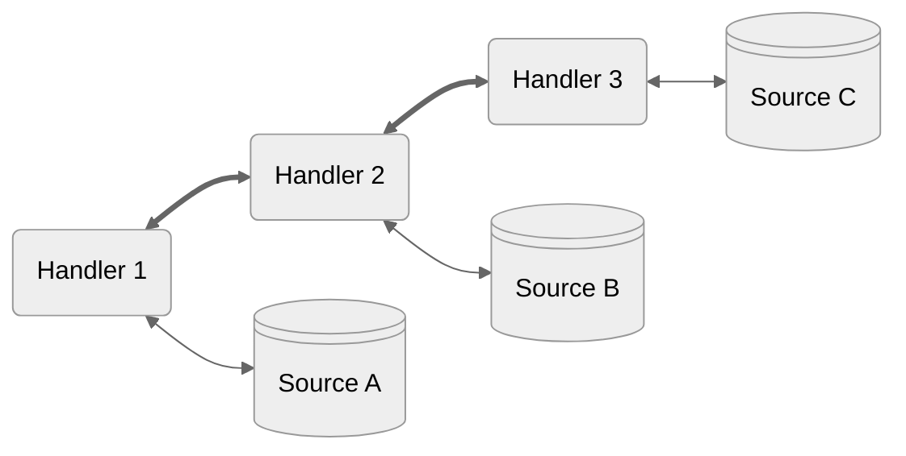


A handler receives the request `context` as well as a `next` function with which to pass along
a request if it so chooses.

```ts
type NextFn<T> = (req: RequestInfo) => Future<T>;

type Handler = {
  request<T>(context: RequestContext, next: NextFn<T>): Promise<T> | Future<T>;
}
```

`next` returns a Future, which is a promise with a few additional capabilities. Futures resolve
with the response from the next handler in the chain. This allows a handler to read or modify
the response if it wants.

> [!Important]
> requests are immutable, to modify one the handler must create a new request, copying over or
> cloning the parts it wants to leave unchanged.

```ts
type NextFn<T> = (req: RequestInfo) => Future<T>;

type Handler = {
  request<T>(context: RequestContext, next: NextFn<T>): Promise<T> | Future<T>;
}
```

A handler may be any object with a `request` method. This allows both stateful and non-stateful handlers to be utilized.

> [!TIP]
> Handlers should take care of the most generalizable concerns. In general great handlers
> - apply to many-if-not-all requests
> - have a clear heuristic by which they activate (a header, op-code, option, or url scheme)
> - don't block response streaming (we'll talk about this later)

<br>

| | |
| -- | -- |
| [← Introduction](./1-overview.md) &nbsp;&nbsp;&nbsp;&nbsp;&nbsp;&nbsp;&nbsp;&nbsp;&nbsp;&nbsp;&nbsp;&nbsp;&nbsp;&nbsp;&nbsp;&nbsp;&nbsp;&nbsp;&nbsp;&nbsp;&nbsp;&nbsp; | &nbsp;&nbsp;&nbsp;&nbsp;&nbsp;&nbsp;&nbsp;&nbsp;&nbsp;&nbsp;&nbsp;&nbsp;&nbsp;&nbsp;&nbsp;&nbsp;&nbsp;&nbsp;&nbsp;&nbsp;&nbsp;&nbsp;[Key Data Structures →](./3-data.md) |


---

| | |
| -- | -- |
| [← Making Requests](./2-requests.md) &nbsp;&nbsp;&nbsp;&nbsp;&nbsp;&nbsp;&nbsp;&nbsp;&nbsp;&nbsp;&nbsp;&nbsp;&nbsp;&nbsp;&nbsp;&nbsp;&nbsp;&nbsp;&nbsp;&nbsp;&nbsp;&nbsp; | &nbsp;&nbsp;&nbsp;&nbsp;&nbsp;&nbsp;&nbsp;&nbsp;&nbsp;&nbsp;&nbsp;&nbsp;&nbsp;&nbsp;&nbsp;&nbsp;&nbsp;&nbsp;&nbsp;&nbsp;&nbsp;&nbsp;[Caching →](./4-caching.md) |

## Data

In every application data can take on many different representations:

- the API format (what your backend understands)
- the wire format (what your backend sends you)
- the cache format (what your frontend deserializes the wire format into)
- the presentation format (what your frontend transforms the cache format into for utility)

As much as possible, WarpDrive encourages aligning *at-least* the first three of these four
formats. Aligning formats reduces the mental complexity required to understand the flow of
data through your application, making it easier to debug, and reduces the computation necessary
at each layer, making your application faster.

Misalignment tends to occur when API and Application developers don't work together to understand
requirements, or when the format in use is "lossy" (unable to accurately convey the full scope of
information being serialized).

We encourage the use of [JSON:API](https://jsonapi.org/) as the wire and cache format because unlike
most other formats in use today it encodes information about your data in a near-lossless and easily-cacheable manner.

For the presentation format, we encourage applications to limit the amount of manual transformation
done. Applications should wherever possible align the interfaces of the data components expect to
the shape of the data available, rather than transforming data to fit into the component. This said,
WarpDrive offers powerful schema-defined transformation and derivation capabilities built-in to the
reactivity layer for presenting data from the cache. Handling transformation universally via schema
enables apps to align to component interfaces where needed in a safer, more performant manner.

We'll explore these capabilities later on in the manual in the sections on [Presentation](./5-presentation.md) and [Schemas](./6-schemas.md). But first, lets take some time to look at some key
concepts surrounding the wire and cache format.


### StructuredDocuments

### ResourceDocuments

### Resources

### CacheKeys

### Membership

### Fields

<br>

| | |
| -- | -- |
| [← Making Requests](./2-requests.md) &nbsp;&nbsp;&nbsp;&nbsp;&nbsp;&nbsp;&nbsp;&nbsp;&nbsp;&nbsp;&nbsp;&nbsp;&nbsp;&nbsp;&nbsp;&nbsp;&nbsp;&nbsp;&nbsp;&nbsp;&nbsp;&nbsp; | &nbsp;&nbsp;&nbsp;&nbsp;&nbsp;&nbsp;&nbsp;&nbsp;&nbsp;&nbsp;&nbsp;&nbsp;&nbsp;&nbsp;&nbsp;&nbsp;&nbsp;&nbsp;&nbsp;&nbsp;&nbsp;&nbsp;[Caching →](./4-caching.md) |


---

| | |
| -- | -- |
| [← Key Data Structures](./3-data.md) &nbsp;&nbsp;&nbsp;&nbsp;&nbsp;&nbsp;&nbsp;&nbsp;&nbsp;&nbsp;&nbsp;&nbsp;&nbsp;&nbsp;&nbsp;&nbsp;&nbsp;&nbsp;&nbsp;&nbsp;&nbsp;&nbsp; | &nbsp;&nbsp;&nbsp;&nbsp;&nbsp;&nbsp;&nbsp;&nbsp;&nbsp;&nbsp;&nbsp;&nbsp;&nbsp;&nbsp;&nbsp;&nbsp;&nbsp;&nbsp;&nbsp;&nbsp;&nbsp;&nbsp;[Working with Data in your UI →](./5-presentation.md) |

## Caching

<br>

### CacheHandler

<br>

### CachePolicy

<br>

### In-Memory Cache

<br>

### Cache Eviction

<br>

### Persisted Caching

<br>

| | |
| -- | -- |
| [← Key Data Structures](./3-data.md) &nbsp;&nbsp;&nbsp;&nbsp;&nbsp;&nbsp;&nbsp;&nbsp;&nbsp;&nbsp;&nbsp;&nbsp;&nbsp;&nbsp;&nbsp;&nbsp;&nbsp;&nbsp;&nbsp;&nbsp;&nbsp;&nbsp; | &nbsp;&nbsp;&nbsp;&nbsp;&nbsp;&nbsp;&nbsp;&nbsp;&nbsp;&nbsp;&nbsp;&nbsp;&nbsp;&nbsp;&nbsp;&nbsp;&nbsp;&nbsp;&nbsp;&nbsp;&nbsp;&nbsp;[Working with Data in your UI →](./5-presentation.md) |


---

| | |
| -- | -- |
| [← Caching](./4-caching.md) &nbsp;&nbsp;&nbsp;&nbsp;&nbsp;&nbsp;&nbsp;&nbsp;&nbsp;&nbsp;&nbsp;&nbsp;&nbsp;&nbsp;&nbsp;&nbsp;&nbsp;&nbsp;&nbsp;&nbsp;&nbsp;&nbsp; | &nbsp;&nbsp;&nbsp;&nbsp;&nbsp;&nbsp;&nbsp;&nbsp;&nbsp;&nbsp;&nbsp;&nbsp;&nbsp;&nbsp;&nbsp;&nbsp;&nbsp;&nbsp;&nbsp;&nbsp;&nbsp;&nbsp;[Field Schemas →](./6-schemas.md) |

## Working with Data in your UI

<br>

| | |
| -- | -- |
| [← Caching](./4-caching.md) &nbsp;&nbsp;&nbsp;&nbsp;&nbsp;&nbsp;&nbsp;&nbsp;&nbsp;&nbsp;&nbsp;&nbsp;&nbsp;&nbsp;&nbsp;&nbsp;&nbsp;&nbsp;&nbsp;&nbsp;&nbsp;&nbsp; | &nbsp;&nbsp;&nbsp;&nbsp;&nbsp;&nbsp;&nbsp;&nbsp;&nbsp;&nbsp;&nbsp;&nbsp;&nbsp;&nbsp;&nbsp;&nbsp;&nbsp;&nbsp;&nbsp;&nbsp;&nbsp;&nbsp;[Field Schemas →](./6-schemas.md) |


---

| | |
| -- | -- |
| [← Working with Data in your UI](./5-presentation.md) &nbsp;&nbsp;&nbsp;&nbsp;&nbsp;&nbsp;&nbsp;&nbsp;&nbsp;&nbsp;&nbsp;&nbsp;&nbsp;&nbsp;&nbsp;&nbsp;&nbsp;&nbsp;&nbsp;&nbsp;&nbsp;&nbsp; | &nbsp;&nbsp;&nbsp;&nbsp;&nbsp;&nbsp;&nbsp;&nbsp;&nbsp;&nbsp;&nbsp;&nbsp;&nbsp;&nbsp;&nbsp;&nbsp;&nbsp;&nbsp;&nbsp;&nbsp;&nbsp;&nbsp;[Request Builders →](./7-builders.md) |

## Field Schemas

<br>

| | |
| -- | -- |
| [← Working with Data in your UI](./5-presentation.md) &nbsp;&nbsp;&nbsp;&nbsp;&nbsp;&nbsp;&nbsp;&nbsp;&nbsp;&nbsp;&nbsp;&nbsp;&nbsp;&nbsp;&nbsp;&nbsp;&nbsp;&nbsp;&nbsp;&nbsp;&nbsp;&nbsp; | &nbsp;&nbsp;&nbsp;&nbsp;&nbsp;&nbsp;&nbsp;&nbsp;&nbsp;&nbsp;&nbsp;&nbsp;&nbsp;&nbsp;&nbsp;&nbsp;&nbsp;&nbsp;&nbsp;&nbsp;&nbsp;&nbsp;[Request Builders →](./7-builders.md) |


---

| | |
| -- | -- |
| [← Field Schemas](./6-schemas.md) &nbsp;&nbsp;&nbsp;&nbsp;&nbsp;&nbsp;&nbsp;&nbsp;&nbsp;&nbsp;&nbsp;&nbsp;&nbsp;&nbsp;&nbsp;&nbsp;&nbsp;&nbsp;&nbsp;&nbsp;&nbsp;&nbsp; | &nbsp;&nbsp;&nbsp;&nbsp;&nbsp;&nbsp;&nbsp;&nbsp;&nbsp;&nbsp;&nbsp;&nbsp;&nbsp;&nbsp;&nbsp;&nbsp;&nbsp;&nbsp;&nbsp;&nbsp;&nbsp;&nbsp;&nbsp;&nbsp;&nbsp;&nbsp;&nbsp;&nbsp;&nbsp;&nbsp;&nbsp;&nbsp;&nbsp;&nbsp;&nbsp;&nbsp;&nbsp;&nbsp;&nbsp;&nbsp;&nbsp;&nbsp;&nbsp;&nbsp;&nbsp;&nbsp;&nbsp;&nbsp;&nbsp;&nbsp;&nbsp;&nbsp;&nbsp;&nbsp;&nbsp; |

## Builders

<br>

| | |
| -- | -- |
| [← Field Schemas](./6-schemas.md) &nbsp;&nbsp;&nbsp;&nbsp;&nbsp;&nbsp;&nbsp;&nbsp;&nbsp;&nbsp;&nbsp;&nbsp;&nbsp;&nbsp;&nbsp;&nbsp;&nbsp;&nbsp;&nbsp;&nbsp;&nbsp;&nbsp; | &nbsp;&nbsp;&nbsp;&nbsp;&nbsp;&nbsp;&nbsp;&nbsp;&nbsp;&nbsp;&nbsp;&nbsp;&nbsp;&nbsp;&nbsp;&nbsp;&nbsp;&nbsp;&nbsp;&nbsp;&nbsp;&nbsp;&nbsp;&nbsp;&nbsp;&nbsp;&nbsp;&nbsp;&nbsp;&nbsp;&nbsp;&nbsp;&nbsp;&nbsp;&nbsp;&nbsp;&nbsp;&nbsp;&nbsp;&nbsp;&nbsp;&nbsp;&nbsp;&nbsp;&nbsp;&nbsp;&nbsp;&nbsp;&nbsp;&nbsp;&nbsp;&nbsp;&nbsp;&nbsp;&nbsp; |


---

# Migrating Between Versions Using The Two Store Approach

Sometimes apps build over features, private APIs 🙈, or 3rd party libraries that later become deprecated and removed.

Most deprecations are relatively easy to resolve, but sometimes APIs change that had been central to the way an app was built. A good example of a difficult to resolve change is the switch away from per-record caching internally, which should have been transparent to apps but left users of a popular 3rd party libary (ModelFragments) stuck on the 4.6 release.

An example of such a shift in public APIs is the move away from Ember's ArrayLike interface for collections of records and away from promise-proxy wrappers surrounding async relationships. While lots of new patterns exist to replace those APIs, users that made heavy use of these features have a harder time migrating from version 4 to version 5, and thus stop being able to adopt new features in newer parts of their application until a substantial cleanup has occurred.

This is where the two-store-approach can be useful. In the two-store approach, an application configures a second store service under a different service name (for instance `v2-store`) enabling some portions of the app to use modern features without immediately being required to upgrade all of the existing application code to match.

Any application can configure more than one store using whatever version of EmberData/WarpDrive is installed, but to maximize this approach it is useful to be able to have the second store also use a more recent version of the library.

This is why we publish **"mirror"** versions of every package.

## Mirror Versions

Every package we publish has a **"mirror"** package equivalent.

For packages that have an org name (e.g. `@ember-data/store` or `@warp-drive/ember`) we add `-mirror` to the org name. E.g. `@ember-data/store` has the mirror `@ember-data-mirror/store`. For packages without an org we add `-mirror` to the name e.g. `ember-data` has the mirror `ember-data-mirror`.

Mirror packages are configured to work with other mirror packages as a wholly distinct package ecosystem.

For instance, the mirror of `@ember-data/model` is `@ember-data-mirror/model` and instead of having a peer-dependency on `@ember-data/store` it has a peer-dependency on `@ember-data-mirror/store`.

When importing code, you import from the mirror path e.g. `import Model, { attr } from '@ember-data-mirror/model';`.

For convenience, some types, constants and symbols that are safe to interop between versions will do so if you have both mirror and non-mirror versions available.

Mirror packages are available for versions `^4.13.0 | >=5.3.8`.

## TypeScript

All mirror packages are also versions which ship their own types. To use those types, configure your `tsconfig.json` to be able to find them [as shown here](../typescript/1-configuration.md#using-native-types), adding the appropriate `-mirror` appendage to each package name (PS: you can have distinct types for both your older and your newer version!).

## Caveat Umptor

Utilizing the two-store approach has a few tradeoffs:

1. If you want compatible type signatures for use by your components, you should upgrade your app to make use of native types first, likely using the [types-package approach](../typescript/0-installation.md#using-types-packages).

In fact, it is likely that if you want typescript for the v2 store that you are *forced* to remove the `@types/ember*` packages from your project entirely and upgrade to using native types for ember-source and ember-data. This is because the native types for EmberData/WarpDrive depend on ember's native types.

2. You should not use both `ember-data` and `ember-data-mirror` or there will be an unresolveable race condition for which one is the `store` service. Instead one of the stores, usually the mirror, MUST import and fully configure the store. E.g.

```ts
import Store from '@ember-data-mirror/store';

export default class V2Store extends Store {
  // ... config here
}
```

Configuring the store generally means you need to do *at least* four things:

- setup the hooks for presentation (instantiateRecord/teardownRecord)
- setup the schema source
- setup and configure the request-manager
  - *optionally* configure a cache policy
- setup the cache

We recommend the source-code for [ember-data/store](https://github.com/emberjs/data/blob/main/packages/-ember-data/src/store.ts) if you are curious what the configuration used "by default" historically looks like. If you wanted to exactly match the behaviors of your existing store (but perhaps without deprecated features) this is what would be required. However, if taking the two-store approach it is likely you want to use a different configuration.

For instance:

- perhaps you want to fully drop support for adapters and serializers
- perhaps you want to drop support for Model and only use SchemaRecord (or use some of both to give yourself some flexibility)

3. Due to (#2) above, your ember-cli-build file MUST call `setConfig` to configure the build config for the library.

```ts
const EmberApp = require('ember-cli/lib/broccoli/ember-app');

module.exports = async function (defaults) {
  const { setConfig } = await import('@warp-drive-mirror/build-config');

  const app = new EmberApp(defaults, {});

  setConfig(app, __dirname, {
    // settings here if desired
  });

  return app.toTree();
}
```

4. Record instances created by one store may not be used by another store, this primarily means they cannot be set as values of relationships. The records (and data) of each store is a wholly distinct context. You may find [ember-provide-consume-context](https://github.com/customerio/ember-provide-consume-context) useful for helping to manage this. Migrating "leaf first" or well-encapsulated parts of your app will generally lead to the pit-of-success.


---

# Reactive Data

In addition to request and cache management, WarpDrive provides a reactive access
layer for data in the cache.

Data in the cache is conceptualized as belonging to one of three forms

- **Documents** - the response to a request
- **Resources** - a unique cacheable entity within the response to a request
- **Fields** - the data for an individual property on a resource

Each form of data can be accessed and managed reactively through one of two modes

- *(upcoming, default in v6)* [PolarisMode](./polaris/overview.md)
- *(current, default in v5)* [LegacyMode](./legacy/overview.md)

These modes are interopable. The reactive object (record) for a resource in PolarisMode can relate to
a record in LegacyMode and vice-versa. This interopability is true whether the record in LegacyMode is
a SchemaRecord or a Model.

These reactive primitives use fine-grained signals-based reactivity. Currently, we use
glimmer's (Ember's) implementation of `Signal` (`@tracked`) and `Computed` (`@cached`);
however, we've architected our use to be pluggable and will soon enable configuration
of any desired implementation, thus making WarpDrive compatible with any signals compatible
library or framework.


---

# Relationships Guide

## Feature Overview
- [Inverses](./features/inverses.md)
- [LinksMode](./features/links-mode.md)
- [Polymorphism](./features/polymorphism.md)

<!--
- [Resource Relationships]()
- [Collection Relationships]()
- [Polymorphism]()
- [Links vs Identifiers]()
- [Sync vs Async]()
-->

## Configuration
- [1:none](./configuration/0-one-to-none.md) (One To None)
- [1:1](./configuration/1-one-to-one.md) (One To One)
- [1:Many](./configuration/2-one-to-many.md) (One To Many)
- [Many:None](./configuration/3-many-to-none.md) (Many To None)
- [Many:1](./configuration/4-many-to-one.md) (Many To One)
- [Many:Many](./configuration/5-many-to-many.md) (Many To Many)

<!--
## Mutating Relationships
- [Adding/Removing]()
- [Saving]()
- [Saving Multiple Related Records At Once]()
- [Sorting & Filtering]()

## Advanced
- [Understanding "the Graph"]()
- [Pagination]()
- [Directionality]()
- [Compound Foreign Keys]()
- [Joins]()
-->

# Misc

- [Terminology](./terminology.md#relationships)


---

# Request Guide

## Examples

- [Basic Usage](./examples/0-basic-usage.md)
- [Dealing with Auth](./examples/1-auth.md)

## Overview

- Intro: [What Is a Request?](./overview/0-intro.md)
- [Request Management](./overview/1-request-management.md)

## Usage

```ts
const userList = await manager.request({
  url: `/api/v1/users.list`
});

const users = userList.content;
```

---

### Making Requests

`RequestManager` has a single asynchronous method as it's API: `request`

```ts
class RequestManager {
  request<T>(req: RequestInfo): Future<T>;
}
```

`manager.request(<RequestInfo>)` accepts an object containing the information
necessary for the request to be handled successfully.

These options extend the [options](https://developer.mozilla.org/en-US/docs/Web/API/fetch#parameters) provided to `fetch`, and can accept a [`Request`](https://developer.mozilla.org/en-US/docs/Web/API/Request/Request). All properties accepted by Request options and fetch options are valid.

```ts
interface RequestInfo extends FetchOptions {
  op?: string;
  store?: Store;

  url: string;
  /**
   * data that a handler should convert into
   * the query (GET) or body (POST)
   */
  data?: Record<string, unknown>;
  /**
   * options specifically intended for handlers
   * to utilize to process the request
   */
  options?: Record<string, unknown>;
}
```

> **note**
> providing a `signal` is unnecessary as an `AbortController` is automatically provided if none is present.

---

#### Using the Response

`manager.request` returns a `Future`, which allows access to limited information about the request while it is still pending and fulfills with the final state when the request completes and the response has been read.

```ts
const usersFuture = manager.request({
  url: `/api/v1/users.list`
});
```

A `Future` is cancellable via `abort`.

```ts
usersFuture.abort();
```

Handlers may *optionally* expose a `ReadableStream` to the `Future` for streaming data; however, when doing so the handler should not resolve until it has fully read the response stream itself.

```ts
interface Future<T> extends Promise<StructuredDocument<T>> {
  abort(): void;

  async getStream(): ReadableStream | null;
}
```

A Future resolves or rejects with a `StructuredDocument`.

```ts
interface StructuredDocument<T> {
  request: RequestInfo;
  response: ResponseInfo | null;
  content?: T;
  error?: Error;
}
```

The `RequestInfo` specified by `document.request` is the same as originally provided to `manager.request`. If any handler fulfilled this request using different request info it is not represented here. This contract helps to ensure that `retry` and `caching` are possible since the original arguments are correctly preserved. This also allows handlers to "fork" the request or fulfill from multiple sources without the details of fulfillment muddying the original request.

The `ResponseInfo` is a serializable fulfilled subset of a [Response](https://developer.mozilla.org/en-US/docs/Web/API/Response) if set via `setResponse`. If no response was ever set this will be `null`.

```ts
/**
 * All readonly properties available on a Response
 *
 */
interface ResponseInfo {
  headers?: Record<string, string>;
  ok?: boolean;
  redirected?: boolean;
  status?: HTTPStatusCode;
  statusText?: string;
  type?: 'basic' | 'cors';
  url?: string;
}
```

---

### Request Handlers

Requests are fulfilled by handlers. A handler receives the request context
as well as a `next` function with which to pass along a request to the next
handler if it so chooses.

A handler may be any object with a `request` method. This allows both stateful and non-stateful
handlers to be utilized.

If a handler calls `next`, it receives a `Future` which resolves to a `StructuredDocument`
that it can then compose how it sees fit with its own response.

```ts

type NextFn<P> = (req: RequestInfo) => Future<P>;

interface Handler {
  async request<T>(context: RequestContext, next: NextFn<P>): T;
}
```

`RequestContext` contains a readonly version of the `RequestInfo` as well as a few methods for building up the `StructuredDocument` and `Future` that will be part of the response.

```ts
interface RequestContext<T> {
  readonly request: RequestInfo;

  setStream(stream: ReadableStream | Promise<ReadableStream>): void;
  setResponse(response: Response | ResponseInfo): void;
}
```

A basic `fetch` handler with support for streaming content updates while
the download is still underway might look like the following, where we use
[`response.clone()`](https://developer.mozilla.org/en-US/docs/Web/API/Response/clone) to `tee` the `ReadableStream` into two streams.

A more efficient handler might read from the response stream, building up the
response content before passing along the chunk downstream.

```ts
import type { Handler, RequestContext } from '@ember-data/request';

const FetchHandler: Handler = {
  async request<T>(context: RequestContext) {
    const response = await fetch(context.request);
    context.setResponse(response);
    context.setStream(response.clone().body);

    return response.json();
  }
}
```

Request handlers are registered by configuring the manager via `use`

```ts
manager.use([Handler1, Handler2])
```

Handlers will be invoked in the order they are registered ("fifo", first-in first-out), and may only be registered up until the first request is made. It is recommended, but not required to register all handlers at one time in order to ensure explicitly visible handler ordering.

---

#### Handling Errors

Each handler in the chain can catch errors from upstream and choose to
either handle the error, re-throw the error, or throw a new error.

```ts
import type { Handler, NextFn, RequestContext } from '@ember-data/request';

const MAX_RETRIES = 5;
const AuthHandler: Handler = {
  async request<T>(context: RequestContext, next: NextFn<T>) {
    let attempts = 0;

    while (attempts < MAX_RETRIES) {
      attempts++;
      try {
        const response = await next(context.request);
        return response;
      } catch (e) {
        if (isTimeoutError(e) && attempts < MAX_RETRIES) {
          // retry request
          continue;
        }
        // rethrow if it is not a timeout error
        throw e;
      }
    }
  }
}
```

---

#### Handling Abort

Aborting a request will reject the current handler in the chain. However,
every handler can potentially catch this error. If your handler needs to
separate AbortError from other Error types, it is recommended to check
`context.request.signal.aborted` (or if a custom controller was supplied `controller.signal.aborted`).

In this manner it is possible for a request to recover from an abort and
still proceed; however, as a best practice this should be used for necessary
cleanup only and the original AbortError re-thrown if the abort signal comes
from the root controller.

**AbortControllers are Always Present and Always Entangled**

If the initial request does not supply an [AbortController](https://developer.mozilla.org/en-US/docs/Web/API/AbortController), one will be generated.

The [signal](https://developer.mozilla.org/en-US/docs/Web/API/AbortSignal) for this controller is automatically added to the request passed into the first handler.

Each handler has the option to supply a new controller to the request when calling `next`.
If a new controller is provided it will be automatically entangled with the root controller.
If the root controller aborts, so will any entangled controllers.

If an entangled controller aborts, the root controller will not abort.
This allows for advanced request-flow scenarios to abort subsections of the request tree without aborting the entire request.

---

#### Stream Currying

`RequestManager.request` and `next` differ from `fetch` in one **crucial detail** in that the outer Promise resolves only once the response stream has been processed.

For context, it helps to understand a few of the use-cases that RequestManager
is intended to allow.

- to manage and return streaming content (such as video files)
- to fulfill a request from multiple sources or by splitting one request into multiple requests
  - for instance one API call for a user and another for the user's friends
  - or e.g. fulfilling part of the request from one source (one API, in-memory, localStorage, IndexedDB
   etc.) and the rest from another source (a different API, a WebWorker, etc.)
- to coalesce multiple requests
- to decorate a request with additional info
  - e.g. an Auth handler that ensures the correct tokens or headers or cookies are attached.

`await fetch(<req>)` resolves at the moment headers are received. This allows for the body of the request to be processed as a stream by application
code *while chunks are still being received by the browser*.

When an app chooses to `await response.json()` what occurs is the browser reads the stream to completion and then returns the result. Additionally, this stream may only be read **once**.

The `RequestManager` preserves this ability to subscribe to and utilize the stream by either the application or the handler – thereby delivering the full power and flexibility of native APIs – without restricting developers in ways that lead to complicated workarounds.

Each handler may call `setStream` only once, but may do so *at any time* until the promise that the handler returns has resolved. The associated promise returned by calling `future.getStream` will resolve with the stream set by `setStream` if that method is called, or `null` if that method
has not been called by the time that the handler's request method has resolved.

Handlers that do not create a stream of their own, but which call `next`, should defensively pipe the stream forward. While this is not required (see automatic currying below) it is better to do so in most cases as otherwise the stream may not become available to downstream handlers or the application until the upstream handler has fully read it.

```ts
context.setStream(future.getStream());
```

Handlers that either call `next` multiple times or otherwise have reason to create multiple  fetch requests should either choose to return no stream, meaningfully combine the streams, or select a single prioritized stream.

Of course, any handler may choose to read and handle the stream, and return either no stream or a different stream in the process.

---

#### Automatic Currying of Stream and Response

In order to simplify the common case for handlers which decorate a request, if `next` is called only a single time and `setResponse` was never called by the handler, the response set by the next handler in the chain will be applied to that handler's outcome. For instance, this makes the following pattern possible `return (await next(<req>)).content;`.

Similarly, if `next` is called only a single time and neither `setStream` nor `getStream` was called, we automatically curry the stream from the future returned by `next` onto the future returned by the handler.

Finally, if the return value of a handler is a `Future`, we curry `content` and `errors` as well, thus enabling the simplest form `return next(<req>)`.

In the case of the `Future` being returned, `Stream` proxying is automatic and immediate and does not wait for the `Future` to resolve.

---

### Using as a Service

Most applications will desire to have a single `RequestManager` instance, which can be achieved using module-state patterns for singletons, or for [Ember](https://emberjs.com) applications by exporting the manager as a [service](https://guides.emberjs.com/release/services/).

*services/request.ts*
```ts
import RequestManager from '@ember-data/request';
import Fetch from '@ember-data/request/fetch';
import Auth from 'app/services/ember-data-handler';

export default class extends RequestManager {
  constructor(args?: Record<string | symbol, unknown>) {
    super(args);
    this.use([Auth, Fetch]);
  }
}
```

---

#### Using with `@ember-data/store`

To have a request service unique to a Store:

```ts
import Store, { CacheHandler } from '@ember-data/store';
import RequestManager from '@ember-data/request';
import Fetch from '@ember-data/request/fetch';

class extends Store {
  requestManager = new RequestManager()
    .use([Fetch])
    .useCache(CacheHandler);
}
```

---

#### Using with `ember-data`

If using the package [ember-data](https://github.com/emberjs/data/tree/main/packages/-ember-data),
the following configuration will automatically be done in order to preserve the
legacy [Adapter](https://github.com/emberjs/data/tree/main/packages/adapter) and
[Serializer](https://github.com/emberjs/data/tree/main/packages/serializer) behavior.
Additional handlers or a service injection like the above would need to be done by the
consuming application in order to make broader use of `RequestManager`.

```ts
import Store from 'ember-data/store';
import { CacheHandler } from '@ember-data/store';
import RequestManager from '@ember-data/request';
import Fetch from '@ember-data/request/fetch';
import { LegacyNetworkHandler } from '@ember-data/legacy-compat';

export default class extends Store {
  requestManager = new RequestManager()
    .use([LegacyNetworkHandler, Fetch])
    .useCache(CacheHandler);
}
```

To provide a different configuration, import and extend `ember-data/store`. The
default configuration will be ignored if the `requestManager` property is set,
though the store will still register the CacheHandler.

For usage of the store's `requestManager` via `store.request(<req>)` see the
[Store](https://api.emberjs.com/ember-data/release/modules/@ember-data%2Fstore) documentation.


---

# Installation

WarpDrive now provides a cli that will handle installation and configuration for you
when installing the types-packages for native types to use with older releases (such as 4.12).

```cli
npx warp-drive retrofit types@canary
```

The cli will

- uninstall DT packages for ember-source and ember-data
- add native types as sources to your ts-config for both ember-source and ember-data
- install all required types packages for ember-data based on the dependencies in your package.json

The cli may also be used to update to the latest canary versions of the types by
simply running the command again.

For additional documentation or to manuall install and configure, continue reading the
below guide.


---


> [!CAUTION]
> EmberData does not maintain the DefinitelyTyped types for 
> EmberData (e.g. the `@types/ember-data__*`). If you were
> previously using these, you should uninstall them first.

> [!IMPORTANT]
> EmberData's Native Types require the use of Ember's
> Native Types.
>
> Type definitions need to be installed top-level, this means
> you have to install every EmberData package `ember-data`
> depends on.

> [!TIP]
> When installing packages, use an NPM dist tag to get the latest
> version for a given channel. E.g. `pnpm install ember-data@latest`
> valid channels with types are `latest`, `canary`, `v4-latest` and `v4-canary`

There are currently two ways to gain access to EmberData's native types.

1) [Use A Version That Has Types](#using-native-types)

2) [Use Official Types Packages](#using-types-packages)
with releases `>= 4.12.*`

---

### Using Versions That Supply Types

The following versions supply their own type definitions. These type definitions will still need to be configured for use in tsconfig.

- Versions of 4.x >= 4.13.0-alpha.0
- Versions of 5.x >= 5.3.8

In order to use the types for these versions, the dependencies of `ember-data` (and their peer-dependencies) must also be added to `package.json`.

Generally that means the following packages are needed, though you may need fewer (or more!) depending on if you have migrated away from Adapter/Serializer and replaced Model with SchemaRecord:

| Name | Latest | Canary | V4 |
| ---- | -------| ------ | -- |
| [ember-data](https://github.com/emberjs/data/blob/main/packages/-ember-data/README.md) |  |  |  |
| [@ember-data/adapter](https://github.com/emberjs/data/blob/main/packages/adapter/README.md) |  |  |  |
| [@ember-data/graph](https://github.com/emberjs/data/blob/main/packages/graph/README.md) |  |  |  |
| [@ember-data/json-api](https://github.com/emberjs/data/blob/main/packages/json-api/README.md) |  |  |  |
| [@ember-data/legacy-compat](https://github.com/emberjs/data/blob/main/packages/legacy-compat/README.md) |  |  |  |
| [@ember-data/model](https://github.com/emberjs/data/blob/main/packages/model/README.md) |  |  |  |
| [@ember-data/request](https://github.com/emberjs/data/blob/main/packages/request/README.md) |  |  |  |
| [@ember-data/request-utils](https://github.com/emberjs/data/blob/main/packages/request-utils/README.md) |  |  |  |
| [@ember-data/serializer](https://github.com/emberjs/data/blob/main/packages/serializer/README.md) |  |  |  |
| [@ember-data/store](https://github.com/emberjs/data/blob/main/packages/store/README.md) |  |  |  |
| [@ember-data/tracking](https://github.com/emberjs/data/blob/main/packages/tracking/README.md) |  |  |  |
| [@warp-drive/core-types](https://github.com/emberjs/data/blob/main/packages/core-types/README.md) |  |  |  |

Here's a single install command for pnpm. Swap pnpm for yarn or npm as needed.

```
PACKAGES=("@types/ember" "@types/ember-data" "@types/ember-data__adapter" "@types/ember-data__model" "@types/ember-data__serializer" "@types/ember-data__store" "@types/ember__application" "@types/ember__array" "@types/ember__component" "@types/ember__controller" "@types/ember__debug" "@types/ember__destroyable" "@types/ember__engine" "@types/ember__error" "@types/ember__helper" "@types/ember__modifier" "@types/ember__object" "@types/ember__owner" "@types/ember__routing" "@types/ember__runloop" "@types/ember__service" "@types/ember__string" "@types/ember__template" "@types/ember__test" "@types/ember__utils" "ember-data" );

for pkg in "${PACKAGES[@]}"; do pnpm remove "$pkg"; done

pnpm install ember-data@latest @ember-data/adapter@latest @ember-data/graph@latest @ember-data/json-api@latest @ember-data/legacy-compat@latest @ember-data/model@latest @ember-data/request@latest @ember-data/request-utils@latest @ember-data/serializer@latest @ember-data/store@latest @ember-data/tracking@latest @warp-drive/core-types@latest
```

Here's an example change to package.json which drops all use of types from `@types/` for both Ember and EmberData and adds the appropriate canary packages.

```diff
-    "@types/ember": "4.0.11",
-    "@types/ember-data": "4.4.16",
-    "@types/ember-data__adapter": "4.0.6",
-    "@types/ember-data__model": "4.0.5",
-    "@types/ember-data__serializer": "4.0.6",
-    "@types/ember-data__store": "4.0.7",
-    "@types/ember__application": "4.0.11",
-    "@types/ember__array": "4.0.10",
-    "@types/ember__component": "4.0.22",
-    "@types/ember__controller": "4.0.12",
-    "@types/ember__debug": "4.0.8",
-    "@types/ember__destroyable": "4.0.5",
-    "@types/ember__engine": "4.0.11",
-    "@types/ember__error": "4.0.6",
-    "@types/ember__helper": "4.0.7",
-    "@types/ember__modifier": "4.0.9",
-    "@types/ember__object": "4.0.12",
-    "@types/ember__owner": "4.0.9",
-    "@types/ember__routing": "4.0.22",
-    "@types/ember__runloop": "4.0.10",
-    "@types/ember__service": "4.0.9",
-    "@types/ember__string": "3.16.3",
-    "@types/ember__template": "4.0.7",
-    "@types/ember__test": "4.0.6",
-    "@types/ember__utils": "4.0.7",
-    "ember-data": "~5.3.3",
+    "ember-data": "5.4.0-alpha.64",
+    "@ember-data/store": "5.4.0-alpha.64",
+    "@ember-data/adapter": "5.4.0-alpha.64",
+    "@ember-data/graph": "5.4.0-alpha.64",
+    "@ember-data/json-api": "5.4.0-alpha.64",
+    "@ember-data/legacy-compat": "5.4.0-alpha.64",
+    "@ember-data/request": "5.4.0-alpha.64",
+    "@ember-data/request-utils": "5.4.0-alpha.64",
+    "@ember-data/serializer": "5.4.0-alpha.64",
+    "@ember-data/model": "5.4.0-alpha.64",
+    "@ember-data/tracking": "5.4.0-alpha.64",
+    "@warp-drive/core-types": "0.0.0-alpha.50",
```

> [!TIP]
> If your package manager enables deduping, we recommend deduping types as much as possible.

>[!TIP]
> It is best to ensure no other dependencies are still bringing `@types/*` packages as this will cause weird type bugs.

---

### Using Types Packages

> [!WARNING]
> When consuming types in this way, you may sometimes
> encounter a misalignment between the types and the actual API. These misalignments should be rare for 4.12.* => 5.4.*. Overall, even when these misalignments occur, we suspect there are fewer mistakes or issues with these types than in the DefinitelyTyped types.


Every package in the project that ships types also publishes its types under a second package name.
This enables older releases to consume these types instead of relying on the DefinitelyTyped project.

These types-only packages have the same version number as the version they were published with, and their org or name is suffixed with `-types`. 


**Required Packages for Types**


| Name | Types Package | Version |
| ---- | ------- | ------- |
| [ember-data](https://github.com/emberjs/data/blob/main/packages/-ember-data/README.md) | ember-data-types |  |
| [@ember-data/adapter](https://github.com/emberjs/data/blob/main/packages/adapter/README.md) | @ember-data-types/adapter |  |
| [@ember-data/graph](https://github.com/emberjs/data/blob/main/packages/graph/README.md) | @ember-data-types/graph |  |
| [@ember-data/json-api](https://github.com/emberjs/data/blob/main/packages/json-api/README.md) | @ember-data-types/json-api |  |
| [@ember-data/legacy-compat](https://github.com/emberjs/data/blob/main/packages/legacy-compat/README.md) | @ember-data-types/legacy-compat |  |
| [@ember-data/model](https://github.com/emberjs/data/blob/main/packages/model/README.md) | @ember-data-types/model |  |
| [@ember-data/request](https://github.com/emberjs/data/blob/main/packages/request/README.md) | @ember-data-types/request |  |
| [@ember-data/request-utils](https://github.com/emberjs/data/blob/main/packages/request-utils/README.md) | @ember-data-types/request-utils |  |
| [@ember-data/serializer](https://github.com/emberjs/data/blob/main/packages/serializer/README.md) | @ember-data-types/serializer |  |
| [@ember-data/store](https://github.com/emberjs/data/blob/main/packages/store/README.md) | @ember-data-types/store |  |
| [@ember-data/tracking](https://github.com/emberjs/data/blob/main/packages/tracking/README.md) | @ember-data-types/tracking |  |
| [@warp-drive/core-types](https://github.com/emberjs/data/blob/main/packages/core-types/README.md) | @warp-drive-types/core-types |  |

Here's a single install command for pnpm. Swap pnpm for yarn or npm as needed.

```
pnpm install ember-data-types@canary @ember-data-types/adapter@canary @ember-data-types/graph@canary @ember-data-types/json-api@canary @ember-data-types/legacy-compat@canary @ember-data-types/model@canary @ember-data-types/request@canary @ember-data-types/request-utils@canary @ember-data-types/serializer@canary @ember-data-types/store@canary @ember-data-types/tracking@canary @warp-drive-types/core-types@canary
```

Here's an example change to package.json which drops all use of types from `@types/` for both Ember and EmberData and adds the appropriate canary packages.

```diff
-    "@types/ember": "4.0.11",
-    "@types/ember-data": "4.4.16",
-    "@types/ember-data__adapter": "4.0.6",
-    "@types/ember-data__model": "4.0.5",
-    "@types/ember-data__serializer": "4.0.6",
-    "@types/ember-data__store": "4.0.7",
-    "@types/ember__application": "4.0.11",
-    "@types/ember__array": "4.0.10",
-    "@types/ember__component": "4.0.22",
-    "@types/ember__controller": "4.0.12",
-    "@types/ember__debug": "4.0.8",
-    "@types/ember__destroyable": "4.0.5",
-    "@types/ember__engine": "4.0.11",
-    "@types/ember__error": "4.0.6",
-    "@types/ember__helper": "4.0.7",
-    "@types/ember__modifier": "4.0.9",
-    "@types/ember__object": "4.0.12",
-    "@types/ember__owner": "4.0.9",
-    "@types/ember__routing": "4.0.22",
-    "@types/ember__runloop": "4.0.10",
-    "@types/ember__service": "4.0.9",
-    "@types/ember__string": "3.16.3",
-    "@types/ember__template": "4.0.7",
-    "@types/ember__test": "4.0.6",
-    "@types/ember__utils": "4.0.7",
+    "@ember-data-types/adapter": "^5.4.0-alpha.64",
+    "@ember-data-types/model": "^5.4.0-alpha.64",
+    "@ember-data-types/serializer": "^5.4.0-alpha.64",
+    "@ember-data-types/store": "^5.4.0-alpha.64",
+    "@ember-data-types/graph": "^5.4.0-alpha.64",
+    "@ember-data-types/json-api": "^5.4.0-alpha.64",
+    "@ember-data-types/legacy-compat": "^5.4.0-alpha.64",
+    "@ember-data-types/request": "^5.4.0-alpha.64",
+    "@ember-data-types/request-utils": "^5.4.0-alpha.64",
+    "@ember-data-types/tracking": "^5.4.0-alpha.64",
+    "@warp-drive-types/core-types": "^0.0.0-alpha.50",
     "ember-data": "^4.12.7",
+    "ember-data-types": "^5.4.0-alpha.64",
```


---

# Configuration

There are currently two ways to gain access to EmberData's native types.
Follow the configuration guide below for the [installation](./0-installation.md)
option you chose.

1) [Use A Version That Has Types](#using-native-types)

2) [Use Official Types Packages](#using-types-packages)
with releases `>= 4.12.*`

> [!IMPORTANT]
> EmberData's Native Types require the use of Ember's
> Native Types, the configuration below will also setup
> Your application to consume Ember's Native Types.

### Using Native Types

To consume `alpha` stage types, you must import the types in your project's `tsconfig.json`.

For alpha stage types, we add `unstable-preview-types` to the path to help you remember the
potential volatility.

```diff
 {
   "compilerOptions": {
+   "types": [
+      "ember-source/types",
+      "ember-data/unstable-preview-types",
+      "@ember-data/store/unstable-preview-types",
+      "@ember-data/adapter/unstable-preview-types",
+      "@ember-data/graph/unstable-preview-types",
+      "@ember-data/json-api/unstable-preview-types",
+      "@ember-data/legacy-compat/unstable-preview-types",
+      "@ember-data/request/unstable-preview-types",
+      "@ember-data/request-utils/unstable-preview-types",
+      "@ember-data/model/unstable-preview-types",
+      "@ember-data/serializer/unstable-preview-types",
+      "@ember-data/tracking/unstable-preview-types",
+      "@warp-drive/core-types/unstable-preview-types"
+    ]
   }
 }
```

### Using Types Packages

To consume `alpha` stage types, you must import the types in your project's `tsconfig.json`.

For alpha stage types, we add `unstable-preview-types` to the path to help you remember the
potential volatility.

```diff
 {
   "compilerOptions": {
+   "types": [
+      "ember-source/types",
+      "ember-data-types/unstable-preview-types",
+      "@ember-data-types/store/unstable-preview-types",
+      "@ember-data-types/adapter/unstable-preview-types",
+      "@ember-data-types/graph/unstable-preview-types",
+      "@ember-data-types/json-api/unstable-preview-types",
+      "@ember-data-types/legacy-compat/unstable-preview-types",
+      "@ember-data-types/request/unstable-preview-types",
+      "@ember-data-types/request-utils/unstable-preview-types",
+      "@ember-data-types/model/unstable-preview-types",
+      "@ember-data-types/serializer/unstable-preview-types",
+      "@ember-data-types/tracking/unstable-preview-types",
+      "@warp-drive-types/core-types/unstable-preview-types"
+    ]
   }
 }
```


---

# EmberData's Types Strategy

If you previously used the EmberData types provided by DefinitelyTyped, one MASSIVE
difference you will notice immediately is that EmberData does not use any registries
for types.

Instead, EmberData uses Symbol keys to brand objects with additional type information.

For example:

```ts
import Model, { attr } from '@ember-data/model';
import { Type } from '@warp-drive/core-types/symbols';

export default class User extends Model {
  @attr declare name: string;

  [Type] = 'user' as const;
}
```

This means that when calling an API that takes in a resource type, we pass this branded class as a generic instead of relying on registries. For example:

```ts
import type User from 'my-app/models/user';

// ...

const user = await store.findRecord<User>('user', '1');
```

We chose this direction over registries or objects for a number of reasons we'll detail below.

### Why not registries?

We found registries had 5 significant drawbacks.

First, registries have a max number of entries before TypeScript begins resolving unions based on the registry as `any`. This limit is relatively low (in the hundreds) so many applications hit into this relatively quickly.

Second, constructing registries is brittle. Conflicts often arise when attempting to source models from additional libraries, and often result in `never` types due to an empty registry.

Third, we couldn't type EmberData itself using registries without adopting extreme complexity. This is because while DefinitelyTyped could assume one single global registry, EmberData cannot. This arises for a myriad of reasons: EmberData supports multiple stores, multiple sources of schema, and our own test suite defines Models for each test that would conflict with each other if we were forced to use a single global registry.

Fourth, and possibly most importantly, registries assume that for a given resource-type (like `'user'`) that only a single type signature exists. While this has *mostly* been true historically in EmberData, it is no longer true and will become increasingly less true as we roll out additional features we have planned. Supporting different
type signatures for Create/Edit/Delete as well as for partials and actions means if we stuck with registries, we'd need tons of them and things would get complicated quickly.

Fifth, the registry approach prevents static analysis from easily determining where in the application a Model or Schema is in use, making it difficult for bundlers to
optimize while code-splitting.

### Ok, so then why not objects?

A common alternative to registries is to pass classes as tokens into an API. For instance, we could have redesigned
EmberData to take a class instead of a string in the call to `findRecord` below.

```ts
import type User from 'my-app/models/user';

// ...

const user = await store.findRecord(User, '1');
```

There are two significant drawbacks to this approach. The first is one of the same reasons as "why not registries": we expect that lots of type signatures will satisfy a single resource-type in the future.

The second is related and more important: it forces you to use classes or other objects to represent data, which we don't want to do.

In the near future, EmberData will switch the default story for presenting data from `Model` which is a class-per-resource approach to `SchemaRecord`, which is a single class capable of presenting the data for any associated schema. Schema's are defined in `json` and can be loaded into the app in any number of ways. That means when using SchemaRecord, there never would be a class to import and use as a token for such a call.

### Ok, Brands!

Brands solve the various issues mentioned above, and a bit more!

Over time, they should enable us to curate a great experience for working with partials, actions, contrained edit signatures, query syntaxes like GraphQL and more.


---

# Typing Models & Transforms

## Type

Example: add the `Type` brand to the `user` model.

```ts
import Model, { attr } from '@ember-data/model';
import { Type } from '@warp-drive/core-types/symbols';

export default class User extends Model {
  @attr declare name: string;

  [Type] = 'user' as const;
}
```

The benefit of the above is that the value of Type is readable at runtime and thus easy to debug.
However, you can also choose to do this via types only:

```ts
import Model, { attr } from '@ember-data/model';
import type { Type } from '@warp-drive/core-types/symbols';

export default class User extends Model {
  @attr declare name: string;

  declare [Type]: 'user';
}
```

EmberData will never access Type as an actual value, these brands are *purely* for type inference.

## Transforms

Transforms with a `Type` brand will have their type and options validated. Once we move to stage-3 decorators, the signature of the field would also be validated against the transform.

Example: Typing a Transform

```ts
import type { Type } from '@warp-drive/core-types/symbols';

export default class BigIntTransform {
  deserialize(serialized: string): BigInt | null {
    return !serialized || serialized === '' ? null : BigInt(serialized + 'n');
  }
  serialize(deserialized: BigInt | null): string | null {
    return !deserialized ? null : String(deserialized);
  }

  declare [Type]: 'big-int';

  static create() {
    return new this();
  }
}
```

Example: Using Transforms

```ts
import Model, { attr } from '@ember-data/model';
import type { StringTransform } from '@ember-data/serializer/transforms';
import type { Type } from '@warp-drive/core-types/symbols';

export default class User extends Model {
  @attr<StringTransform>('string') declare name: string;

  declare [Type]: 'user';
}
```

## Sync BelongsTo

`belongsTo` relationships will have their resource type and options config validated against the passed in type.

Once we move to stage-3 decorators, explicitly setting the generic would not be required as it could be infered from the field's type.

```ts
import Model, { belongsTo } from '@ember-data/model';
import type Address from './address';
import { Type } from '@warp-drive/core-types/symbols';

export default class User extends Model {
  @belongsTo<Address>('address', { async: false, inverse: null })
  declare address: Address;

  [Type] = 'user' as const;
}
```

## Async BelongsTo

`belongsTo` relationships will have their resource type and options config validated against the passed in type.

Once we move to stage-3 decorators, explicitly setting the generic would not be required as it could be infered from the field's type.

```ts
import Model, { belongsTo, AsyncBelongsTo } from '@ember-data/model';
import type Address from './address';
import { Type } from '@warp-drive/core-types/symbols';

export default class User extends Model {
  @belongsTo<Address>('address', { async: true, inverse: null })
  declare address: AsyncBelongsTo<Address>;

  [Type] = 'user' as const;
}
```

## Sync HasMany (data only)

If you don't need access to meta or links on relationships, you can type the relationship as just an array.

`hasMany` relationships will have their resource type and options config validated against the passed in type.

Once we move to stage-3 decorators, explicitly setting the generic would not be required as it could be infered from the field's type.

```ts
import Model, { hasMany } from '@ember-data/model';
import type Post from './post';
import { Type } from '@warp-drive/core-types/symbols';

export default class User extends Model {
  @hasMany<Post>('post', { async: false, inverse: 'author' })
  declare posts: Post[];

  [Type] = 'user' as const;
}
```

## Sync HasMany (with meta, links, etc)

`hasMany` relationships will have their resource type and options config validated against the passed in type.

Once we move to stage-3 decorators, explicitly setting the generic would not be required as it could be infered from the field's type.

```ts
import Model, { hasMany, HasMany } from '@ember-data/model';
import type Post from './post';
import { Type } from '@warp-drive/core-types/symbols';

export default class User extends Model {
  @hasMany<Post>('post', { async: false, inverse: 'author' })
  declare posts: HasMany<Post>;

  [Type] = 'user' as const;
}
```

## Async HasMany (restricted)

If you don't need access to meta, links or template iterations on relationships, you can type the relationship as just a promise resolving to an array. Only use this if the value
will always be awaited before iteration.

`hasMany` relationships will have their resource type and options config validated against the passed in type.

Once we move to stage-3 decorators, explicitly setting the generic would not be required as it could be infered from the field's type.

```ts
import Model, { hasMany, AsyncHasMany } from '@ember-data/model';
import type Post from './post';
import { Type } from '@warp-drive/core-types/symbols';

export default class User extends Model {
  @hasMany<Post>('post', { async: true, inverse: 'author' })
  declare posts: Promise<Post[]>;

  [Type] = 'user' as const;
}
```

`Promise<HasMany<Post>>` also works.

## Async HasMany (with links, meta, etc.)

`hasMany` relationships will have their resource type and options config validated against the passed in type.

Once we move to stage-3 decorators, explicitly setting the generic would not be required as it could be infered from the field's type.

```ts
import Model, { hasMany, AsyncHasMany } from '@ember-data/model';
import type Post from './post';
import { Type } from '@warp-drive/core-types/symbols';

export default class User extends Model {
  @hasMany<Post>('post', { async: true, inverse: 'author' })
  declare posts: AsyncHasMany<Post>;

  [Type] = 'user' as const;
}
```


---

# Typing Requests & Builders

## How it works (but what not to do in the general case)

`requestManager.request` and `store.request` each take a generic that can be used to set
the return type of the content of the associated request.

```ts
const { content } = await store.request<User>({ ... });

// here content will be typed as a User
```

> [!CAUTION]
> Note that this puts the burden on you to ensure the return type accurately portrays the result!

In all cases, the response will be a `StructuredDocument<T>` where `T` is the content type provided.

This approach allows for a lot of flexibility in designing great sugar overtop of the request infrastructure, but again, limits the amount of safety provided and should be used with great caution.

A better approach is to use builders and set the generic via inference.

## Setting Content's Type from a Builder

The signature for `request` will infer the generic for the content type from a special brand on the options passed to it.

```ts
import type { RequestSignature } from '@warp-drive/core-types/symbols';
import type { CollectionRecordArray } from '@ember-data/store/types';
import type User from '../models/user';

type MyRequest {
  // ...
  [RequestSignature]: CollectionRecordArray<User>
}

function buildMyRequest(...): MyRequest { /* ... */ }

const { content } = await store.request(
  buildMyRequest(...)
);

// here content will be set to `CollectionRecordArray<User>`
```

## Advanced Builders

Because builders are just functions that produce a request options object, and because this object can be branded with
the type signature of the response, we can use this to create
advanced more-strongly-typed systems.

For instance, imagine you had a query builder that validated
and linted the query against a backing schema, such as you might
get with GraphQL

```ts
const { content } = await store.request(
  gql`query withoutVariable {
    continents {
      code
      name
      countries {
        name
        capital
      }
    }
  }`
);
```


---

# Typing Includes

Many APIs offer the concept of "sideloading" or "including related resources". For instance,
when loading a `user` you might also want to load the information for the company where they
work, the company's CEO, and a list of the user's friends. Historically this was managed
through the `includes` param.

For instance, in the example above, the includes array would usually look like this:

```ts
{ include: ['company', 'company.ceo', 'friends'] }
```

Though some users author this requirement as a string instead:

```ts
{ include: 'company,company.ceo,friends' }
```

> [!TIP]
> We recommend authoring includes as an array instead of as a string. It will
> generally scale better if the list is long, and provides better autocomplete support.
> Within WarpDrive/EmberData provide builders and adapters there should be no functional
> difference between using an array or using a string.

Typing relationship paths like includes is valuable for increased confidence, as small typos in these
strings could result in significant application bugs. And, where possible, autocomplete support while
typing these strings can help a developer better learn and explore the graph of data available to be loaded.

WarpDrive offers several type utilities to assist with strictly typing strings that represent relationship
paths: `Includes` and `StringSatisfiesIncludes`


## The `Includes` Type Util

The `Includes` type util will return a union of all valid relationship paths discoverable from the input type, within a few constraints.

- Cyclical paths are eliminated, so if a user has friends that are users you should never see `user.friends.friends` or `user.friends.company` as options.
- There is a configurable MAX_DEPTH which defaults to `3` to help encourage reduced complexity and better typescript performance
- There is an absolute MAX-DEPTH for paths of `5`. If you wish to support longer paths than `5` please reach out to discuss. This limit is in place for performance reasons due to the size of union that gets generated.
- If your type/model has non-relationship properties that compute to typed record instances (or arrays of typed record instances) you may encounter false positives for paths.

> [!TIP]
> In general, we discourage the usage of `getters` (aka `computed` or `derived` fields) that compute their value from related records.


```ts
Includes<
  T extends TypedRecordInstance,
  MAX_DEPTH extends _DEPTHCOUNT = DEFAULT_MAX_DEPTH
>
```

### Basic Usage

```ts
import type { Includes } from '@warp-drive/core-types/record';

function builderThatAcceptsIncludes<T extends TypedRecordInstance>(req: {
  includes: Includes<T>[]
  // ... other props
});

builderThatAcceptsIncludes<User>({
  includes: ['friends']
})
```

## The `StringSatisfiesIncludes` Type Util

Due to limitations in TypeScript and the underlying (poor) algorithmic 
performance that would result from many approaches, comma-separated-string based
include arguments (e.g. `'company,company.ceo,friends'`) aren't typed by-default.

However, if you wish to support validating these strings with types, we offer a
stand-alone utility with reasonably good performance characteristics and minimal
runtime overhead.

We mention runtime overhead as it requires creating a function to have it work
with reasonable DX.

This approach has two main drawbacks: it currently does not autocomplete (though
we believe there's a path to making it do so) and its up to the developer to use
the validator at the callsite, its not automatic.

### Using the Runtime Function

```ts
import { createIncludeValidator } from '@warp-drive/core-types/record';

const userIncludesValidator = createIncludeValidator<User>;

function builderThatAcceptsIncludes<T extends TypedRecordInstance>(req: {
  includes: string
  // ... other props
});

builderThatAcceptsIncludes<User>({
  includes: userIncludesValidator('company,company.ceo,friends')
})
```

### Using the Type Util Directly

The type util that powers `createIncludeValidator` can be used directly; however, we only
recommend doing so if writing a wrapper utility similar to `createIncludeValidator` as
otherwise it results in needing to type out the string twice.

```ts
import type { StringSatisfiesIncludes, Includes } from '@warp-drive/core-types/record';

function builderThatAcceptsIncludes<T extends TypedRecordInstance>(req: {
  includes: string
  // ... other props
});

const includes: StringSatisfiedIncludes<
  'company,company.ceo,friends',
  Includes<User>
> = 'company,company.ceo,friends';

builderThatAcceptsIncludes<User>({
  includes
})
```


---

# 💚 TypeScript Guide

Before getting started, we recommend reading
the following two sections

- [Notice on Type Maturity](#type-maturity)
- [Contributing Type Fixes](#contributing-type-fixes)


---

- Installation
  - [Using Versions That Supply Types](./0-installation.md#using-versions-that-supply-types)
  - [Using Types Packages](./0-installation.md#using-types-packages)
- Configuration
  - [Using Native Types](./1-configuration.md#using-native-types)
  - [Using Types Packages](./1-configuration.md#using-types-packages)
- Usage
  - [Why Brands](./2-why-brands.md)
  - [Typing Models & Transforms](./3-typing-models.md)
  - [Typing Requests & Builders](./4-typing-requests.md)
  - [Typing Includes](./5-typing-includes.md)
  - Typing Handlers
  - Using Store APIs

---

## Type Maturity

We publish types in stages, just like `canary | beta | stable` channels for code.

- `private` we don't ship types (yet), even if typed in the repo
- `alpha` we expect high churn on type signatures and users must opt-in to use these types.
- `beta` we expect moderate churn on type signatures and users must opt-in to use these types.
- `stable` we feel the types story is robust enough to attempt to follow semver when changing these types.

Each package in the project can choose its own stage for types.

> [!TIP]
> TypeScript support for all EmberData and WarpDrive packages is currently `alpha`.
>
> **This means that you must opt-in to be able use EmberData's types.**

## Contributing Type Fixes

Even though EmberData/WarpDrive is typed, what makes for good types for a project doesn't necessarily make for good types for that project's consumers (your application).

Currently, TypeScript support is `alpha` largely because we expect to need to improve **a lot** of type signatures to make them more useful and correct for your app.

Both strategies for installing and consuming types listed in [installation](./0-installation.md) pull their types from the `main` branch (canary).

Every commit to main can be one-click published by us as a new canary version for both installation strategies, this means we can ship type fixes as quickly as folks contribute them, letting us dogfood our way to robust stable types.


---

# LegacyMode

- ⮐ [ReactiveData](../index.md)

---

🚧 This guide is under active construction, it will talk about the below points 🚧 

In LegacyMode records are:

- mutable
- local changes immediately reflect app wide
- all the APIs of Model (references, state props, currentState, methods etc)
- limited reactivity for fields (same as Model)
- requires continued use of the `model` and `legacy-compat` packages (though most imports from them can be removed)


---

# PolarisMode

- ⮐ [ReactiveData](../index.md)

---

🚧 This guide is under active construction, it will talk about the below points 🚧 

In PolarisMode records are:

- immutable (unless creating or checking out for editing)
- local changes only show where you want them to on the editable version
- none of the APIs of Model (references, state props, currentState, methods etc)
- deep reactivity for fields
- advanced derivations, aliasing and transformations
- [currently] limited support for relationships
- no promise proxies for relationships


---

# One To None Relationships

- Next → [One To One Relationships](./1-one-to-one.md)
- ⮐ Go Back [Relationships Guide](../index.md)

---

Pretend we're building a social network for trail runners 🏃🏃🏾‍♀️, and a TrailRunner (maybe [@runspired](https://github.com/runspired)) can have a favorite Trail to run on . While the TrailRunner has a favorite trail, the trail has no concept of a TrailRunner.

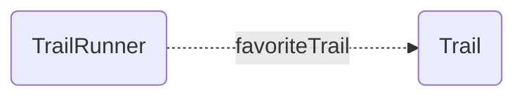

> **Note** In our charts we use dotted lines for singular relationships and thick solid lines for collection relationships.

Such a relationship is singular and unidirectional (it only points to one resource, and only points in one direction).
When a relationship only points in one direction, we say it has no [inverse](../features/inverses.md).

You'll note that effectively this setup implicitly indicates a "many" relationship. A Trail "implicitly" has many runners (for whom it is their favorite trail).

Internally, EmberData will keep track of this implicit relationship such that if the trail were to be destroyed in a landslide its deletion would result in removing it as the favoriteTrail for each associated runner.

Implicit relationships are not available as a public API, because they represent a highly incomplete view of the data, but the book-keeping produces benefits such as
the ability to efficiently disassociate the record from relationships when it is destroyed.

Here's how we can define such a relationship via various mechanisms.

- [Using @ember-data/model](#using-ember-datamodel)
- [Using json schemas](#using-json-schemas)
- [🚧 Using @warp-drive/schema-record](#using-warp-driveschema-record-🚧-coming-soon)
  - [Legacy Compat Mode](#legacycompat-mode)

---

## Using `@ember-data/model`

> **Note** Models are currently the primary way that users of EmberData define "schema".
>
> Models are not the only way to define schema today, but they
> are the most immediately available ergonomic way to do so.

When using Models, EmberData parses schema from them at runtime,
converting static information defined on the class into the json
schema format needed by the rest of the system.

This is handled by the implementation of the [schema service](https://api.emberjs.com/ember-data/release/classes/SchemaService) provided
by the `@ember-data/model` package. The service converts the class
definitions into the json definitions described in the next section.

⛰️ *Trail*

```ts
import Model, { attr } from '@ember-data/model';

export default class Trail extends Model {
  @attr name;
}
```

🌲 *TrailRunner*

```ts
import Model, { belongsTo } from '@ember-data/model';

export default class TrailRunner extends Model {
  @belongsTo('trail', { inverse: null, async: false })
  favoriteTrail;
}
```

---

## Using JSON Schemas

EmberData doesn't care where your schemas come from, how they are authored,
or how you load them into the system so long as when it asks the [schema service](https://api.emberjs.com/ember-data/release/classes/SchemaService)
for information it gets back field definitions in the right json shape.

Here, we show how the above trail runner relationship is described by a field definition.

**Current**

```json
{
  "kind": "belongsTo",
  "name": "favoriteTrail",
  "options": { "async": false, "inverse": null },
  "type": "trail",
}
```

**🚧 Coming Soon**

Because we deprecated implicit option values in 4.x, we are now able to change defaults.

This means that the next iteration of Schema will be able to reliably use
the The lack of an option like "async" or "inverse" as a false-y value.

We also are shifting the value for "kind" from "belongsTo" to "resource"
to make it more readil clear that relationships do not (by default) have
directionality or ownership over their inverse.

```json
{
  "kind": "resource",
  "name": "favoriteTrail",
  "type": "trail",
}
```

---

## Using `@warp-drive/schema-record` (🚧 Coming Soon)

Working with schemas in a raw json format is far more flexible, lightweight and
performant than working with bulky classes that need to be shipped across the wire,parsed, and instantiated. Even relatively small apps can quickly find themselves shipping large quantities of JS just to describe their data.

No one wants to author schemas in raw JSON though (we hope 😬), and the ergonomics of typed data and editor autocomplete based on your schemas are vital to productivity and
code quality. For this, we offer a way to express schemas as typescript using types, classes and decorators which are then compiled into json schemas and typescript interfaces for use by your project.

⛰️ *Trail*

```ts
import { field } from '@warp-drive/schema';

export class Trail {
  @field name: string;
}
```

🌲 *TrailRunner*

```ts
import { resource } from '@warp-drive/schema';
import { Trail } from './trail';

export class TrailRunner {
  @resource(Trail) favoriteTrail;
}
```

### LegacyCompat Mode

Support for migrating from `@ember-data/model` on a more granular basis is provided by decorators that preserve the semantics of the quirks of that class. This allows you to begin eliminating models
and adopting other features of schemas sooner.

⛰️ *Trail*

```ts
import { attr } from '@warp-drive/schema/legacy';

export default class Trail {
  @attr name: string;
}
```

🌲 *TrailRunner*

```ts
import { belongsTo } from '@warp-drive/schema/legacy';
import Trail from './trail';

export default class TrailRunner {
  @belongsTo(Trail) favoriteTrail;
}
```

---

- Next → [One To One Relationships](./1-one-to-one.md)
- ⮐ [Relationships Guide](../index.md)


---

# One To One Relationships

- Previous ← [One To None Relationships](./0-one-to-none.md)
- Next → [One To Many Relationships](./2-one-to-many.md)
- ⮐ [Relationships Guide](../index.md)

---

Imagine our social network for trail runners 🏃🏃🏾‍♀️ allows runners to add their other social accounts. For instance, the TrailRunner [@runspired](https://github.com/runspired) might add their Instagram account.

Here, the coupling goes both ways. In this model, the 📸 Instagram account can only belong to one Trail Runner, and the Trail Runner only has one Instagram Account. Let's take a selfie:

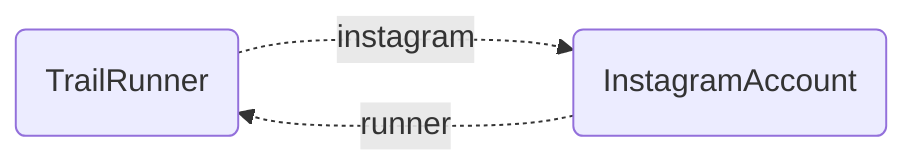

There are two ways we can model this relationship: bidirectionally with managed [inverses](../features/inverses.md), or unidirectionally without managed inverses.

In the bidirectional configuration, changes to one side of the relationship change the other side as well. This includes
both updates from remote state (a payload for the resource received from the API) as well as mutations to the local state
(application code setting a new, unsaved value for the relationship).

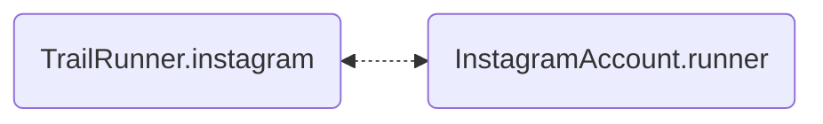

> **Note** In our charts we use dotted lines for singular relationships and thick solid lines for collection relationships.

In the unidirectional configuration, we effectively have two separate distinct [one-to-none](./0-one-to-none.md) relationships.

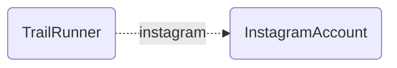


With distinct relationships, we may edit one side without affecting the state of the inverse.

Note, modeling this setup as two "one-to-none" relationships has the advantage of creating an implicit "many" relationship in both directions. Imagine that many runners could have the same instagram account and that at the same time many instagram accounts could belong to the same runner.

You might be tempted to think of this as a [many-to-many](./5-many-to-many.md) or two [many-to-none](./4-many-to-one.md), but sometimes this is effectively modeled as two `one-to-none` relationships.

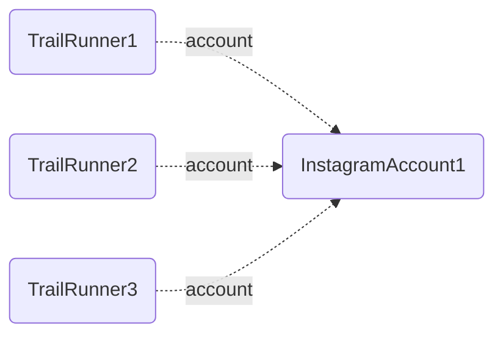

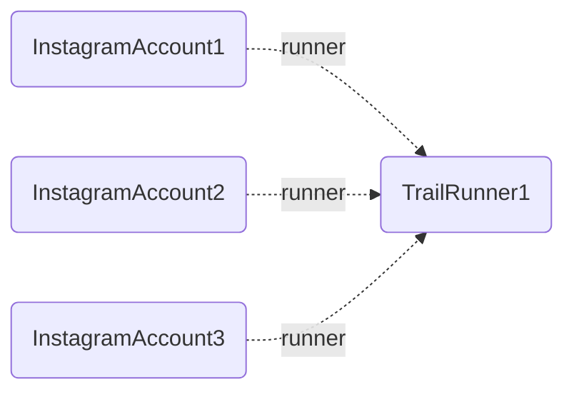


Head over to [one-to-none](./0-one-to-none.md) if this is the setup that is best for you. Else, here's how we can define such a relationship via various mechanisms.

- [Using @ember-data/model](#using-ember-datamodel)
- [Using json schemas](#using-json-schemas)
- [🚧 Using @warp-drive/schema-record](#using-warp-driveschema-record-🚧-coming-soon)
  - [Legacy Compat Mode](#legacycompat-mode)

---

## Using `@ember-data/model`

> **Note** Models are currently the primary way that users of EmberData define "schema".
>
> Models are not the only way to define schema today, but they
> are the most immediately available ergonomic way to do so.

When using Models, EmberData parses schema from them at runtime,
converting static information defined on the class into the json
schema format needed by the rest of the system.

This is handled by the implementation of the [schema service](https://api.emberjs.com/ember-data/release/classes/SchemaService) provided
by the `@ember-data/model` package. The service converts the class
definitions into the json definitions described in the next section.

📸 *InstagramAccount*

```ts
import Model, { belongsTo } from '@ember-data/model';

export default class InstagramAccount extends Model {
  @belongsTo('trail-runner', { inverse: 'instagram', async: false })
  runner;
}
```

🌲 *TrailRunner*

```ts
import Model, { belongsTo } from '@ember-data/model';

export default class TrailRunner extends Model {
  @belongsTo('instagram-account', { inverse: 'runner', async: false })
  instagram;
}
```

---

## Using JSON Schemas

EmberData doesn't care where your schemas come from, how they are authored,
or how you load them into the system so long as when it asks the [schema service](https://api.emberjs.com/ember-data/release/classes/SchemaService)
for information it gets back field definitions in the right json shape.

Here, we show how the above trail runner relationship is described by a field definition.

**Current**

📸 *InstagramAccount*

```json
{
  "kind": "belongsTo",
  "name": "runner",
  "options": { "async": false, "inverse": "instagram" },
  "type": "trail-runner",
}
```

🌲 *TrailRunner*

```json
{
  "kind": "belongsTo",
  "name": "instagram",
  "options": { "async": false, "inverse": "runner" },
  "type": "instagram-account",
}
```

**🚧 Coming Soon**

Because we deprecated implicit option values in 4.x, we are now able to change defaults.

This means that the next iteration of Schema will be able to reliably use
the The lack of an option like "async" or "inverse" as a false-y value.

We also are shifting the value for "kind" from "belongsTo" to "resource"
to make it more readil clear that relationships do not (by default) have
directionality or ownership over their inverse.

📸 *InstagramAccount*

```json
{
  "kind": "resource",
  "name": "runner",
  "options": { "inverse": "instagram" },
  "type": "trail-runner",
}
```

🌲 *TrailRunner*

```json
{
  "kind": "resource",
  "name": "instagram",
  "options": { "inverse": "runner" },
  "type": "instagram-account",
}
```

---

## Using `@warp-drive/schema-record` (🚧 Coming Soon)

Working with schemas in a raw json format is far more flexible, lightweight and
performant than working with bulky classes that need to be shipped across the wire,parsed, and instantiated. Even relatively small apps can quickly find themselves shipping large quantities of JS just to describe their data.

No one wants to author schemas in raw JSON though (we hope 😬), and the ergonomics of typed data and editor autocomplete based on your schemas are vital to productivity and
code quality. For this, we offer a way to express schemas as typescript using types, classes and decorators which are then compiled into json schemas and typescript interfaces for use by your project.

📸 *InstagramAccount*

```ts
import { resource } from '@warp-drive/schema';
import { TrailRunner } from './trail-runner';

export class InstagramAccount {
  @resource(TrailRunner) runner;
}
```

🌲 *TrailRunner*

```ts
import { resource } from '@warp-drive/schema';
import { InstagramAccount } from './instagram-account';

export class TrailRunner {
  @resource(InstagramAccount) instagram;
}
```

### LegacyCompat Mode

Support for migrating from `@ember-data/model` on a more granular basis is provided by decorators that preserve the semantics of the quirks of that class. This allows you to begin eliminating models
and adopting other features of schemas sooner.

📸 *InstagramAccount*

```ts
import { belongsTo } from '@warp-drive/schema/legacy';
import { TrailRunner } from './trail-runner';

export class InstagramAccount {
  @belongsTo(TrailRunner, { inverse: "instagram" })
  runner;
}
```

🌲 *TrailRunner*

```ts
import { belongsTo } from '@warp-drive/schema/legacy';
import { InstagramAccount } from './instagram-account';

export class TrailRunner {
  @belongsTo(InstagramAccount, { inverse: "reunnter" })
  instagram;
}
```

---

- Previous ← [One To None Relationships](./0-one-to-none.md)
- Next → [One To Many Relationships](./2-one-to-many.md)
- ⮐ [Relationships Guide](../index.md)


---

# One To Many Relationships

- Previous ← [One To One Relationships](./1-one-to-one.md)
- Next → [Many To None Relationships](./3-many-to-none.md)
- ⮐ [Relationships Guide](../index.md)

---

Imagine our social network for trail runners 🏃🏃🏾‍♀️ allows runners to upload their runs as activities.

In this model, the ActivityData only pertains on one TrailRunner


While the Trail Runner has many such activies.

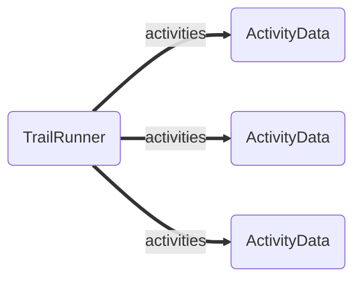

> **Note** In our charts we use dotted lines for singular relationships and thick solid lines for collection relationships.

Let's workout!

There are two ways we can model this relationship: bidirectionally with managed [inverses](../features/inverses.md), or unidirectionally without managed inverses.

In the bidirectional configuration, changes to one side of the relationship change the other side as well. This includes
both updates from remote state (a payload for the resource received from the API) as well as mutations to the local state
(application code setting a new, unsaved value for the relationship).

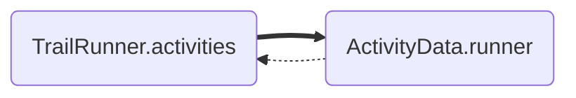

In the unidirectional configuration, we effectively have two separate distinct relationships.

A [many-to-none](./4-many-to-none.md) relationship from TrailRunner to ActivityData.

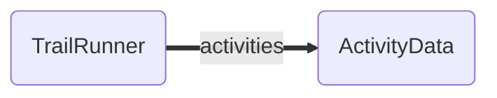

And a [one-to-none](./0-one-to-none.md) relationship from ActivityData to TrailRunner.


With distinct relationships, we may edit one side without affecting the state of the inverse. This is particularly useful
in two situations.

First, it may be the case that the user has thousands or tens of thousands of activities. In this case, you likely don't want whichever individual activities you happen to load to create an incomplete list of the TrailRunner's activities. It's better to load and work with the activities list in isolation, ideally in a paginated manner.

Second, it may be the case that runner is able to share the activity data with another runner that forgot to record. By not coupling the relationship, the ActivityData can still be owned by the first runner by included in the second runner's list of activities as well.

Head over to [many-to-none](./4-many-to-none.md) and [one-to-none](./0-one-to-none.md) if this is the setup that is best for you. Else, here's how we can define such a relationship via various mechanisms.

- [Using @ember-data/model](#using-ember-datamodel)
- [Using json schemas](#using-json-schemas)
- [🚧 Using @warp-drive/schema-record](#using-warp-driveschema-record-🚧-coming-soon)
  - [Legacy Compat Mode](#legacycompat-mode)

---

## Using `@ember-data/model`

> **Note** Models are currently the primary way that users of EmberData define "schema".
>
> Models are not the only way to define schema today, but they
> are the most immediately available ergonomic way to do so.

When using Models, EmberData parses schema from them at runtime,
converting static information defined on the class into the json
schema format needed by the rest of the system.

This is handled by the implementation of the [schema service](https://api.emberjs.com/ember-data/release/classes/SchemaService) provided
by the `@ember-data/model` package. The service converts the class
definitions into the json definitions described in the next section.

🏃🏾‍♀️ *ActivityData*

```ts
import Model, { belongsTo } from '@ember-data/model';

export default class ActivityData extends Model {
  @belongsTo('trail-runner', { inverse: 'activities', async: false })
  runner;
}
```

🌲 *TrailRunner*

```ts
import Model, { hasMany } from '@ember-data/model';

export default class TrailRunner extends Model {
  @hasMany('activity-data', { inverse: 'runner', async: false })
  activities;
}
```

---

## Using JSON Schemas

EmberData doesn't care where your schemas come from, how they are authored,
or how you load them into the system so long as when it asks the [schema service](https://api.emberjs.com/ember-data/release/classes/SchemaService)
for information it gets back field definitions in the right json shape.

Here, we show how the above trail runner relationship is described by a field definition.

**Current**

🏃🏾‍♀️ *ActivityData*

```json
{
  "kind": "belongsTo",
  "name": "runner",
  "options": { "async": false, "inverse": "activities" },
  "type": "trail-runner",
}
```

🌲 *TrailRunner*

```json
{
  "kind": "hasMany",
  "name": "activities",
  "options": { "async": false, "inverse": "runner" },
  "type": "activity-data",
}
```

**🚧 Coming Soon**

Because we deprecated implicit option values in 4.x, we are now able to change defaults.

This means that the next iteration of Schema will be able to reliably use
the The lack of an option like "async" or "inverse" as a false-y value.

We also are shifting the value for "kind" from "belongsTo" to "resource"
to make it more readil clear that relationships do not (by default) have
directionality or ownership over their inverse.

🏃🏾‍♀️ *ActivityData*

```json
{
  "kind": "resource",
  "name": "runner",
  "options": { "inverse": "activities" },
  "type": "trail-runner",
}
```

🌲 *TrailRunner*

```json
{
  "kind": "collection",
  "name": "activities",
  "options": { "inverse": "runner" },
  "type": "activity-data",
}
```

---

## Using `@warp-drive/schema-record` (🚧 Coming Soon)

Working with schemas in a raw json format is far more flexible, lightweight and
performant than working with bulky classes that need to be shipped across the wire,parsed, and instantiated. Even relatively small apps can quickly find themselves shipping large quantities of JS just to describe their data.

No one wants to author schemas in raw JSON though (we hope 😬), and the ergonomics of typed data and editor autocomplete based on your schemas are vital to productivity and
code quality. For this, we offer a way to express schemas as typescript using types, classes and decorators which are then compiled into json schemas and typescript interfaces for use by your project.

🏃🏾‍♀️ *ActivityData*

```ts
import { resource } from '@warp-drive/schema';
import { TrailRunner } from './trail-runner';

export class ActivityData {
  @resource(TrailRunner, { inverse: "activities" })
  runner;
}
```

🌲 *TrailRunner*

```ts
import { collection } from '@warp-drive/schema';
import { ActivityData } from './activity-data';

export class TrailRunner {
  @collection(ActivityData, { inverse: "runner" })
  activities;
}
```

### LegacyCompat Mode

Support for migrating from `@ember-data/model` on a more granular basis is provided by decorators that preserve the semantics of the quirks of that class. This allows you to begin eliminating models
and adopting other features of schemas sooner.

🏃🏾‍♀️ *ActivityData*

```ts
import { belongsTo } from '@warp-drive/schema/legacy';
import { TrailRunner } from './trail-runner';

export class ActivityData {
  @belongsTo(TrailRunner, { inverse: "activities" })
  runner;
}
```

🌲 *TrailRunner*

```ts
import { hasMany } from '@warp-drive/schema/legacy';
import { ActivityData } from './activity-data';

export class TrailRunner {
  @hasMany(ActivityData, { inverse: "runner" })
  activities;
}
```

---

- Previous ← [One To One Relationships](./1-one-to-one.md)
- Next → [Many To None Relationships](./3-many-to-none.md)
- ⮐ [Relationships Guide](../index.md)


---

# Many To None Relationships

- Previous ← [One To Many Relationships](./2-one-to-many.md)
- Next → [Many To One Relationships](./4-many-to-one.md)
- ⮐ [Relationships Guide](../index.md)

---

Imagine our social network for trail runners 🏃🏃🏾‍♀️ allows runners to tag their activities. [#runday](https://www.instagram.com/explore/tags/runday/?hl=en) [#justdoit](https://www.instagram.com/explore/tags/justdoit/?hl=en)

In this model, the ActivityData might have multiple tags, but given that millions if not billions if not trillions of activities might use a tag like [#neverstopexploring](https://www.instagram.com/explore/tags/neverstopexploring/?hl=en), it turns out we definitely don't want the tag to keep track of every activity that ever referenced it.


> **Note** In our charts we use dotted lines for singular relationships and thick solid lines for collection relationships.

Often `ManyToNone` is used for exactly this sort of case, where conceptually the relationship is [many-to-many](./5-many-to-many.md) in nature, but one side would be so large that modeling it as such is prohibitive.

Here's how we can define such a relationship via various mechanisms.

- [Using @ember-data/model](#using-ember-datamodel)
- [Using json schemas](#using-json-schemas)
- [🚧 Using @warp-drive/schema-record](#using-warp-driveschema-record-🚧-coming-soon)
  - [Legacy Compat Mode](#legacycompat-mode)

---

## Using `@ember-data/model`

> **Note** Models are currently the primary way that users of EmberData define "schema".
>
> Models are not the only way to define schema today, but they
> are the most immediately available ergonomic way to do so.

When using Models, EmberData parses schema from them at runtime,
converting static information defined on the class into the json
schema format needed by the rest of the system.

This is handled by the implementation of the [schema service](https://api.emberjs.com/ember-data/release/classes/SchemaService) provided
by the `@ember-data/model` package. The service converts the class
definitions into the json definitions described in the next section.

🏷️ *Hashtag*

```ts
import Model, { attr } from '@ember-data/model';

export default class Hashtag extends Model {
  @attr name;
}
```

🏃🏾‍♀️ *ActivityData*

```ts
import Model, { hasMany } from '@ember-data/model';

export default class ActivityData extends Model {
  @hasMany('hashtag', { async: false, inverse: null })
  tags;
}
```

---

## Using JSON Schemas

EmberData doesn't care where your schemas come from, how they are authored,
or how you load them into the system so long as when it asks the [schema service](https://api.emberjs.com/ember-data/release/classes/SchemaService)
for information it gets back field definitions in the right json shape.

Here, we show how the above trail runner relationship is described by a field definition.

**Current**

🏃🏾‍♀️ *ActivityData*

```json
{
  "kind": "hasMany",
  "name": "tags",
  "options": { "async": false, "inverse": null },
  "type": "hashtag",
}
```

**🚧 Coming Soon**

Because we deprecated implicit option values in 4.x, we are now able to change defaults.

This means that the next iteration of Schema will be able to reliably use
the The lack of an option like "async" or "inverse" as a false-y value.

We also are shifting the value for "kind" from "belongsTo" to "resource"
to make it more readil clear that relationships do not (by default) have
directionality or ownership over their inverse.

🏃🏾‍♀️ *ActivityData*

```json
{
  "kind": "collection",
  "name": "tags",
  "type": "hashtag",
}
```

---

## Using `@warp-drive/schema-record` (🚧 Coming Soon)

Working with schemas in a raw json format is far more flexible, lightweight and
performant than working with bulky classes that need to be shipped across the wire,parsed, and instantiated. Even relatively small apps can quickly find themselves shipping large quantities of JS just to describe their data.

No one wants to author schemas in raw JSON though (we hope 😬), and the ergonomics of typed data and editor autocomplete based on your schemas are vital to productivity and
code quality. For this, we offer a way to express schemas as typescript using types, classes and decorators which are then compiled into json schemas and typescript interfaces for use by your project.

🏷️ *Hashtag*

```ts
import { field } from '@warp-drive/schema';

export class Hashtag extends Model {
  @field name: string;
}
```

🏃🏾‍♀️ *ActivityData*

```ts
import { collection } from '@warp-drive/schema';
import { Hashtag } from './hashtag';

export class ActivityData extends Model {
  @collection(Hashtag) tags;
}
```

### LegacyCompat Mode

Support for migrating from `@ember-data/model` on a more granular basis is provided by decorators that preserve the semantics of the quirks of that class. This allows you to begin eliminating models
and adopting other features of schemas sooner.

🏷️ *Hashtag*

```ts
import { attr } from '@warp-drive/schema/legacy';

export class Hashtag extends Model {
  @attr name: string;
}
```

🏃🏾‍♀️ *ActivityData*

```ts
import { hasMany } from '@warp-drive/schema/legacy';
import { Hashtag } from './hashtag';

export class ActivityData extends Model {
  @hasMany(Hashtag) tags;
}

---

- Previous ← [One To Many Relationships](./2-one-to-many.md)
- Next → [Many To One Relationships](./4-many-to-one.md)
- ⮐ [Relationships Guide](../index.md)


---

# Many To One Relationships

- Previous ← [Many To None Relationships](./3-many-to-none.md)
- Next → [Many To Many Relationships](./5-many-to-many.md)
- ⮐ [Relationships Guide](../index.md)

---

Many To One Relationships are the same as [One to Many relationships](./2-one-to-many.md). Just flip the order in
how you conceptualize the relationship.


---

# Many To Many Relationships

- Previous ← [Many To One Relationships](./4-one-to-many.md)
- ⮐ [Relationships Guide](../index.md)

---

Imagine our social network for trail runners 🏃🏃🏾‍♀️ allows runners to connect with friends, other trail runners!

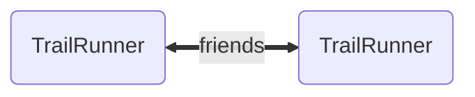

> **Note** In our charts we use dotted lines for singular relationships and thick solid lines for collection relationships.

Or, maybe more accurately since this is a [*reflexive*](../terminology.md#reflexive) relationship:

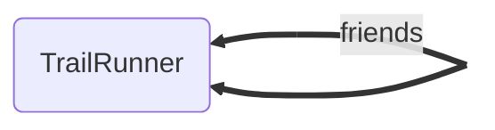

There are two ways we can model this relationship: bidirectionally with managed [inverses](../features/inverses.md), or unidirectionally without managed inverses.

In the bidirectional configuration, changes to one side of the relationship change the other side as well. This includes
both updates from remote state (a payload for the resource received from the API) as well as mutations to the local state
(application code setting a new, unsaved value for the relationship).

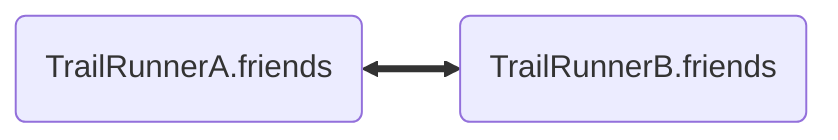

In the unidirectional configuration, we effectively have two separate distinct [many-to-none](./3-many-to-none.md) relationships.


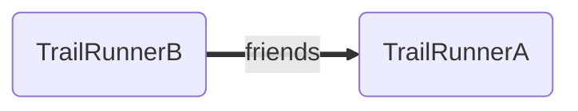

With distinct relationships, we may edit one side without affecting the state of the inverse. This is especially useful
when the collections might be very large, paginated, or not
bidirectional in nature.

For an example of a non-bidirectional relationship of this sort, it might be that Chris lists Thomas as a friend, but sadly Thomas does not feel the same. This Thomas being in Chris' friends does not mean that Chris should be in the list of Thomas' friends.

Head over to [many-to-none](./3-many-to-none.md) if this is the setup that is best for you. Else, here's how we can define such a relationship via various mechanisms.

- [Using @ember-data/model](#using-ember-datamodel)
- [Using json schemas](#using-json-schemas)
- [🚧 Using @warp-drive/schema-record](#using-warp-driveschema-record-🚧-coming-soon)
  - [Legacy Compat Mode](#legacycompat-mode)

---

## Using `@ember-data/model`

> **Note** Models are currently the primary way that users of EmberData define "schema".
>
> Models are not the only way to define schema today, but they
> are the most immediately available ergonomic way to do so.

When using Models, EmberData parses schema from them at runtime,
converting static information defined on the class into the json
schema format needed by the rest of the system.

This is handled by the implementation of the [schema service](https://api.emberjs.com/ember-data/release/classes/SchemaService) provided
by the `@ember-data/model` package. The service converts the class
definitions into the json definitions described in the next section.

🌲 *TrailRunner*

```ts
import Model, { hasMany } from '@ember-data/model';

export default class TrailRunner extends Model {
  @hasMany('trail-runner', { inverse: 'friends', async: false })
  friends;
}
```

Note, the [many-to-none](./3-many-to-none.md) variation of this would be:

```ts
import Model, { hasMany } from '@ember-data/model';

export default class TrailRunner extends Model {
  @hasMany('trail-runner', { inverse: null, async: false })
  friends;
}
```

---

## Using JSON Schemas

EmberData doesn't care where your schemas come from, how they are authored,
or how you load them into the system so long as when it asks the [schema service](https://api.emberjs.com/ember-data/release/classes/SchemaService)
for information it gets back field definitions in the right json shape.

Here, we show how the above trail runner relationship is described by a field definition.

**Current**

🌲 *TrailRunner*

```json
{
  "kind": "hasMany",
  "name": "friends",
  "options": { "async": false, "inverse": "friends" },
  "type": "trail-runner",
}
```

Note, the [many-to-none](./3-many-to-none.md) variation of this would be:

```json
{
  "kind": "hasMany",
  "name": "friends",
  "options": { "async": false, "inverse": null },
  "type": "trail-runner",
}
```

**🚧 Coming Soon**

Because we deprecated implicit option values in 4.x, we are now able to change defaults.

This means that the next iteration of Schema will be able to reliably use
the The lack of an option like "async" or "inverse" as a false-y value.

We also are shifting the value for "kind" from "belongsTo" to "resource"
to make it more readil clear that relationships do not (by default) have
directionality or ownership over their inverse.

🌲 *TrailRunner*

```json
{
  "kind": "collection",
  "name": "friends",
  "options": { "inverse": "friends" },
  "type": "trail-runner",
}
```

Note, the [many-to-none](./3-many-to-none.md) variation of this would be:

```json
{
  "kind": "collection",
  "name": "friends",
  "type": "trail-runner",
}
```

---

## Using `@warp-drive/schema-record` (🚧 Coming Soon)

Working with schemas in a raw json format is far more flexible, lightweight and
performant than working with bulky classes that need to be shipped across the wire,parsed, and instantiated. Even relatively small apps can quickly find themselves shipping large quantities of JS just to describe their data.

No one wants to author schemas in raw JSON though (we hope 😬), and the ergonomics of typed data and editor autocomplete based on your schemas are vital to productivity and
code quality. For this, we offer a way to express schemas as typescript using types, classes and decorators which are then compiled into json schemas and typescript interfaces for use by your project.

🌲 *TrailRunner*

```ts
import { collection } from '@warp-drive/schema';

export class TrailRunner {
  @collection(TrailRunner, { inverse: "friends" })
  friends;
}
```

Note, the [many-to-none](./3-many-to-none.md) variation of this would be:

```ts
import { collection } from '@warp-drive/schema';

export class TrailRunner {
  @collection(TrailRunner) friends;
}
```

### LegacyCompat Mode

Support for migrating from `@ember-data/model` on a more granular basis is provided by decorators that preserve the semantics of the quirks of that class. This allows you to begin eliminating models
and adopting other features of schemas sooner.

🌲 *TrailRunner*

```ts
import { hasMany } from '@warp-drive/schema/legacy';

export class TrailRunner {
  @hasMany(TrailRunner, { inverse: "friends" })
  friends;
}
```

Note, the [many-to-none](./3-many-to-none.md) variation of this would be:

```ts
import { hasMany } from '@warp-drive/schema/legacy';

export class TrailRunner {
  @hasMany(TrailRunner) friends;
}

---

- Previous ← [Many To One Relationships](./4-one-to-many.md)
- ⮐ [Relationships Guide](../index.md)


---

# Relationship Inverses

- ⮐ [Relationships Guide](../index.md)

---

## 🚧 Under Construction 🚧

🔜 Check back soon! 


---

# LinksMode

- ⮐ [Relationships Guide](../index.md)

---

**LinksMode** is a special feature that can be activated for any `belongsTo` or `hasMany` relationship.

It allows that relationship to be fetched using the standard `request` experience instead of via the legacy `adapter` interface.

LinksMode behaves *slightly* differently depending on whether
you are using Model (including via [LegacyMode](../../reactive-data/legacy/overview.md)) or [PolarisMode](../../reactive-data/polaris/overview.md). We'll explain this nuance below.

> [!TIP]
> The next-generation of reactive data which replaces Model is SchemaRecord.
> SchemaRecord has two modes, Legacy - which emulates all of Model's
> behaviors and APIs, and Polaris - a new experience which we intend
> to make default in Version 6.

## How Does It Work?

### Related Link Becomes Required

Relationships in WarpDrive are stored using the same top-level structure as resource documents, a structure
adopted from the [JSON:API](https://jsonapi.org) specification.

- **data**: the membership (state of) the relationship
- **links** *(optional)*: an object containing various links for fetching and managing the relationship
- **meta** *(optional)*: an object of arbitrary extra information about the relationship

This is roughly described by the interface below:

```ts
interface Relationship {
  meta?: Record<string, Value>;
  links?: Links;
}

interface ResourceRelationship extends Relationship {
  data: { type: string; id: string | null; lid: string } | null;
}

interface CollectionRelationship extends Relationship {
  data: { type: string; id: string | null; lid: string }[]
}
```

When `linksMode` is activated for a relationship, it is required that a related link is present.

```ts
interface LinksModeRelationship {
  meta?: Record<string, Value>;

  // no longer optional
  links: {
    related: string | { href: string };

    // other links as desired
  }
}
```

<br>

### Related Links May Be Provided by Handlers

This means that, in order to use links mode, a relationship payload given to the cache MUST contain this related link. 

If your API does not provide this link, a [request handler](https://api.emberjs.com/ember-data/release/classes/%3Cinterface%3E%20handler/) could be utilized to decorate an API response to add them provided that your handlers (or your API) are able to understand that link.

Note that this approach can even work if your API requires you to send a POST request to fetch the relationship. [This blog post](https://runspired.com/2025/02/26/exploring-advanced-handlers.html) contains an overview of advanced request handling to achieve a similar aim for pagination.

<br>

### When a Relationship Is Fetched, the Related Link Is Used

Fetching a relationship via any of `relationship.reload`, `reference.reload`, `reference.load` or `await record.relationship` will issue a request to your handler chain. That request will look like the following:

```ts
interface FetchRelationshipRequest {
  op: 'findHasMany' | 'findBelongsTo';
  store: Store;
  url: string; // the related link
  method: 'GET';
  records: StableRecordIdentifier[]; // the current membership of the relationship
  data: {
    field: LegacyBelongsToField | LegacyHasManyField;
    links: Links;
    meta: Meta;
    options: unknown; // any options passed to `reload` or `load`
    record: StableRecordIdentifier; // the parent record
  };

  // tells the store to not automatically convert the response into something reactive
  // since the reactive relationship class itself will do that
  [EnableHydration]: false; 
}
```

The three most important things in this request are:

- the `op` code: this is how the cache will know to use the response to update the state of a relationship
- `data.field`: this is how the cache will know which field it should update
- `data.record`: this is how the cache will know which record to associate the response to.

The normalized API response (what your handler must return either directly from your API or with some normalization on the client) that should be passed to the JSON:API cache should be a standard JSON:API document.

The contents of `data` will be inserted into the resource cache and the list of records contained therein will be used to update the state of the relationship. The `meta` and `links` of the response will become the `meta` and `links` available for the
relationship as well.

Sideloads (included records) are valid to include in these responses.

<br>

---

## Activating LinksMode

LinksMode is activated by adding `linksMode: true` to the relationship's options.

Read on below for examples and nuances specific to Model vs SchemaRecord

<br>

### For a Relationship on a Model

```ts
import Model, { belongsTo, hasMany } from '@ember-data/model';

export default class User extends Model {
  @belongsTo('address', {
    async: false,
    inverse: 'residents',
    linksMode: true
  })
  homeAddress;
}
```

This works for both `async` and `non-async` relationships and only changes the fetching behavior of the field it is defined on. For instance, in the example above, `homeAddress` is fetched in links mode while `<Address>.residents` might still be using the legacy adapter experience.

<br>

### For a SchemaRecord in LegacyMode

```ts
import type { ResourceSchema } from '@warp-drive/core-types/schema/fields';

const UserSchema = {
  type: 'user',
  // this is what puts the record instance into LegacyMode
  legacy: true,
  fields: [
    {
      kind: 'belongsTo',
      name: 'homeAddress',
      options: {
        async: false,
        inverse: 'residents',
        linksMode: true
      }
    }
  ]
} satisfies ResourceSchema;
```

The behavior of a relationship for a SchemaRecord in LegacyMode is always identical to that of a the same
relationship defined on a Model.

<br>

### For a SchemaRecord in PolarisMode

```ts
import type { ResourceSchema } from '@warp-drive/core-types/schema/fields';

const UserSchema = {
  type: 'user',
  fields: [
    {
      kind: 'belongsTo',
      name: 'homeAddress',
      options: {
        async: false,
        inverse: 'residents',
        linksMode: true
      }
    }
  ]
} satisfies ResourceSchema;
```

The only difference here is that we don't mark the resource schemas as `legacy`. This puts us in the standard/default mode (`polaris`);

When using PolarisMode, `hasMany` and `belongsTo` relationships have additional constraints:

- 1. They MUST use linksMode. Nothing except linksMode is supported.
- 2. They MUST be `async: false`. Async relationships will never be supported in PolarisMode (read more on this below)
- 3. There is no `autofetch` behavior (because relationships are `async: false`)

You can load this link to fetch the relationship, though it is less easy to because the utility methods and links are
not as readily exposed via references as they are with Model.

For `belongsTo` this is a particularly large drawback. `belongsTo` has no mechanism by which to expose its links or a reload method. There are work arounds via the cache API / via derivations if needed, but cumbersome.

For `hasMany`, this restriction is not too difficult as it can be loaded via its link by calling `reload`, e.g. `user.friends.reload()`. As with hasMany in LegacyMode, its links are also available via `user.friends.links`.

This makes PolarisMode relationships intentionally limited. This limitation is not permanent – there is a replacement
in the works for `belongsTo` and `hasMany` that aligns relationships with the intended Polaris experience.

In the meantime, we've enabled synchronous linksMode relationships in order to allow folks to experiment with the polaris experience while still staying generally aligned with the direction relationships will evolve.

If this limitation is too great we would recommend continuing to use `LegacyMode` until the full story for 
relationships in PolarisMode is shipped.

<br>

---

#### What To Expect from PolarisMode Relationships in the Future

We intend to replace `belongsTo` and `hasMany` fields with the (as yet not implemented)
`resource` and `collection` fields.

These fields will have no `autofetch` behavior, and no async proxy. There will still be `sync` and `async`
variations of the field but this flag will take on a better meaning.

An `async` relationship represents a POTENTIALLY asynchronous boundary in your API, meaning that even if
sometimes the data for that relationship is included as a sideload, it may not always be and may require
its own request. Async collection relationships can be paginated.

A `sync` relationship represents an ALWAYS synchronous boundary, meaning that the full state of the relationship
is ALWAYS included as a sideload and cannot ever be loaded as its own request. Sync relationships can never be
paginated, and generally require use of a request which fetches their parent record to get updated state.

In LegacyMode, sync relationships gave direct access to the record or array while async relationships gave access
to a promisified proxy to the record/array.

In PolarisMode using `resource` and `collection`, sync relationships will also give direct access while async
relationships will instead provide access to a [reactive document](https://api.emberjs.com/ember-data/release/classes/Document).

So for instance, if `user.homeAddress` were `async: false`, then its value would be an instance of an `Address` record.
But if `user.homeAddress` were `asunc: true`, it would instead be a reactive class with `links`, `meta` and (only-if-loaded) `data`.

- `user.homeAddress.links` would provide access to its associated links
- `user.homeAddress.meta` would provide access to any associated meta
- `user.homeAddress.data` would provide access to the address record instance IF (and only if) the relationship data had been included as part of the response for a parent record previously OR fetched explicitly via its link.


---

# Relationship Polymorphism

- ⮐ [Relationships Guide](../index.md)

---

Polymorphic relationships are relationships where the value can be more than one
type of resource.

For instance, say a human has pets, where a pet can be any furry friend:

```ts
interface Human {
  pets: FurryFriend[];
}
```

That furry friend may be a cat, a zebra, a monkey or best a dog! Each furry friend comes with
their own unique characteristics and personalities, but they have one thing in common: YOU.

```ts
interface FurryFriend {
  owner: Human;
}

interface Cat extends FurryFriend {
  color: 'calico' | 'tabby' | 'black';
  personality: 'indoor' | 'outdoor';
  name: 'you only wish you knew';
}

interface Zebra extends FurryFriend {
  speed: number;
  weight: number;
  name: string;
}

interface Monkey extends FurryFriend {
  throwPoop: boolean;
  stealsHats: boolean;
  sitsOnShoulder: boolean;
  bananaCache: number;
}

interface Dog extends FurryFriend {
  isGood: true;
  goesToHeaven: 'always';
}
```

It isn't very useful to think of your pets as just furry friends, because you want to use the unique
characteristics of each. In reality, our relationship is a union:

```ts
interface Human {
  pets: Array<Cat | Zebra | Monkey | Dog>;
}
```

We can look at each pet and immediately see their distinctly loveable traits.

Of course, sometimes we're a bit too giving of our love and accept anything that shows up at our door, in
our car, above our kitchen cabinent, or in our attic as our pet. We can model that too:

```ts
interface Human {
  pets: unknown[];
}
```

<br>

---

## How To Implement

WarpDrive implements polymorphism structurally: as long as records on both sides of the relationship agree
to the same structural contract, it works. In other words, you do not need inheritance, mixins, decorators
or any other compositional primitive to achieve polymorphism (though sometimes these compositional patterns are useful in their own right).

There are two polymorphic modes in WarpDrive:

- **open** - any type of record can be a value (this is like our last example above of `pets: unknown[]`)
- **closed** - only types of records that conform to a specific contract can be a value

<br>

### Open Polymorphism

To make any relationship an open polymorphic relationship, its options should include both `inverse: null` and 
`polymorphic: true`. The related type can be any meaningful string, and does not need to be a resource type
ever encountered.

So for instance, to implement our pets relationship using open polymorphism using `Model`:

```ts
import Model, { hasMany } from '@ember-data/model';

export default class Human extends Model {
  @hasMany('abstract-pet', { async: false, inverse: null, polymorphic: true })
  declare pets: unknown[];
}
```

That same relationship using a schema:

```ts
store.schema.registerResource({
  type: 'human',
  identity: { kind: '@id', name: 'id' },
  fields: [
    {
      kind: 'hasMany',
      name: 'pets',
      type: 'abstract-pet',
      options: {
        async: false,
        inverse: null,
        polymorphic: true
      }
    }
  ]
})
```

<br>

### Closed/Structural Polymorphism

To make any relationship a closed polymorphic relationship based on structural contract, its options should
include both an explicit non-null inverse and `polymorphic: true`.

The related type can be any meaningful string, and does not need to be a resource type ever encountered.

The inverse relationship on any record looking to adhere to the structural contract MUST be implemented
exactly the same each time.

So for instance, to implement our pets relationship using closed polymorphism using `Model`:


```ts
import Model, { hasMany } from '@ember-data/model';

export default class Human extends Model {
  @hasMany('abstract-pet', { async: false, inverse: 'owner', polymorphic: true })
  declare pets: Array<Cat | Zebra | Monkey | Dog>
}
```

And on *every* model that can be a pet, this same relationship as shown below for cat:

```ts
import Model, { belongsTo } from '@ember-data/model';

export default class Cat extends Model {
  @belongsTo('human', { async: false, inverse: 'pets', as: 'abstract-pet' })
  declare owner: Human;
}
```

By "same" we mean the entirety of the below with zero changes:

```ts
  @belongsTo('human', { async: false, inverse: 'pets', as: 'abstract-pet' })
  declare owner: Human;
```

E.g. if the relationship is `async: false` it must always be `async: false`, if it is named `owner` it must
always be named `owner`, if it is a `belongsTo` is must always be a `belongsTo` and so-on.

Enforcing this consistency is why often teams will choose to use a class decorator, inheritance or similar
as a compositional pattern to provide the relationship definition. But it is not the mechanism of composition
but the shape of the field that actually drives the behavior.

For completeness: the above relationships using schemas:

```ts
store.schema.registerResources([
  {
    type: 'human',
    identity: { kind: '@id', name: 'id' },
    fields: [
      {
        kind: 'hasMany',
        name: 'pets',
        type: 'abstract-pet',
        options: {
          async: false,
          inverse: 'owner',
          polymorphic: true
        }
      }
    ]
  },
  {
    type: 'cat',
    identity: { kind: '@id', name: 'id' },
    fields: [
      {
        kind: 'belongsTo',
        name: 'owner',
        type: 'human',
        options: {
          async: false,
          inverse: 'pets',
          as: 'abstract-pet'
        }
      }
    ]
  },
]);
```

In the schema approach, the entirety of the below field definition is what must be the same on each resource
schema:

```js
 {
  kind: 'belongsTo',
  name: 'owner',
  type: 'human',
  options: {
    async: false,
    inverse: 'pets',
    as: 'abstract-pet'
  }
}
```

<br>

---

## Fetching Polymorphic Data

When working with a polymorphic relationship, the resource data for each related resource
should use its concrete type, not the abstract type.

For instance, `cat` in our example is a concrete type, while `abstract-pet` is the abstract type.

The happy path for polymorphism is to always use the concrete type when possible in relationship and resource data.

But if your app does not take the happy path, all is not lost!

It is fine to request data via the abstract type provided the API response returns the concrete types. Most of the time WarpDrive will just do the right thing and understand what you did.

Figuring out "the right thing" even extends to automatically detecting and upgrading the identity of a record
from the abstract type to the concrete type.

For instance: say you said you had one pet in your pets relationship, specified as `{ type: 'abstract-pet', id: '1' }`.
For whatever reason, at the point you got this data the concrete type was unknown. Later, you make a request to get this data:

```ts
await store.request(findRecord('abstract-pet', '1'));

/* response json
=> {
  data: {
    type: 'dog',
    id: '1',
    attributes: { ... }
  }
}
*/
```

The response returns a resource with the type `'dog'` (still with id `'1'`). This is what is often referred to as
single-table polymorphism (single shared id index, multiple potential types). By default, WarpDrive will *usually* 
recognize that `'abstract-pet'` was the abstract type and upgrade the type to `'dog'`, ensuring any relationships
that relate to `{ type: 'abstract-pet', id: '1' }` point at the dog resource.

When WarpDrive doesn't get it right, or when your API uses multi-table polymorphism and exposes relationships via the abstract and not the concrete type, there are several escape valves to be aware of.

- 1) Your most powerful ally is requests and request handlers. You can post-process responses and convert the concrete types back to abstract types in relationships and assign the `lid` of the abstract type to the resource so that the cache understands to associated the abstract identity to the concrete identity.
- 2) Alternatively (or in conjunction with option 1) you can implement the identity generation hook to teach the cache how to understand which identities are actually the same identity. This generally works best in scenarios where `id` is
globally unique (such as a uuid).


---

# Requests

- Next → [Auth Handler](./1-auth.md)
- ⮐ [Requests Guide](../index.md)

## Basic Usage Example

> **Note**
> This example uses [Ember](https://emberjs.com/)
> for convenience.
>
> `@ember-data/request` works with raw javascript
> or any framework of your choosing.

Say you want to show a list of companies and their CEO. Your API returns a list of companies with the related employee records with a payload similar to the one shown below.

```jsonc
{
  "data": [
    {
      "id": "1",
      "type": "company",
      "attributes": { "name": "Auditboard" },
      "relationships": {
        "ceo": {
          "data": { "id": "1", "type": "employee" }
        }
      }
    },
    // ... and 49 more omitted for brevity
  ],
  "included": [
    {
      "id": "1",
      "type": "employee",
      "attributes": {
        "name": "Scott Arnold",
        "profileImage": "https://www.auditboard.com/img/leadership/scott-arnold.jpg"
      }
    }
    // ... and 49 more omitted for brevity
  ],
}
```

> **Note**
> Curious about this format? This is [JSON:API](https://jsonapi.org/format/#document-top-level) using [Cursor Pagination Profiles](https://jsonapi.org/profiles/ethanresnick/cursor-pagination/) and [Sparse Fieldsets](https://jsonapi.org/format/#fetching-sparse-fieldsets)

Because the list is large and our API supports pagination, we want to request just 50 items at a time.

And because we only need the name of each company, and the name
and profile image of its ceo, we want to ask for just that information to be returned.

To get this payload we issue the following http request:

```HTTP
GET /api/companies?fields[company]=name&fields[employee]=name,profileImage&included=ceo&page[size]=10 HTTP/2
Accept: application/vnd.api+json; profile="https://jsonapi.org/profiles/ethanresnick/cursor-pagination"
```

Lets see how we'd approach this request.

## Step 1: lets create a request manager for our app

*app/fetch.ts*

```ts
import RequestManager from '@ember-data/request';
import Fetch from '@ember-data/request/fetch';

const fetch = new RequestManager().use([Fetch]);

export default fetch;
```

Our API is a simple HTTP api and all we really need is the
ability to interact with it via `fetch`. While you might be
tempted to just make a fetch request and move on, there's a
few advantages to using a RequestManager here instead.

First, the manager takes care of a few things for us right away
even in this simple form.

- [AbortController](https://developer.mozilla.org/en-US/docs/Web/API/AbortController) is wired in
- The double await goes away (ie no `response = await fetch(); data = await response.json()` )
- Its simpler to mock for our tests and can even help us provide [advanced parallel and concurrent test mocking](https://github.com/emberjs/data/tree/main/packages/holodeck#readme)
- It automatically adds test waiters we can use to guard against leaky tests!
- It gives us a unified interface for managing requests everywhere in our app, not just for this request!

It also sets up nicely in case we later decide to refactor our API, add authentication, adjust needed headers, or add caching.

Second, the [Fetch Handler](https://api.emberjs.com/ember-data/release/classes/Fetch) is doing a lot of heavy lifting for us.

- It normalizes network errors
- It ensures API errors are thrown as errors
- It parses JSON responses (content or errors) into JSON for us and attaches meaningful status information.

Apps may have multiple request managers, but typically just one will do even for extremely large apps.

## Step 2: Configure some request defaults

Since we're interacting with a JSON:API API we can use the request utilities provided by
 [@ember-data/json-api/request](https://github.com/emberjs/data/tree/main/packages/json-api#readme)
to help us construct requests.

Let's configure the utils to interface with this API and use the [Cursor Pagination Profile](https://jsonapi.org/profiles/ethanresnick/cursor-pagination/):

```ts
import { setBuildURLConfig } from '@ember-data/json-api/request';

setBuildURLConfig({
  host: 'https://cloud.example.com',
  namespace: 'api/v1',
  profiles: {
    pagination: "https://jsonapi.org/profiles/ethanresnick/cursor-pagination"
  }
});
```

## Step 3: Lets make a request!

As a reminder, this is the request we want to construct:

```HTTP
GET /api/companies?fields[company]=name&fields[employee]=name,profileImage&included=ceo&page[size]=10 HTTP/2
Accept: application/vnd.api+json; profile="https://jsonapi.org/profiles/ethanresnick/cursor-pagination"
```

The `query` builder from `@ember-data/json-api/request` will do most of the heavy lifting for us,
constructing the url, and making sure headers are attached appropriately.

*app/page.ts*

```ts
import { query } from '@ember-data/json-api/request';
import fetch from './fetch';

// ... execute a request
const { content: collection } = await fetch.request(query('company', {
  include: ['ceo'],
  fields: {
    company: 'name',
    employee: ['name', 'profileImage']
  },
  page: {
    size: 10
  }
}));
```

Now, we can make use of the returned data. The has the following structure:

```ts
type StructuredResponse<T> = {
  request: Request;
  response: Response;
  content: T;
}
```

The `json:api` document we got back is available as `content`, so the companies
list is its `data`.

```ts
const companies = collection.data;
```

At first this may feel a little verbose, but this structure ensures we have access to everything,
so for instance if your API stores valuable information as `headers` then `result.response.headers` will give access to that information.

### Requesting via the Store

Requests issued against the store differ in three ways from raw requests.

1. The store's `CacheHandler` will resolve from cache if the request is not stale
2. The store's `CacheHandler` will update the cache if a new request is made
3. The result's `content` will be a `StructuredDocument` whose data property is a list of records instead of raw data.

```ts
import { query } from '@ember-data/json-api/request';

// ... execute a request
const { content: collection } = await store.request(query('company', {
  include: ['ceo'],
  fields: {
    company: 'name',
    employee: ['name', 'profileImage']
  },
  page: {
    size: 10
  }
}));

// accessing the data is the same, except now
// this will be a list of records instead of raw objects
const companies = collection.data;
```

### Pagination

The API response above likely contained a bit more information in the payload than just `data` and `included`. Since we were using the `cursor pagination` profile, the full response likely looked like this:

```jsonc
{
  "data": [
    // ...
  ],
  "included": [
    //...
  ],
  "links": {
    "first": "/api/company?fields[company]=name&fields[employee]=name,profileImage&included=ceo&page[size]=10",
    "prev": null,
    "next": "/api/company?fields[company]=name&fields[employee]=name,profileImage&included=ceo&page[size]=10&page[after]=10",
    "last": "/api/company?fields[company]=name&fields[employee]=name,profileImage&included=ceo&page[size]=10&page[after]=5990",
    "self": "/api/company?fields[company]=name&fields[employee]=name,profileImage&included=ceo&page[size]=10"
  },
  "meta": {
    "page": {
      "total": 6000,
      "maxSize": 100
    }
  }
}
```

This information is also available on the result, and can be used to quickly fetch additional pages in the same
collection without needing to remember all the original parameters.

```ts
const { content: nextPage } = await fetch.request({ url: result.content.links.next });
```

If we were using the cache handler and store, this is built in!

```ts
const nextPage = await collection.next();
```

## Step 4: Handling Errors

Errors are handled via try/catch

```ts
import { query } from '@ember-data/json-api/request';
import fetch from './fetch';

// ... execute a request
try {
  const result = await fetch.request(query('company', {
    include: ['ceo'],
    fields: {
      company: 'name',
      employee: ['name', 'profileImage']
    },
    page: {
      size: 10
    }
  }));
} catch (error) {
  // errors will be normal Errors with some extra information
  error instanceof Error; // true

  // request and response are also available on errors
  const { request, response } = error;
}
```

Errors thrown by the `Fetch` handler have some additional useful properties.

- If the API returned an error with a JSON payload, it is parsed and available as `content`.
- If the API returned an array of errors or an object with an `errors` property as an array, an `AggregateError` is thrown with those errors.
- `status`, `statusText`, `name`, `code` are all available and normalized
- `isRequestError` will be set to `true`

---

- Next → [Auth Handler](./1-auth.md)
- ⮐ [Requests Guide](../index.md)


---

# Auth Handler

- Previous ← [Requests](./0-basic-usage.md)
- Next → [Not sure what next?](./something.md)
- ⮐ [Requests Guide](../index.md)

## In This Guide

EmberData is flexible enough to work with any request authentication strategy. This guide will show you how
you might implement some common strategies.

- [JWT Token](#jwt-token)
- [CSRF Token](#csrf-token)
- [Secure Cookie](#secure-cookie)

### JWT Token

> **Note**
> This example uses [Ember](https://emberjs.com/) for convenience.
>
> `@ember-data/request` works with raw javascript or any framework of your choosing.

Many public APIs require authentication. A common pattern nowadays is the use of an `Authorization` header with a bearer token.

```HTTP
GET /api/companies?fields[company]=name&fields[employee]=name,profileImage&included=ceo&page[size]=10 HTTP/2
Accept: application/vnd.api+json; profile="https://jsonapi.org/profiles/ethanresnick/cursor-pagination"
Authorization: Bearer <token>
```

#### Basic example

In Ember Data we can create our own custom handler to add authentication header to all requests

```ts
import type { Handler, NextFn, RequestContext } from '@ember-data/request';

const ourSecureToken = '<token>'
const AuthHandler: Handler = {
  async request<T>(context: RequestContext, next: NextFn<T>) {
    const headers = new Headers(context.request.headers);
    headers.append(
      'Authorization',
      `Bearer ${ourSecureToken}`,
    );

    return next(Object.assign({}, context.request, { headers }));
  }
}
```

This handler would need to be added to request manager service configuration:

```ts
import RequestManager from '@ember-data/request';
import Fetch from '@ember-data/request/fetch';
import AuthHandler from './auth-handler.js';

export default class extends RequestManager {
  constructor(args?: Record<string | symbol, unknown>) {
    super(args);

    this.use([AuthHandler, Fetch]);
  }
}
```

This way every request that was made using this request manager will have `Authorization` header added to it.

#### Class based Handler

Handlers can also be defined as classes. This is useful when you need to inject some services into your handler.

Lets imagine we are using [Ember Simple Auth](https://github.com/simplabs/ember-simple-auth) addon to handle authentication. In this case we need to inject `session` service to get the token.

**app/services/auth-handler.js**

```ts
import { service } from '@ember/service';
import type { NextFn, RequestContext } from '@ember-data/request';

export default class AuthHandler {
  @service session;

  request<T>(context: RequestContext, next: NextFn<T>) {
    const headers = new Headers(context.request.headers);
    headers.append(
      'Authorization',
      `Bearer ${this.session.accessToken}`,
    );

    return next(Object.assign({}, context.request, { headers }));
  }
}
```

> **Note**
> This is just a native javascript class, so it is not aware of Ember's dependency injection system.

To use this handler we need to register it in our request manager service, but also we need to tell Ember's dependency injection system to provide context for `@service session;` to work.

**app/services/request-manager.js**

```ts
import RequestManager from '@ember-data/request';
import Fetch from '@ember-data/request/fetch';
import { getOwner, setOwner } from '@ember/application';
import AuthHandler from './auth-handler';

export default class extends RequestManager {
  constructor(args?: Record<string | symbol, unknown>) {
    super(args);

    const authHandler = new AuthHandler();
    setOwner(authHandler, getOwner(this));

    this.use([authHandler, Fetch]);
  }
}
```

Apart of this little twist with dependency injection, everything else is the same as in previous example.

### CSRF Token

### Simple

The easy way of protecting against Cross Site Request Forgery (CSRF) is to set a static custom header in every HTTP Request (for example `X-CSRF-Protection: static`), check for it on the backend and make sure that CORS is only accepting data from trusted domains.

If you do this, you don't have to generate dynamic CSRF tokens for every request.

More information at [MDN](https://developer.mozilla.org/en-US/docs/Web/HTTP/CORS#simple_requests).

### Advanced

> **Note**
> This example uses [Ember](https://emberjs.com/) for convenience.
>
> `@ember-data/request` works with raw javascript or any framework of your choosing.

Some APIs require CSRF token to be sent with every request. This token is usually stored in a cookie and needs to be extracted from it.

```HTTP
GET /api/companies?fields[company]=name&fields[employee]=name,profileImage&included=ceo&page[size]=10 HTTP/2
Accept: application/vnd.api+json; profile="https://jsonapi.org/profiles/ethanresnick/cursor-pagination"
X-CSRF-Token: <token>
```

Usually this token is stored in a cookie, so we need to extract it from there. Also this token is usually sent only with `POST`, `PUT`, `PATCH` and `DELETE` requests. Let's create a handler that will do just that.

```ts
import type { Handler, NextFn, RequestContext } from '@ember-data/request';

const MUTATION_OPS = new Set(['createRecord', 'updateRecord', 'deleteRecord']);
const AuthHandler: Handler = {
  async request<T>(context: RequestContext, next: NextFn<T>) {
    if (MUTATION_OPS.has(context.request.op)) {
      const headers = new Headers(context.request.headers);
      headers.append(
        'X-CSRF-Token',
        document.cookie.match(/csrfToken=([^;]+)/)[1],
      );
      return next(Object.assign({}, context.request, { headers }));
    }

    return next(context.request);
  }
}
```

This handler would need to be added to request manager service configuration:

```ts
import RequestManager from '@ember-data/request';
import Fetch from '@ember-data/request/fetch';
import AuthHandler from './auth-handler';

export default class extends RequestManager {
  constructor(args?: Record<string | symbol, unknown>) {
    super(args);

    this.use([AuthHandler, Fetch]);
  }
}
```

This way every request that was made using this request manager will have `X-CSRF-Token` header added to it when needed.

### Secure Cookie

Secure cookies are automatically managed by the browser, so we don't
need to do anything special to send them with our requests when using
native fetch (as for instance the provided `Fetch` handler does).
We just need to make sure that we are requesting our API from the same
domain that it is served from.

There are a few scenarios where you may need to manage the cookie
yourself, in these cases you could write a handler and take the same
approach as the JWT Token example above. For instance, using a WebView
to deploy a mobile or desktop app or if you are using a custom fetch
library that doesn't automatically send cookies (potentially for something like SSR).

---

- Previous ← [Requests](./0-basic-usage.md)
- Next → [Not sure what next?](./something.md)
- ⮐ [Requests Guide](../index.md)


---

# Request Guide | Overview

- Next → [Request Management](./1-request-management.md)
- ⮐ [Requests Guide](../index.md)

---

## What Is a Request?

A request is the process of fetching data from a source or asking a source to update data to a new state. Sources can be anything that has the ability for you to store and retrieve data, for example your API or IndexedDB.

Though the actual source and transport do not matter, in a typical app requests are handled by [fetch](https://developer.mozilla.org/en-US/docs/Web/API/Fetch_API).

Irrespective of source or transport, it still helps to conceptualize requests as a formalization of fetch [Request](https://developer.mozilla.org/en-US/docs/Web/API/Request) / [Response](https://developer.mozilla.org/en-US/docs/Web/API/Response) lifecycles, and for convenience we adopt those APIs.

---

- Next → [Request Management](./1-request-management.md)
- ⮐ [Requests Guide](../index.md)


---

# Request Guide | Overview

- Previous ← Intro: [What Is a Request?](./0-intro.md)
- Next → [?](./2-.md)
- ⮐ [Requests Guide](../index.md)

---

## Request Management

A `RequestManager` receives a request and manages fulfillment via configured handlers. It may be used standalone from the rest of *Ember***Data** and is not specific to any library or framework.

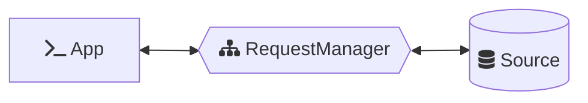

Each handler may choose to fulfill the request using some source of data or to pass the request along to other handlers.

```mermaid
flowchart LR
    A[fa:fa-terminal App] <--> B{{fa:fa-sitemap RequestManager}}
    B <--> C(handler)
    C <--> E(handler)
    E <--> F(handler)
    C <--> D[(fa:fa-database Source)]
    E <--> G[(fa:fa-database Source)]
    F <--> H[(fa:fa-database Source)]
```

The same or a separate instance of a `RequestManager` may also be used to fulfill requests issued by [*Ember***Data**{Store}](https://github.com/emberjs/data/tree/main/packages/store)

```mermaid
flowchart LR
    A[fa:fa-terminal App] <--> D{fa:fa-code-fork Store}
    B{{fa:fa-sitemap RequestManager}} <--> C[(fa:fa-database Source)]
    D <--> E[(fa:fa-archive Cache)]
    D <--> B
    click D href "https://github.com/emberjs/data/tree/main/packages/store" "Go to @ember-data/store" _blank
    click E href "https://github.com/emberjs/data/tree/main/packages/json-api" "Go to @ember-data/json-api" _blank
    style D color:#58a6ff;
    style E color:#58a6ff;
```

When the same instance is used by both this allows for simple coordination throughout the application. Requests issued by the `Store` will use the in-memory cache and return hydrated responses, requests issued directly to the `RequestManager` will skip the in-memory cache and return raw responses.

```mermaid
flowchart LR
    A[fa:fa-terminal App] <--> B{{fa:fa-sitemap RequestManager}}
    B <--> C[(fa:fa-database Source)]
    A <--> D{fa:fa-code-fork Store}
    D <--> E[(fa:fa-archive Cache)]
    D <--> B
    click D href "https://github.com/emberjs/data/tree/main/packages/store" "Go to @ember-data/store" _blank
    click E href "https://github.com/emberjs/data/tree/main/packages/json-api" "Go to @ember-data/json-api" _blank
    style D color:#58a6ff;
    style E color:#58a6ff;
```

To see code examples of how to use `RequestManager` see the [basic usage guide](../examples/0-basic-usage.md).

To see how to start migrating your application to use `RequestManager` see the [incremental adoption guide](../../cookbook/incremental-adoption-guide.md).

---

- Previous ← Intro: [What Is a Request?](./0-intro.md)
- Next → [?](./2-.md)
- ⮐ [Requests Guide](../index.md)


---

