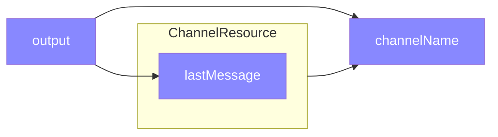
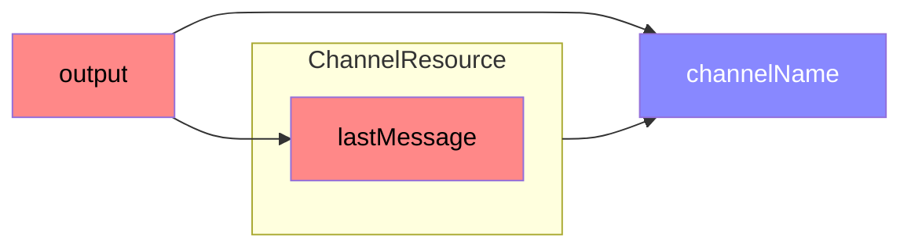
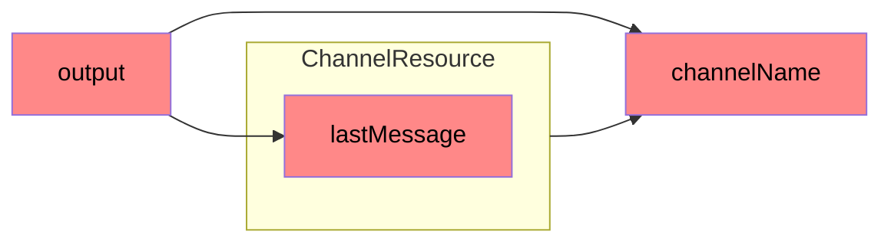

<!-- vi: tabstop=4 noexpandtab -->

# ember-resources

1. [Introduction](./README.md) 👈 You are here
2. [Resources](./resources.md) 
3. [Usage in Ember](./ember.md)

## Reactivity in Ember Octane

With the introduction of Ember's first edition, Octane, a new Reactivity system was introduced, ["tracked properties"](https://blog.emberjs.com/octane-is-here/#toc_glimmer-reactivity).

By the end of the v3.x series, we had _two_ user-facing reactive primitives:

- `@tracked`  
  In Ember Octane, it was assumed that all reactive state, "root state", 
  would exist on a property in class instance, 
  which could then be decorated with the `@tracked` decorator. 
  This allows the decorator to define a [getter and setter](https://github.com/tc39/proposal-decorators#class-auto-accessors) so that the reactivity system can operate while still allowing "native property getting and setting" (e.g.: without `Ember.get` and `Ember.set`).

- functions  
  In Ember Octane and before, these were called "helpers". It wasn't until [`ember-source@4.5`](https://blog.emberjs.com/ember-4-5-released) that plain functions became supported as a reactive primitive without [the polyfill](https://github.com/ember-polyfills/ember-functions-as-helper-polyfill). However, "helpers", (now called ["classic helpers"](https://guides.emberjs.com/v5.0.0/components/helper-functions/#toc_classic-helpers)) had two implementations: a simpler function-based version, and class-based version. These both required framework-specific abstractions to use and build, but the class-based version of these classic helpers had cleanup capabilities (albeit, awkwardly, via inheritance).

## Rethinking Reactivity

- values  
  A value is the most basic kind of reactive primitive. It's a place to store data that can be updated atomically. Updates to values take effect immediately.

- functions  
  JavaScript has a built in mechanism for computing values based on other values: functions. Supporting functions as a reactive primitive, as well as their arguments, is essential for reducing the number of abstractions folks need to learn. 

- functions with cleanup  
  Many things in a JavaScript app require cleanup, but it is often forgotten about, leading to memory leaks, increased network activity, and increased CPU usage. This includes handling timers, intervals, fetch, sockets, etc.
	

These are general concepts that extend beyond Ember or any framework -- and this is what [Starbeam](https://www.starbeamjs.com/) is solving -- _Universal Reactivity_.

### _This is where Starbeam comes in_


In Starbeam,
- Values are [_`Cell`s_](https://www.starbeamjs.com/guides/fundamentals/cells.html)
- Functions are just [functions](https://www.starbeamjs.com/guides/fundamentals/functions.html)
- Functions with cleanup are [_`Resource`s_](https://www.starbeamjs.com/guides/fundamentals/resources.html)

And Starbeam is planned for inclusion in the next [edition](https://emberjs.com/editions/) of Ember, Polaris.

It's no secret that Ember's community is smaller than other javascript communities, so one of the goals of Polaris is to reduce the amount of maintenance that a small community needs to do. For example, the [embroider](https://github.com/embroider-build/embroider/) project aims to reduce the maintenance burden on the build system by using broader ecosystem tools such as webpack, vite, rollup, etc. Another example is the reactivity system, `@glimmer/tracking`. We don't need it to be specific to Ember, and in fact, the Starbeam project _is that_ -- Ember's Reactivity _for everyone_, and has focused on [`React`](https://www.starbeamjs.com/frameworks/react/) and [`Preact`](https://www.starbeamjs.com/frameworks/preact/) first, with [`Vue`](https://github.com/starbeamjs/starbeam/tree/main/packages) shortly behind. Reactivity is a non-trivial system that, with bigger community, can help lighten the load on ember maintainers, and additionally breathe new life (and performance) in to the framework by providing reactive primitives at a much lower layer in the tech stack.

<details><summary>Additional Starbeam primitives</summary>

While starbeam includes the 3 primitives listed above, 
there are still two more primitives coming -- not just because Ember needs them, but because 
all of JavaScript needs them.

Those primitives are:
- modifiers  
  The building blocks are here to build modifiers already, as modifiers are a resource builder that receives an element as one of its arguments.
- services  
  The building blocks are here to build services already, as services are resources where their lifetime is tied to the application, rather than something more ephemeral, like a component.

</details>

### ✨ ~ ember-resources ~ ✨ ~ Starbeam ~ ✨

`ember-resources` is a _sort of_ polyfill for Starbeam for use in Ember, supporting `ember-source@3.28.0`+. 

`ember-resources` is built in user-land on top of 100% public APIs.

When Starbeam is integrated in to Ember, there will be codemods to help migrate.

### Values

This is a reactive value.
```js 
const greeting = cell('Hello there!');
```
It can be read and updated, just like a `@tracked` function.

Here is an [interactive demo](https://tutorial.glimdown.com/2-reactivity/1-values) demonstrating how `cell` can be used anywhere (in this case, in module-space[^module-space])

<details><summary>Code for the demo</summary>

```gjs
import { cell } from 'ember-resources';

const greeting = cell("Hello there!");

// Change the value after 3 seconds
setTimeout(() => {
	greeting.current = "General Kenobi!";
}, 3000);

<template>
	Greeting: {{greeting.current}}
</template>
```

</details>


[^module-space]: Even though we can define state in module-space, you typically do not want to do so in your apps. Adding state at the module level is a "module side-effect", and tree-shaking tools may not tree-shake if they detect a "module side-effect". Additionally, when state is, in some way, only created within the context of an app, that state is easily reset between tests (assuming that app state is not shared between tests).

> **Note** <br>
> Cells do not _replace_ `@tracked` or `TrackedObject` / `TrackedArray` or any other reactive state utility you may be used to, but they are another tool to use in your applications and libraries and are otherwise an implementation detail of the more complex reactive data-structures.

<details><summary>Deep Dive: Re-implementing @tracked</summary>

When framing reactivity in terms of "cells", the implementation of `@tracked` could be thought of as an abstraction around a `getter` and `setter`, backed by a private `cell`:

```js 
class Demo {
	#greeting = cell('Hello there!');

	get greeting() {
		return this.#greeting.current;
	}
	set greeting(value) {
		this.#greeting.set(value);
	}
}
```


And then actual implementation of the decorator, which abstracts the above, is only a handful of lines:

```js 
function tracked(target, key, descriptor) {
	let cache = new WeakMap();

	let getCell = (ctx) => {
		let reactiveValue = cache.get(ctx);

		if (!reactiveValue) {
			cache.set(ctx, reactiveValue = cell(descriptor.initializer?.()));
		}

		return reactiveValue;
	};

	return {
		get() {
			return getCell(this).current;
		},
		set(value) {
			getCell(this).set(value);
		}
	}
}
```

Note that this decorator style is using the [Stage 1 / Legacy Decorators](https://github.com/wycats/javascript-decorators/blob/e1bf8d41bfa2591d949dd3bbf013514c8904b913/README.md)

See also [`@babel/plugin-proposal-decorators`](https://babeljs.io/docs/babel-plugin-proposal-decorators#version)


</details>

One huge advantage of this way of defining the lowest level reactive primitive is that we can escape the typical framework boundaries of components, routes, services, etc, and rely every tool JavaScript has to offer. Especially as Starbeam is being developed, abstractions made with these primitives can be used in other frameworks as well.  


Here is an [interactive demo showcasing `@tracked`](https://tutorial.glimdown.com/2-reactivity/2-decorated-values), but framed in way that builds off of this new "value" primitive.

<details><summary>Code for the demo</summary>

```gjs
import { tracked } from '@glimmer/tracking';

class Demo {
	@tracked greeting = 'Hello there!';
}

const demo = new Demo();

// Change the value after 3 seconds
setTimeout(() => {
	demo.greeting = "General Kenobi!";
}, 3000);

<template>
	Greeting: {{demo.greeting}}
</template>
```

</details>

### Functions

This is a reactive function.

```js
function shout(text) {
	return text.toUpperCase();
}
```
It's _just a function_. And we don't like to use the word "just" in technical writing, but there are honestly 0 caveats or gotchyas here.

Used in Ember, it may look like this:
```js
function shout(text) {
	return text.toUpperCase();
}

<template>
	{{shout @greeting}}
</template>
```

The function, `shout`, is reactive: in that when the `@greeting` argument changes, `shout` will be re-called with the new value.


Here is an interactive demo showcasing how [functions are reactive](https://tutorial.glimdown.com/2-reactivity/4-functions)

<details><summary>Code for the demo</summary>

```gjs
import { cell } from 'ember-resources';

const greeting = cell("Hello there!");
const shout = (text) => text.toUpperCase();

// Change the value after 3 seconds
setTimeout(() => {
	greeting.current = "General Kenobi!";
}, 3000);

<template>
	Greeting: {{ (shout greeting.current) }}
</template>
```

</details>


### Functions with cleanup

_Why does cleanup matter?_

Many things in a JavaScript app require cleanup. We need to cleanup in order to:
- prevent memory leaks
- reduce unneeded network activity 
- reduce CPU usage 

This includes handling timers, intervals, fetch, sockets, etc.

_Resources_ are functions with cleanup, but cleanup isn't all they're conceptually concerned with.

>
> Resources Convert Processes Into Values 
>
> Typically, a resource converts an imperative, stateful process.
> That allows you to work with a process just like you'd work with any other reactive value.
> 

For details on resources, see the [Resources chapter](./resources.md).

Here is an interactive demo showcasing how [resources are reactive functions with cleanup](https://tutorial.glimdown.com/2-reactivity/5-resources)

<details><summary>Code for the demo</summary>

```gjs 
import { resource, cell } from 'ember-resources';

const Clock = resource(({ on }) => {
	let time = cell(new Date());
	let interval = setInterval(() => time.current = new Date(), 1000);

	on.cleanup(() => clearInterval(interval));

	return () => time.current;
});

<template>
	It is: <time>{{Clock}}</time>
</template>
```

</details>


## References

- [Starbeam](https://www.starbeamjs.com/) - Reactivity Made Simple and Fun
- [State in Ember](https://guides.emberjs.com/v5.0.0/components/component-state-and-actions/#toc_tracked-properties)
- @pzuraq's Reactivity Series
  - [What is Reactivity?](https://www.pzuraq.com/blog/what-is-reactivity)
  - [What makes a Good Reactive System?](https://www.pzuraq.com/blog/what-makes-a-good-reactive-system)
  - [How Autotracking Works](https://www.pzuraq.com/blog/how-autotracking-works) 
  - [Autotracking Case Study - TrackedMap](https://www.pzuraq.com/blog/autotracking-case-study-trackedmap)
- [Reactive Programming](https://en.wikipedia.org/wiki/Reactive_programming) (Wikipedia)
- Pull-based Reactivity
  - [Starbeam](https://www.starbeamjs.com/) - Reactivity Made Simple and Fun
- Event / Push-based Reactivity
  - [Solid.JS](https://www.solidjs.com/guides/reactivity)


-----------------------------------


Next: [Resources](./resources.md) 


---

# Using Resources with Ember

1. [Introduction](./README.md)
2. [Resources](./resources.md)
3. [Usage in Ember](./ember.md) 👈 You are here

`ember-resources` tries to stay out of your way when working with resources.

This document shows the mechanics of how to interact with a resource in ember.

## Direct usage in template

Using resources directly in templates uses no feature of `ember-resources`, but here we can review the various ways in which resources can be rendered.

### In Strict Mode / `<template>`

Resources work best in strict mode / gjs/gts / `<template>`.

For more information about this format, please see [this interactive tutorial](https://tutorial.glimdown.com)

```gjs
const Clock = resource(/* ... */);

<template>
  {{Clock}}
</template>
```

And then if your resource takes arguments:

```gjs
function Clock(locale) {
  return resource(/* ... */);
}

resourceFactory(Clock)

<template>
  {{Clock 'en-US'}}
</template>
```


### In Templates

In `ember-resources`, resources are powered by Ember's "Helper Manager" APIs, such as [`invokeHelper`](https://api.emberjs.com/ember/release/functions/@ember%2Fhelper/invokeHelper).

So in order to use resources in template-only components, they'll need to be re-exported in your `app/helpers/*` folder.

For example, by defining `app/helpers/clock.js`,
```js
export { Clock as default } from './location/of/clock';
```

you'd then be able to directly reference `Clock` in your template, albeit in the lower-kebab-case format (i.e.: if your helper is MultiWord, it's invoked as `multi-word`),

```hbs
{{ (clock) }}
```


### When the template has a backing class.

Because resources in `ember-resources` are backed by the Helper Manager API, and ever since "everything that has a value can be used in a template" [docs here](https://guides.emberjs.com/release/in-depth-topics/rendering-values/), we can _almost_ use resources in templates _as if_ you were using `<template>`.
This is not a feature of ember-resources, but it is a useful technique that we've been able to use since `ember-source@3.25`

```js
import { Clock } from './location/of/clock';
import Component from '@glimmer/component';

export default class Demo extends Component {
  /**
   * This looks goofy!
   * This assigns the value "Clock" to the property on Demo, "Clock"
   * [property] = value;
   *
   * It could also be
   * AClock = Clock, and then access in the template as this.AClock
   */
  Clock = Clock;
}
```
```hbs
{{this.Clock}}

{{! and if Clock takes arguments }}

{{this.Clock 'en-US'}}
```

## Usage in JavaScript

In JavaScript, we need a helper utility to bridge from native javascript in to ember's reactivity system.

When using `@use`, the host class will need to have [_the Owner_](https://api.emberjs.com/ember/5.0/modules/@ember%2Fowner) set on it.

Resources may only be composed within
- a class with an owner
- another resource (covered [here](./resources.md)


```js
import { use } from 'ember-resources';
import { Clock } from './location/of/clock';

class Demo {
  clock = use(this, Clock);
}
```

Or, if the resource takes arguments:

```js
import { use } from 'ember-resources';
import { Clock } from './location/of/clock';

class Demo {
  clock = use(this, Clock('en-US'));
}
```

If you need the argument(s) to the resource to be reactive, you can pass a function:

```js
import { use } from 'ember-resources';
import { tracked } from '@glimmer/tracking';
import { Clock } from './location/of/clock';

class Demo {
  @tracked locale = 'en-US';

  clock = use(this, Clock(() => this.locale));
}
```

<details><summary>why can't a decorator be used here?</summary>

When defining a function in the decorator

```js
class Demo {
  @use(Clock(() => this.locale)) clock;
  /* ... */
}
```

The arrow function does _not_ take on the context of the class instance,
because decorators are evaluated before an instance is created.
The `this` is actually the type of the context that the class is defined in.

This form of decorator *is* implemented, but it turned out to not be useful
enough for the variety of use cases we need for resource invocation.

Here is how it looks for no args, and static args, and both of these situations
work as you'd expect:

```js

import { use } from 'ember-resources';
import { Clock, ClockWithArgs } from './location/of/clock';

class Demo {
  @use(Clock) clock;
  @use(ClockWithArgs('en-US')) clockWithArg;
}
```

</details>

This technique with using a function is nothing special to ember-resources, and can be used with any other data / class / etc as well.

Further, if multiple reactive arguments are needed with individual reactive behavior, you may instead decide to have your wrapping function receive an object.

<details><summary>about resourceFactory</summary>

`resourceFactory` is a pass-through function purely for telling ember to
invoke the underlying resource immediately after invoking the `resourceFactory` function.

This is why we don't use its return value: it's the same as what you pass to it.

Without `resourceFactory`, ember would need extra internal changes to support primitives that
don't yet exist within the framework to, by convention, decide to _double-invoke_ the functions.

The signature is basically `() => () => Value`, where we want to flatten that chain of functions to get the underlying `Value`.

</details>


```js
import { use } from 'ember-resources';
import { tracked } from '@glimmer/tracking';
import { Clock } from './location/of/clock';

class Demo {
  @tracked locale = 'en-US';
  @tracked timezone = 'America/New_York';

  clock = use(this, Clock({
    locale: () => this.locale,
    timeZone: () => this.timezone,
  }));
}
```

So when authoring a `Clock` that receives these types of function arguments, but _also_ needs to support being invoked from a template, how do you implement that?

```js
import { resourceFactory } from 'ember-resources';

export function Clock(args) {
  return resource(() => {
    let { locale, timeZone } = args;

    // each of locale and timeZone could be either be a
    // string or a function that returns a string
    let localeValue = typeof locale === 'function' ? locale() : locale;
    let timeZoneValue = typeof timeZone === 'function' ? timeZone() : timeZone;

    // ...
  });
}

resourceFactory(Clock);
```

<details><summary>using functions for fine-grained reactivity</summary>

Earlier, it was mentioned that this way of managing reactivity isn't specific to `ember-resources`.
That's because it's one technique you can use to build native classes in you app that have fine-grained reactivity.

For example, say you have a component:
```js
import Component from '@glimmer/component';

export default class Demo extends Component {
  /** ... */
}
```

And you have want to manage state in another class that doesn't necessarily need to a be a component.
For example, this could be a data abstraction, or a statemachine, or some other integration with the browser.

```js
class MyState {}
```

You can assign an instance of `MyState` to an instance of your component by calling `new`.

```js
import Component from '@glimmer/component';

export default class Demo extends Component {
  state = new MyState();

  /** ... */
}
```

but then to pass args, you may expect that you'd pass them like this:

```js
import Component from '@glimmer/component';

export default class Demo extends Component {
  state = new MyState(this.locale, this.timezone);

  /** ... */
}
```

But this is not reactive, because the values of `locale` and `timezone` are evaluated at the time of creating `MyState`.

We can delay auto-tracking by converting these properties to functions:
```js
import Component from '@glimmer/component';

export default class Demo extends Component {
  state = new MyState(() => this.locale, () => this.timezone);

  /** ... */
}
```

and then using them in getters:
```js
class MyState {
  constructor(localeFn, timeZoneFn) {
    this.#localeFn = localeFn;
    this.#timeZoneFn = timeZoneFn;
  }

  get locale() {
    return this.#localeFn();
  }

  get timeZone() {
    return this.#timeZoneFn();
  }
}
```

And then all the way back in our component template (`demo.hbs`), we can say:
```hbs
{{this.state.locale}}

and

{{this.state.timeZone}}
```

and each of the individual `{{ }}` usages will individually auto-track with the corresponding properties on `MyState`.


</details>


## Usage in TypeScript / Glint

### Typing the above examples

If you've used TypeScript in Ember before, this may look familiar as we declare the types on services in the same way. This follows the same pattern described [here](https://jamescdavis.com/declare-your-injections-or-risk-losing-them/)

```ts
import { use } from 'ember-resources';
import { Clock, ClockWithArgs } from './location/of/clock';

class Demo {
  clock = use(this, Clock);
// ^? string

  clock2 = use(this, ClockWithArgs('en-US'));
// ^? string
}
```

```ts
import { use } from 'ember-resources';
import { tracked } from '@glimmer/tracking';
import { Clock, ClockWithReactiveArgs } from './location/of/clock';

class Demo {
  @tracked locale = 'en-US';

  clock = use(this, ClockWithReactiveArgs(() => this.locale));
// ^? string
}
```


### For Library Authors

For TypeScript, you may have noticed that, if you're a library author, you may want to be concerned with supporting all usages of resources in all contexts, in which case, you may need to support overloaded function calls.

Here is how the overloads for `Compiled`, the resource that represents a dynamically compiled component, provided by `ember-repl`, and used by https://limber.glimdown.com and https://tutorial.glimdown.com.

[compile/index.ts](https://github.com/NullVoxPopuli/limber/blob/main/packages/ember-repl/addon/src/browser/compile/index.ts)

```ts
// Additional types and APIs omitted for brevity
export function Compiled(markdownText: Input | (() => Input)): State;
export function Compiled(markdownText: Input | (() => Input), options?: Format): State;
export function Compiled(markdownText: Input | (() => Input), options?: () => Format): State;
export function Compiled(markdownText: Input | (() => Input), options?: ExtraOptions): State;
export function Compiled(markdownText: Input | (() => Input), options?: () => ExtraOptions): State;

export function Compiled(
  markdownText: Input | (() => Input),
  maybeOptions?: Format | (() => Format) | ExtraOptions | (() => ExtraOptions)
): State {
  return resource(() => {
    let maybeObject =
      typeof maybeOptions === 'function' ? maybeOptions() : maybeOptions;
    let format =
      (typeof maybeObject === 'string' ? maybeObject : maybeObject?.format) || 'glimdown';
    let options =
      (typeof maybeObject === 'string' ? {} : maybeObject) || {};

    let input = typeof markdownText === 'function' ? markdownText() : markdownText;

    /* ... */

    return () => ({
      isReady: ready.current,
      error: error.current,
      component: result.current,
    });
  });
}

resourceFactory(Compiled)
```

When defining `Compiled` this way, we can be type-safe in a variety of situations.
Note that when we invoke from a template, we don't need to worry about functions because,
in templates, all tracked values are inherently reactive, and will re-invoke functions appropriately.

> **Note** <br>
> The function concept here is this demo is _an_ example of how to pass on reactivity to future auto-tracking context. You could pass a `Cell` (created with this library's `cell` util), or some other instance of an object that has its own tracked properties. Functions, however, are a platform primitive that allows for easy demoing -- but it's important to use the abstraction that best fits your, and your team's, use case.

<details>
<summary>  Using `Compiled` as

`(doc: string) => State`

</summary>

- Usage in gjs directly in the template:

  ```gjs
  import { Compiled } from 'ember-repl';

  let doc = '...';

  <template>
    {{#let (Compiled doc) as |state|}}
       ...
    {{/let}}
  </template>
  ```
  This is reactive

- Usage in a class

  ```gjs
  import Component from '@glimmer/component';
  import { tracked } from '@glimmer/tracking';

  import { use } from 'ember-resources';
  import { Compiled } from 'ember-repl';

  export default class Demo extends Component {
    @tracked doc = '...';

    @use(Compiled(this.doc)) state;

    /* ... */
  }
  ```
  This is _not_ reactive because the value of `this.doc` is read when evaluating the decorator.

</details>


<details>
<summary>  Using `Compiled` as

`(doc: string, options: ExtraOptions) => State`

</summary>

- Usage in gjs directly in the template:
  ```gjs
  import { Compiled } from 'ember-repl';
  import { hash } from '@ember/helper';

  let doc = '...';

  <template>
    {{#let (Compiled doc (hash format='gjs')) as |state|}}
       ...
    {{/let}}
  </template>
  ```

- Usage in a class

  ```gjs
  import Component from '@glimmer/component';
  import { tracked } from '@glimmer/tracking';

  import { use } from 'ember-resources';
  import { Compiled } from 'ember-repl';

  export default class Demo extends Component {
    @tracked doc = '...';
    @tracked format = '...';

    state = use(this, Compiled(this.doc, { format: this.format }));

    /* ... */
  }
  ```
  This is _not_ reactive because the value both `this.doc` and the second arg are read when evaluating the decorator.

</details>


<details>
<summary>  Using `Compiled` as

`(doc: string, format: Format) => State`

</summary>

- Usage in gjs directly in the template:
  ```gjs
  import { Compiled } from 'ember-repl';
  import { hash } from '@ember/helper';

  let doc = '...';

  <template>
    {{#let (Compiled doc 'gjs') as |state|}}
       ...
    {{/let}}
  </template>
  ```


- Usage in a class
  ```gjs
  import Component from '@glimmer/component';
  import { tracked } from '@glimmer/tracking';

  import { use } from 'ember-resources';
  import { Compiled } from 'ember-repl';

  export default class Demo extends Component {
    @tracked doc = '...';
    @tracked format = '...';

    state = use(this, Compiled(this.doc, this.format));

    /* ... */
  }
  ```
  This is _not_ reactive because the value both `this.doc` and `this.format` are read when evaluating the decorator.

</details>


<details>
<summary>  Using `Compiled` as

`(doc: () => string) => State`

</summary>

- Usage in a class
  ```gjs
  import Component from '@glimmer/component';
  import { tracked } from '@glimmer/tracking';

  import { use } from 'ember-resources';
  import { Compiled } from 'ember-repl';

  let doc = '...';

  export default class Demo extends Component {
    @tracked doc = '';

    state = use(this, Compiled(() => this.doc));

    /* ... */
  }
  ```

</details>


<details>
<summary>  Using `Compiled` as

`(doc: () => string, format: Format) => State`

</summary>

- Usage in a class
  ```gjs
  import Component from '@glimmer/component';
  import { tracked } from '@glimmer/tracking';

  import { use } from 'ember-resources';
  import { Compiled } from 'ember-repl';

  let doc = '...';

  export default class Demo extends Component {
    @tracked doc = '';

    state = use(this, Compiled(() => this.doc, 'gjs'));

    /* ... */
  }
  ```

</details>

<details>
<summary>  Using `Compiled` as

`(doc: () => string, format: () => Format) => State`

</summary>

- Usage in a class
  ```gjs
  import Component from '@glimmer/component';
  import { tracked } from '@glimmer/tracking';

  import { use } from 'ember-resources';
  import { Compiled } from 'ember-repl';

  let doc = '...';

  export default class Demo extends Component {
    @tracked doc = '';
    @tracked format = 'gjs';

    state = use(this, Compiled(() => this.doc, () => this.format));

    /* ... */
  }
  ```

</details>

<details>
<summary>  Using `Compiled` as

`(doc: () => string, options: ExtraOptions) => State`

</summary>

- Usage in a class
  ```gjs
  import Component from '@glimmer/component';
  import { tracked } from '@glimmer/tracking';

  import { use } from 'ember-resources';
  import { Compiled } from 'ember-repl';

  let doc = '...';

  export default class Demo extends Component {
    @tracked doc = '';

    state = use(this, Compiled(() => this.doc, { format: 'gjs', ...extraOptions }));

    /* ... */
  }
  ```

</details>


<details>
<summary>  Using `Compiled` as

`(doc: () => string, options: () => ExtraOptions) => State`

</summary>

- Usage in a class
  ```gjs
  import Component from '@glimmer/component';
  import { tracked } from '@glimmer/tracking';

  import { use } from 'ember-resources';
  import { Compiled } from 'ember-repl';

  let doc = '...';

  export default class Demo extends Component {
    @tracked doc = '';
    @tracked options = { format: 'gjs', ...extraOptions };

    state = use(this, Compiled(() => this.doc, () => this.options));

    /* ... */
  }
  ```

Note that for this example, it's possible to have as fine-grained reactivity as you want:

  ```gjs
  import Component from '@glimmer/component';
  import { tracked } from '@glimmer/tracking';

  import { use } from 'ember-resources';
  import { Compiled } from 'ember-repl';

  let doc = '...';

  export default class Demo extends Component {
    @tracked doc = '';

    // this isn't supported by the example, but it's possible to implement,
    // if the need is there
    state = use(this, Compiled(() => this.doc), {
        format: () => this.format,
        foo: () => this.foo,
        bar: () => this.bar,
    });

    /* ... */
  }
  ```

</details>


-----------------------------


Previous: [Resources](./resources.md) 👈 You are here


---

# Resources

1. [Introduction](./README.md)
2. [Resources](./resources.md) 👈 You are here
3. [Usage in Ember](./ember.md)

_this document has been adapted/copied[^copying] from the Starbeam[^starbeam] documentation_


This is a high-level introduction to Resources, and how to use them.
For how to integrate Resources in to Ember (Components, etc), see [./ember.md](./ember.md);

In addition to the live demos accompanying each code snippet, all code snippets will have their Starbeam counterparts below them, so that folks can see how similar the libraries are.

When Starbeam is integrated in to Ember, there will be a codemod to convert from ember-resources' APIs to Starbeam's APIs.

_details on that soon_


<hr>


> **Note** <br>
> A resource is a reactive function with cleanup logic.

Resources are created with an owner, and whenever the owner is cleaned up, the resource is also cleaned up. This is called ownership linking.

Typically, a component in your framework will own your resources. The framework renderer will make sure that when your component is unmounted, its associated resources are cleaned up.

<details>
<summary>Resources Convert Processes Into Values</summary>

Typically, a resource converts an imperative, stateful process, such as an asynchronous request or a ticking timer, into a reactive value.

That allows you to work with a process just like you'd work with any other reactive value.

This is a very powerful capability, because it means that adding cleanup logic to an existing reactive value doesn't change the code that works with the value.

The only thing that changes when you convert a reactive value into a resource is that it must be instantiated with an owner. The owner defines the resource's lifetime. Once you've instantiated a resource, the value behaves like any other reactive value.

</details>

## A Very Simple Resource

To illustrate the concept, let's create a simple resource that represents the current time.

```js
import { cell, resource } from "ember-resources";

export const Now = resource(({ on }) => {
  const now = cell(Date.now());

  const timer = setInterval(() => {
    now.set(Date.now());
  });

  on.cleanup(() => {
    clearInterval(timer);
  });

  return now;
});
```

To see this code in action, [checkout the live demo](https://limber.glimdown.com/edit?c=MQAggiDKAuD2AOB3AhtAxgCwFBYCIFMBbWAOwGdoAnVAS1JFgDMRkQAlfM2AV0rXxDQMqEAGt8%2BeGUHU0ohs1yp8AOhKxELaQEduNOVpA1oINMhI4ABtYDmAK2kAbGgDd8WGoXixKJgN4glJw8fPgANKb4jo4gAL4gjJSwhCAA5EQARviUALRBXLz8ZKkA3Dj4AB7evqakFCAAchogALyBwYX4ABRdAfSxAJStAHwgflggteQm6ppt-NFdStCqs10DA2UgE1P10J7ZrSBk%2BNAAkiQrlC7Ijj1DLaPjk5OzKifQS8pqGuubO4MtjtSCo0I58OZuPB7iMxjtJmCIZQLlcbnd9oRsv9JoCdjsgtBeCQQLMyricAAeFZeRzKYY7M4mGhkABcICpB2Gfj8TUQsViFIA9Bj8PShdT4LSVvTrJYgA&format=glimdown).

<details><summary>In Starbeam</summary>

```js
import { Cell, Resource } from "@starbeam/universal";

export const Now = Resource(({ on }) => {
  const now = Cell(Date.now());

  const timer = setInterval(() => {
    now.set(Date.now());
  });

  on.cleanup(() => {
    clearInterval(timer);
  });

  return now;
});
```

</details>


> **:bulb:** <br>
> A resource's return value is a reactive value. If your resource represents a single cell, it's fine to return it directly. It's also common to return a function which returns reactive data -- that depends on reactive state that you created inside the resource constructor.

When you use the `Now` resource in a component, it will automatically get its lifetime linked to that component. In this case, that means that the interval will be cleaned up when the component is destroyed.

The `resource` function creates a resource Constructor. A resource constructor:

1. Sets up internal reactive state that changes over time.
2. Sets up the external process that needs to be cleaned up.
3. Registers the cleanup code that will run when the resource is cleaned up.
4. Returns a reactive value that represents the current state of the resource as a value.

In this case:

| internal state | external process | cleanup code | return value |
| ---- | ---- | ---- | ---- |
| `Cell<number>` | `setInterval` | `clearInterval` | `Cell<number>` |


<details><summary>Resource's values are immutable</summary>

When you return a reactive value from a resource, it will always behave like a generic, immutable reactive value. This means that if you return a `cell` from a resource, the resource's value will have `.current` and `.read()`, but not `.set()`, `.update()` or other cell-specific methods.

If you want your resource to return a value that can support mutation, you can return a JavaScript object with accessors and methods that can be used to mutate the value.

This is an advanced use-case because you will need to think about how external mutations should affect the running process.

</details>

## A Ticking Stopwatch

Here's a demo of a `Stopwatch` resource, similar to the above demo.
The main difference here is that the return value is a function.

```js
import { resource, cell } from 'ember-resources';

const formatter = new Intl.DateTimeFormat("en-US", {
  hour: "numeric",
  minute: "numeric",
  second: "numeric",
  hour12: false,
});

export const Stopwatch = resource((r) => {
  const time = cell(new Date());

  const interval = setInterval(() => {
    time.set(new Date());
  }, 1000);

  r.on.cleanup(() => {
    clearInterval(interval);
  });

  return () => {
    const now = time.current;

    return formatter.format(now);
  };
});
```

To see this code in action, [checkout the live demo](https://limber.glimdown.com/edit?c=MQAggiDKAuD2AOB3AhtAxgCwFBYCIFMBbWAOwGdoAnVAS1JFgDMRkQAlfM2AV0rXxDQMqEAGt8%2BeGUHU0ohsyEC0vSvhLRBNQvgA0LEgBMQjWJUKppNTYgzqQao-ko0SAcwB0OAAa%2B3AK2kAGxoAN3wsbXgzTQBvB04ePj0QfiCgkABfE0pYQhAAciIAI2cAWjUuXn4yAoBuHDRSChMzC2hoZxAAXhASfEQQAEkNII9cVHwAFW18ADE21AAKACJ1MoBVSBX9WKwQEAwkgC4QFZJuHRc0Hf2QQlduTtPzy%2BcaG907snwmoxeLlcPrcDkdeABGABMp0YyCCPy%2BmQAlA0sH8WjAECh0Bgegkqsklkt4vRkT0AHwgPYHdGaaCzPFpIJLfqDCadJZIlF3WkgVydSihOF4n7QEYCoXMzkUrQ6DwqSiOTS9Vkgdn4Tn6cEABl13LupHlQXwyAu8CJSJlaGNyEo4uckqW-IdcK5qIOamgvBIIGl3Up1IOqWamhIsEGvXpcoVSvdQc93ta5lQAo8pmT0BZ4e5B0yWGRqIAPJ1CPAgpNyXchpoaGRTsXZuTYrFMUhUJhMplCwB6KP4Ss9ktlitYXzeIA&format=glimdown).

<details><summary>In Starbeam</summary>

```js
import { Cell, Formula, Resource } from "@starbeam/universal";

export const Stopwatch = Resource((r) => {
  const time = Cell(new Date());

  const interval = setInterval(() => {
    time.set(new Date());
  }, 1000);

  r.on.cleanup(() => {
    clearInterval(interval);
  });

  return Formula(() => {
    const now = time.current;

    return new Intl.DateTimeFormat("en-US", {
      hour: "numeric",
      minute: "numeric",
      second: "numeric",
      hour12: false,
    }).format(now);
  });
});
```

</details>

A description of the `Stopwatch` resource:

| internal state | external process | cleanup code | return value |
| ---- | ---- | ---- | ---- |
| `Cell<Date>` | `setInterval` | `clearInterval` | `string` |

The internals of the `Stopwatch` resource behave very similarly to the `Now` resource. The main difference is that the `Stopwatch` resource returns the time as a formatted string.

From the perspective of the code that uses the stopwatch, the return value is a normal reactive string.

## Reusing the `Now` Resource in `Stopwatch`

You might be thinking that `Stopwatch` reimplements a whole bunch of `Now`, and you ought to be able to just use `Now` directly inside of `Stopwatch`.

You'd be right!

```js
const formatter = new Intl.DateTimeFormat("en-US", {
  hour: "numeric",
  minute: "numeric",
  second: "numeric",
  hour12: false,
});

const Stopwatch = resource(({ use }) => {
  const time = use(Now);

  return () => formatter.format(time.current);
});
```

<details><summary>In Starbeam</summary>

```js
const formatter = new Intl.DateTimeFormat("en-US", {
  hour: "numeric",
  minute: "numeric",
  second: "numeric",
  hour12: false,
});

const Stopwatch = Resource(({ use }) => {
  const time = use(Now);

  return Formula(() => formatter.format(time.current));
});
```

</details>

The `Stopwatch` resource instantiated a `Now` resource using its use method. That automatically links the `Now` instance to the owner of the `Stopwatch`, which means that when the component that instantiated the stopwatch is unmounted, the interval will be cleaned up.

## Using a Resource to Represent an Open Channel

Resources can do more than represent data like a ticking clock. You can use a resource with any long-running process, as long as you can represent it meaningfully as a "current value".

<details><summany>Compared to other systems: Destiny of Unused Values</summary>

You might be thinking that resources sound a lot like other systems that convert long-running processes into a stream of values (such as observables).

While there are similarities between Resources and stream-based systems, there is an important distinction: because Resources only produce values on demand, they naturally ignore computing values that would never be used.

This includes values that would be superseded before they're used and values that would never be used because the resource was cleaned up before they were demanded.

**This means that resources are not appropriate if you need to fully compute values that aren't used by consumers.**

In stream-based systems, there are elaborate ways to use scheduling or lazy reducer patterns to get similar behavior. These approaches tend to be hard to understand and difficult to compose, because the rules are in a global scheduler, not the definition of the stream itself. These patterns also give rise to distinctions like "hot" and "cold" observables.

On the other hand, Starbeam Resources naturally avoid computing values that are never used by construction.

TL;DR Starbeam Resources do not represent a stream of values that you operate on using stream operators.

> **:key: Key Point** <br>
>Starbeam resources represent a single reactive value that is always up to date when demanded.

This also allows you to use Starbeam resources and other values interchangably in functions, and even pass them to functions that expect reactive values.

</details>

Let's take a look at an example of a resource that receives messages on a channel, and returns a string representing the last message it received.

In this example, the channel name that we're subscribing to is dynamic, and we want to unsubscribe from the channel whenever the channel name changes, but not when we get a new message.

```js
import { resourceFactory, resource, cell } from 'ember-resources';

function ChannelResource(channelName) {
  return resource(({ on }) => {
    const lastMessage = cell(null);

    const channel = Channel.subscribe(channelName);

    channel.onMessage((message) => {
      lastMessage.set(message);
    });

    on.cleanup(() => {
      channel.unsubscribe();
    });

    return () => {
      const prefix = `[${channelName}] `;
      if (lastMessage.current === null) {
        return `${prefix} No messages received yet`;
      } /*E1*/ else {
        return `${prefix} ${lastMessage.current}`;
      }
    };
  });
}
resourceFactory(ChannelResource);
```

To see this code in action, [checkout the live demo](https://limber.glimdown.com/edit?c=MQAgMglgtgRgpgJxAUQCYQC4HsEChcAicUWAdgM4YICGGEZIWAZiNSAEpzlYCuCAxnBAYAFrRAI4AB0nk4pDOWEihAIhKUJcQQpBQu5agHM4qrYIgA3OKkalWIAOpwYAZSz8A1nAwgAwmKkpHAANgB0%2BAAG0UYAVkohVnC40FI4vgDeWtx8ggBi1PzYCACeADTZvAJwFYIhISAAviBMCFhQIADkxPAIALSyVYLknQDc%2BAD0AFRTIAAKkhjytgHUQaEgqSHE8hi09PZMOCAwkpaYJSBTE7j8ZJqr6w0AvCAZuCAg5Dww5PwIEHgAC4QAAKfiBYIhABy1H0AEoQM8AHxvD6fEDbXz8aj1GCFTxKV4AbQAuuN0Z8JhMvtAeCFaEJJBZzqQjF8PN5fPpyIYTEopIh6OgcfUSpTMT5NgpEJZcUivj4AJIyhBykKg0GIlFojEYrGbWyvACytBEYTaPFIqFBptEFrWqHaWquIAAHAAGREAahAAEZxnrPgaQHwXiBIiIMBgpOQgdTyAB3ahSCBhVBwSwTFMQCYAEgyELWUNh%2Bka%2BYyEFQjUi%2BCDLR8ENBYfhEr1YVE8lBsjSFCEOp79zgYXiZC1rfrnw7KlIoNQtDYOvek4xopC%2BK85DCUBT4Nx64JSNRa43njnC7CpDhcHhE8njXhgYxjQqfo978fdYxiz49mXQbIY0DGMOAQVBJhSG1Y991PLcpB4cgRHAyCyjbUMKB%2BP4AWBMEoN1ScTwJIkQDJJ9634bZqAQFUljVXFQQgVV1U-etGglNjPjYtj8DuChfEeKFOByaoFUGXI4AKIocBKTUiyeUsbyPfCfwQewxOqTUsgYB8lP-T5eM0BlKCA3kQIVOoNVIekQhYiUDOxSENleATQjCb5fn%2BQE4HBRyYWvWy9TkqEwkA4CTE1Hk%2BUUpc0KMjATKityfFBSKQJY58AoxMgwgouA1h4KRNTwvTV18sIrXcrCvK1Mimkyz4VPsF0YvI%2B5fBkOAmAgAAPBVImJAsgtCBTGlJCNas%2BCAWFBOKEpAnK%2BEkXRnhWkArPqRESr1RqIwLDquu65poSwPQwq4cw4CSWwSh8SIJqaEBpmQP1rhAUI5Hw%2BsdsiPbJAO5oC1ms6FoQJaMBre6OOfJ8H3GWH8AAHiWKApAZJZkXRBH0EsL4MBKbZnlUGAcAzBAQT9KReu4RJUFGEApGoVB0DZcnJCgUZVAxvUMgyFyQiEoY1EFLBUdMRooYRiZsYxyXkdRxkMeiWsgA&format=glimdown)

<details><summary>In Starbeam</summary>

```js
import { Resource, Cell, Formula } from '@starbeam/universal';

function ChannelResource(channelName) {
  return Resource(({ on }) => {
    const lastMessage = Cell(null);

    const channel = Channel.subscribe(channelName.read());

    channel.onMessage((message) => {
      lastMessage.set(message);
    });

    on.cleanup(() => {
      channel.unsubscribe();
    });

    return Formula(() => {
      const prefix = `[${channelName.read()}] `;
      if (lastMessage.current === null) {
        return `${prefix} No messages received yet`;
      } /*E1*/ else {
        return `${prefix} ${lastMessage.current}`;
      }
    });
  });
}
```

</details>

`ChannelResource` is a JavaScript function that takes the channel name as a reactive input and returns a resource constructor.

That resource constructor starts by subscribing to the current value of the `channelName`, and then telling Ember to unsubscribe from the channel when the resource is cleaned up.

It then creates a cell that holds the last message it received on the channel, and returns a function that returns that message as a formatted string (or a helpful message if the channel hasn't received any messages yet).

At this point, let's take a look at the dependencies:



Our output depends on the channel name and the last message received on that channel. The lastMessage depends on the channel name as well, and whenever the channel name changes, the resource is cleaned up and the channel is unsubscribed.

If we receive a new message, the lastMessage cell is set to the new message. This invalidates lastMessage and therefore the output as well.



However, this does not invalidate the resource itself, so the channel subscription remains active.

On the other hand, if we change the channelName, that invalidates the ChannelResource itself.



As a result, the resource will be cleaned up and the channel unsubscribed. After that, the resource will be re-created from the new channelName, and the process will continue.


> **:key: Key Point** <br> From the perspective of the creator of a resource, the resource represents a stable reactive value.

<details><summary>Under the hood</summary>

Under the hood, the internal `ChannelResource` instance is cleaned up and recreated whenever its inputs change. However, the resource you got back when you created it remains the same.
</details>


----------------------------------------

Previous: [Introduction](./README.md)
Next: [Usage in Ember](./ember.md)


[^starbeam]: These docs have been adapted from the [Starbeam](https://www.starbeamjs.com/guides/fundamentals/resources.html) docs on Resources.

[^copying]: while ~90% of the content is copied, adjustments have been made for casing of APIs, as well as omissions / additions as relevant to the ember ecosystem right now. Starbeam is focused on _Universal Reactivity_, which in documentation for Ember, we don't need to focus on in this document. Also, mega huge thanks to [@wycats](https://github.com/wycats) who wrote most of this documentation. I, `@nullvoxpopuli`, am often super stressed by documentation writing (at least when stakes are high) -- I am much happier/relaxed writing code, and getting on the same page between our two projects.


---

# What are "lifetimes"?

Sometimes known as [Object lifetime](https://en.wikipedia.org/wiki/Object_lifetime) is the timespan between creation and destruction of an object.

Resources have two possible lifetimes:
- Resources' lifetime is _linked_ to their parent context
    - this is typically in JavaScript, on a component, service, or custom class
- Resources' lifetime is contained within the block in which they are rendered
    - this is typically in the template

## When is a resource created?

In JavaScript, a resource is created only upon access. Like services, there is no runtime cost to the definition of the property that you'll eventually use. Only when accessed does something happen (that something being the initial invocation of the resource). 

In templates, a resource is created / initially invoked when rendered.

## When is a resource destroyed?

In JavaScript, a resource is destroyed when the parent / containing object is destroyed. This could be when a component is no longer needed, or when a service is destroyed, such as what would happen at the end of a test.

In templates, a resource is destroyed when it is no longer rendered.

```hbs
{{#if condition}}
    
    {{LocalizedClock 'en-US'}}

{{/if}}
```

In this example, the `LocalizedClock` will be created when `condition` is true, and then destroyed when `condition` is false.


When a resource is destroyed, its `on.cleanup()` (set of) function(s) runs.


### When arguments change

When the argument-reference changes, the resource will be destroyed, and will be re-created.

For example:

```js
import Component from '@glimmer/component';
import { tracked } from '@glimmer/tracking';
import { on } from '@ember/modifier';

import { LocalizedClock } from './clock';

export default Demo extends Component {
    <template>
        {{LocalizedClock this.locale}}

        <button {{on 'click' this.changeLocale}}>Update</button>
    </template>

    @tracked locale = 'en-US';

    changeLocale = (newLocal) => this.locale = newLocal;
}
```

Once `this.locale` changes, `LocalizedClock` will be destroyed, and is created again with the new `this.locale` value.


---

# What is `resourceFactory`?

## Why do we need it?

`resourceFactory` provides a compatibility with the design goal of resources given the current limitations of public APIs in Ember. The idea is that we'd eventually get rid of it, and even right now, it's basically a no-op.

<details><summary>What will removing resourceFactory look like?</summary>

This will be automated via codemod in the future, so its best to not worry about the details here, but for the curious:

Since `resourceFactory` is almost no-op function, you would delete it, like this:
```diff
  function LocalizedClock(locale) {
      return resource(() => {
          /* ... */
          return 'theValue';
      });
  }

- resourceFactory(LocalizedClock);
```

Or if you have code that more aggressively wrapped the function with `resourceFactory`, your change would look like this:

```diff
- const LocalizedClock = resourceFactory((locale) => {
+ function LocalizedClock(locale) {
      return resource(() => {
          /* ... */
          return 'theValue';
      });
- });
+ }
```


</details>

The behavior that we _want_ when we define a resource like this:
```js 
function LocalizedClock(locale) {
    return resource(() => {
        /* ... */
        return 'theValue';
    });
}
```
and invoke it like this:
```hbs 
{{LocalizedClock 'en-US'}}
```

We want, not only the function, `LocalizedClock` to be invoked, but also the `resource`.

One way to think about this is to strip away all the resource-isms and you're left with:
```js 
function localizedClock(locale) {
    return function myInnerFunction() {
        return 'theValue';
    }
}
```
this would still be invoked via:
```hbs 
{{localizedClock 'en-US'}}
```
but we can more easily see that the return value is a function.

So, like with `LocalizedClock`, we have to do this for `localizedClock`:
```hbs
{{#let (localizedClock 'en-US') as |innerFunction|}}

    {{ (innerFunction) }} -- prints theValue

{{/let}}

{{#let (LocalizedClock 'en-US') as |theResource|}}

    {{ (theResource) }} -- prints theValue

{{/let}}
```

We don't want to have to use `let` for each time we want to use a resource, so that's what `resourceFactory` helps out with.

`resourceFactory` _immediately_ invokes that returned function.
It's a side-effecting API, so it can be used like this:

```js 
function LocalizedClock(locale) {
    return resource(() => {
        /* ... */
        return 'theValue';
    });
}

resourceFactory(LocalizedClock);
```

which then allows for:
```hbs 
{{LocalizedClock 'en-US'}} -- prints theValue
```


## What is it it?

This is the [implementation](https://github.com/NullVoxPopuli/ember-resources/blob/2608052dcb740223ad83aef679f4406328894669/ember-resources/src/core/function-based/immediate-invocation.ts#L132):
```js
export function resourceFactory(wrapperFn) {
  setHelperManager(ResourceInvokerFactory, wrapperFn);

  return wrapperFn; 
}
```

It's _almost_ an "identity function", i.e: `x => x`.

Docs:

- [`setHelperManager`](https://api.emberjs.com/ember/release/functions/@ember%2Fhelper/setHelperManager)

## Can I _not_ use it?

Yes, if you are reasonbly certain that your Resource doesn't need to directly be invoked in templates 


For example:

```js 
import Component from '@glimmer/component';
import { use, resource } from 'ember-resources';

function LocalizedClock(locale) {
    return resource(() => {
        /* ... */
        return 'theValue';
    });
}

export default class Demo extends Component {
    @use data = LocalizedClock('en-US');

    <template>
        {{this.data}} -- prints 'theValue'
    </template>
}

```

Calling `LocalizedClock` is _just a function call_ -- in JavaScript, there is nothing special between "resources with arguments" vs "functions that return functions", as they could be thought of as the same.

However, in JavaScript, and like with all reactive systems, you must manage reactivity yourself. In the template, we're used to this being automatic, but in JavaScript, if you want reactive arguments to your resource, you'll need to use a technique to _defer_ evaluating the value, this could be an arrow-function, object of getters, or a config object/class-instance. This is a topic for another time tho, on general-reactivity. 


---

# When to use `use`?

`use` connects resources to _JavaScript_ contexts.

<details><summary>Why do we need to connect anything?</summary>
    
Any non-standand JavaScript pattern needs an abstraction to use. With components, we use `<AngleBracket />` syntax within a rendering system (which then, in turn, gives us a bunch of other convinient things). With resources in JavaScript `use` is an abstraction over the implementation details that ultimately don't matter to users. 

Imagine why you need [`@service`](https://api.emberjs.com/ember/5.4/functions/@ember%2Fservice/service) for [dependency injection](https://nullvoxpopuli.com/2020-08-08-how-does-di-work) -- it's the glue to hide the details of what would otherwise by very verbose to use without the abstraction.

</details>

Note that all of these examples use a `Component` class, but they could just as well be any native vanilla JavaScript class. See [link](https://reactive.nullvoxpopuli.com/functions/link.link.html) for more on that.

## `import { use } from 'ember-resources';`

This type of use is for connecting a resource to a JavaScript class.

It has a couple different overloads so that the community can provide feedback on the ergonomics of each over time.


<details><summary>Under the hood</summary>

`use` uses [`invokeHelper`](https://api.emberjs.com/ember/release/functions/@ember%2Fhelper/invokeHelper) which means that resources _are_ helpers. It also means that other non-resource helpers could be passed to `use` (note tho that non-resource usage is not supported by this library).

There is a potential for a whole "usable system" here, piggy-backing off of the [helper-manager](https://rfcs.emberjs.com/id/0625-helper-managers/) pattern.

</details>

### `@use`


#### "@use thisProperty = DefinedAsThis"

This `@use` decorator _replaces_ the property with a getter that gets the underlying value of the resource. You'll see what happens in non-decorator form later.

<details><summary>looking under the hood</summary>

You could think of what the decorator does in this way:

```js
class Demo extends Component {
  @use data = Clock;
}
```
is (at runtime) transformed to:
```js
class Demo extends Component {
  #data1 = invokeHelper(this, Clock);
  
  get data() {
    return getValue(this.#data1);
  }
}
```

Note that the _actual_ return value of `resource` is an internal and private object, and interaction with that object is not supported in user-space.

</details>

In this example, the resource is the value of `data`:

```js
import Component from '@glimmer/component';
import { resource, use } from 'ember-resources';

const Clock = resource(() => {
    /* ... */
    return 2;
});

class Demo extends Component {
    @use data = Clock;

    <template>
        {{this.data}} prints 2
    </template>
}
```

In this example, the `resource` is still the value returned to `data`:

```js
import Component from '@glimmer/component';
import { resource, use } from 'ember-resources';

function LocalizedClock(locale) {
    return resource(() => {
        /* ... */
        return 2;
    });    
}

class Demo extends Component {
    @use data = LocalizedClock('en-US');

    <template>
        {{this.data}} prints 2
    </template>
}
```

#### "@use(ThisResource) namedThis"

This variant of `@use` _only_ works if the Resource does not take arguments.
It is the most constrained / least-flexible way to use `@use`.

<details><summary>but why?</summary>

This is because the left-hand side of decorators exists outside of an instance, so no instance properties may be accessed, because there is no instance.

One way to think of how decorators work right now, is to "in your head", transform the code from:

```js
import Component from '@glimmer/component';
import { resource, use } from 'ember-resources';

const Clock = resource( ... );

class Demo extends Component {
    @use(Clock) time;
}
```

To

```js
import Component from '@glimmer/component';
import { resource, use } from 'ember-resources';

const Clock = resource( ... );

class Demo extends Component {}

let decorator = use(Clock);
Object.defineProperty(Demo.prototype, 'time', {
    get() {
        return decorator(this, 'time', /* ... */);
    }
}
```

</details>

```js
import Component from '@glimmer/component';
import { resource, use } from 'ember-resources';

const Clock = resource(() => 2);

class Demo extends Component {
    @use(Clock) time;

    <template>
        {{this.time}} prints 2
    </template>
}
```

### `use(...)`

This version of `use` does not require decorators, which may be useful if you're in an environment where either you don't have the ability to use decorators, or you are composing contexts, or you want to pass a lazily evaluated pre-configured resource around your application.

The returned value here is a `ReadonlyCell`, meaning you get the value of the resource via a `.current` property.

```js
import Component from '@glimmer/component';
import { resource, use } from 'ember-resources';

const Clock = resource(() => 2);

class Demo extends Component {
    data = use(this, Clock);

    <template>
        {{this.data.current}} prints 2
    </template>
}
```


## `resource(({ use }) => { /* ... */ })`

This type of `use` is only available _within_ resources, and is meant for composing other resources.

For example: 
```js 
const Clock = resource( /* ... */ );

function LocalizedClock(locale) {
    return resource(({ use }) => {
        const clock = use(Clock);

        /* ... format defined in here ... */

        return () => {
            return format(clock.current);
        }
    });
}
```

Like the non-decorator version of `@use`, above, we access the _current_ value via `.current`.

And just the same as before, when we have a function that returns resources (a resource factory):


```js 
const Clock = resource( /* ... */ );

function LocalizedClock(locale) {
    return resource(({ use }) => {
        const clock = use(Clock);

        /* ... format defined in here ... */

        return () => {
            return format(clock.current);
        }
    });
}

const SoManyClocks = resource(({ use }) => {
    let enUS = use(LocalizedClock('en-US'));
    let esPR = use(LocalizedClock('es-PR'));
    let koKR = use(LocalizedClock('ko-KR'));

    return {
        get enUS() {
            return enUS.current;
        },
        get esPR() {
            return esPR.current;
        },
        get koKR() {
            return koKR.current;
        }
    };
});
```


---

